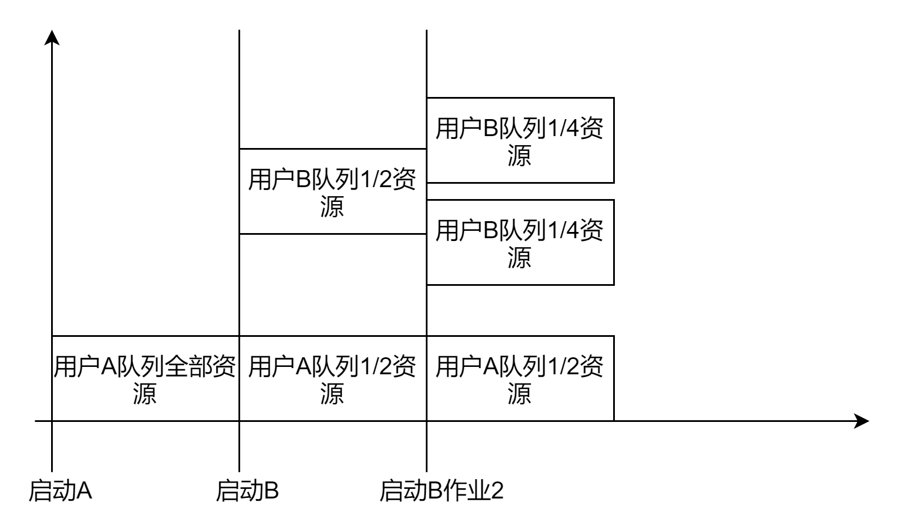

# YARN中的三种资源调度器

## FIFO调度器（FIFO Scheduler）

Hadoop最初设计时的调度器，为单队列调度器，无法充分利用硬件资源。先进先出队列，先为第一个应用请求资源，第一个满足后再依次为队列下一个提供服务，不适合共享集群。

## 容器调度器（Capacity Scheduler）

Capacity Schedulere是Yahoo！开发的多用户调度器，它以队列为单位划分资源，每个队列可设定一定比例的资源最低保证和使用上限，同时，每个用户也可设定一定的资源使用上限以防止资源滥用。而当一个队列的资源有剩余时，可暂时将剩余资源共享给其他队列。总之，Capacity Scheduler主要有以下几个特点：

1. 容量保证。管理员可为每个队列设置资源最低保证和资源使用上限，而所有提交到该队列的应用程序共享这些资源。
2. 灵活性。如果一个队列中的资源有剩余，可以暂时共享给那些需要资源的队列，而一旦该队列有新的应用程序提交，则其他队列释放的资源会归还给该队列。相比于HOD调度器，这种资源灵活分配的方式可明显提高资源利用率。
3. 多重租赁。支持多用户共享集群和多应用程序同时运行。为防止单个应用程序、用户或者队列独占集群中的资源，管理员可为之增加多重约束（比如单个应用程序同时运行的任务数等）。
4. 接口安全保证。每个队列有严格的ACL列表规定它的访问用户，每个用户可指定哪些用户允许查看自己应用程序的运行状态或者控制应用程序（比如杀死应用程序）。此外，管理员可指定队列管理员和集群系统管理员。
5. 动态更新配置文件。管理员可根据需要动态修改各种配置参数，以实现在线集群管理。

容器调度器允许多个组织共享整个hadoop集群，每个组织被配置一个专门的队列，每个队列分配整个集群资源的一部分，队列内部采用FIFO队列。

队列中作业太多导致资源不够用，容量调度可能会将空余的资源分配给队列中的作业。这叫“弹性队列”。但是，容量调度器不会强队列释放资源，当一个队列资源不够时，必须等其他队列资源释放后，才能获取资源，可以为队列设置一个最大资源使用量，以免占用太多的资源，导致其他队列不能使用空闲资，这就是弹性队列需要权衡的地方。

## 公平调度器（Fair Scheduler）

Fair Scheduler是Facebook开发的多用户调度器，同Capacity Scheduler类似，它以队列为单位划分资源，每个队列可设定一定比例的资源最低保证和使用上限，同时，每个用户也可设定一定的资源使用上限以防止资源滥用；当一个队列的资源有剩余时，可暂时将剩余资源共享给其他队列。当然，Fair Scheduler也存在很多与Capacity Scheduler不同之处，这主要体现在以下几个方面：

1. 资源公平共享。在每个队列中，Fair Scheduler 可选择按照FIFO、Fair或DRF策略为应用程序分配资源。其中，Fair策略是一种基于最大最小公平算法9实现的资源多路复用方式，默认情况下，每个队列内部采用该方式分配资源。这意味着，如果一个队列中有两个应用程序同时运行，则每个应用程序可得到1/2的资源；如果三个应用程序同时运行，则每个应用程序可得到1/3的资源。
2. 支持资源抢占。当某个队列中有剩余资源时，调度器会将这些资源共享给其他队列，而当该队列中有新的应用程序提交时，调度器要为它回收资源。为了尽可能降低不必要的计算浪费，调度器采用了先等待再强制回收的策略，即如果等待一段时间后尚有未归还的资源，则会进行资源抢占：从那些超额使用资源的队列中杀死一部分任务，进而释放资源。
3. 负载均衡。Fair Scheduler提供了一个基于任务数目的负载均衡机制，该机制尽可能将系统中的任务均匀分配到各个节点上。此外，用户也可以根据自己的需要设计负载均衡机制。
调度策略配置灵活。Fair Scheduler允许管理员为每个队列单独设置调度策略（当前支持FIFO、Fair或DRF三种）。
4. 提高小应用程序响应时间。由于采用了最大最小公平算法，小作业可以快速获取资源并运行完成。
强调多用户公平地使用资源，并且会动态调整应用程序的资源分配。比如:当一个大job提交时，只有这一个job在运行时，此时这个应用将获得所有的集群资源；当第二个job提交时，公平调度器会从第一个job资源中分配一半给第二个job，可能会存在延时，因为要等待第一个job的资源释放。

公平调度器将应用程序支持以队列的方式组织，队列之间公平地共享资源。

如图所示，每个用户的资源各占一半，每个用户队列内部资源再分配。
