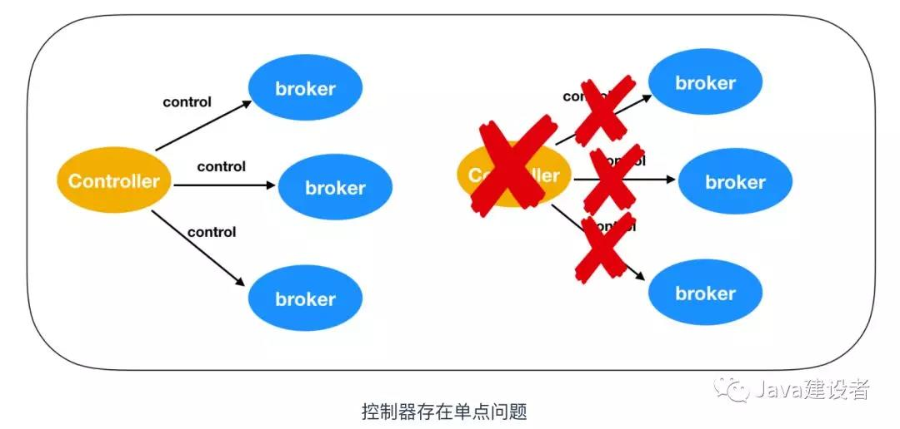
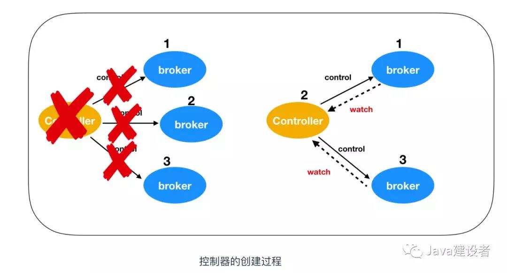

# Kafka的一些原理

本文来探讨一下三个问题：

* Kafka 是如何进行复制的
* Kafka 是如何处理来自生产者和消费者的请求的
* Kafka 的存储细节是怎样的

## 集群成员间的关系

我们知道，Kafka 是运行在 ZooKeeper 之上的，因为 ZooKeeper 是以集群形式出现的，所以 Kafka 也可以以集群形式出现。这也就涉及到多个生产者和多个消费者如何协调的问题，这个维护集群间的关系也是由 ZooKeeper 来完成的。Kafka 集群间会有多个 主机(broker)，每个 broker 都会有一个 broker.id，每个 broker.id 都有一个唯一的标识符用来区分，这个标识符可以在配置文件里手动指定，也可以自动生成。
Kafka 在启动时会在 ZooKeeper 中 /brokers/ids 路径下注册一个与当前 broker 的 id 相同的临时节点。Kafka 的健康状态检查就依赖于此节点。当有 broker 加入集群或者退出集群时，这些组件就会获得通知。

* 如果你要启动另外一个具有相同 ID 的 broker，那么就会得到一个错误 ---- 新的 broker 会试着进行注册，但不会成功，因为 ZooKeeper 里面已经有一个相同 ID 的 broker。
* 在 broker 停机、出现分区或者长时间垃圾回收停顿时，broker 会从 ZooKeeper 上断开连接，此时 broker 在启动时创建的临时节点会从 ZooKeeper 中移除。监听 broker 列表的 Kafka 组件会被告知该 broker 已移除。
* 在关闭 broker 时，它对应的节点也会消失，不过它的 ID 会继续存在其他数据结构中，例如主题的副本列表中，副本列表复制我们下面再说。在完全关闭一个 broker 之后，如果使用相同的 ID 启动另一个全新的 broker，它会立刻加入集群，并拥有一个与旧 broker 相同的分区和主题。

## Broker Controller 的作用

我们之前在讲 Kafka Rebalance 重平衡的时候，提过一个群组协调器，负责协调群组间的关系，那么 broker 之间也有一个控制器组件（Controller），它是 Kafka 的核心组件。它的主要作用是在 ZooKeeper 的帮助下管理和协调整个 Kafka 集群，集群中的每个 broker 都可以称为 controller，但是在 Kafka 集群启动后，只有一个 broker 会成为 Controller 。

### 控制器的选举

Kafka 当前选举控制器的规则是：Kafka 集群中第一个启动的 broker 通过在 ZooKeeper 里创建一个临时节点 /controller 让自己成为 controller 控制器。其他 broker 在启动时也会尝试创建这个节点，但是由于这个节点已存在，所以后面想要创建 /controller 节点时就会收到一个 节点已存在 的异常。然后其他 broker 会在这个控制器上注册一个 ZooKeeper 的 watch 对象，/controller 节点发生变化时，其他 broker 就会收到节点变更通知。这种方式可以确保只有一个控制器存在。那么只有单独的节点一定是有个问题的，那就是单点问题。

如果控制器关闭或者与 ZooKeeper 断开链接，ZooKeeper 上的临时节点就会消失。集群中的其他节点收到 watch对象发送控制器下线的消息后，其他 broker 节点都会尝试让自己去成为新的控制器。其他节点的创建规则和第一个节点的创建原则一致，都是第一个在 ZooKeeper 里成功创建控制器节点的 broker 会成为新的控制器，那么其他节点就会收到节点已存在的异常，然后在新的控制器节点上再次创建 watch 对象进行监听。

### 控制器的作用

Kafka 被设计为一种模拟状态机的多线程控制器，它可以作用有下面这几点

* 控制器相当于部门（集群）中的部门经理（broker controller），用于管理部门中的部门成员（broker）
* 控制器是所有 broker 的一个监视器，用于监控 broker 的上线和下线
* 在 broker 宕机后，控制器能够选举新的分区 Leader
* 控制器能够和 broker 新选取的 Leader 发送消息

再细分一下可以具体分为如下五点：

* 主题管理 : Kafka Controller 可以帮助我们完成对 Kafka 主题创建、删除和增加分区的操作，简而言之就是对分区拥有最高行使权。
* 分区重分配: 分区重分配主要是指，kafka-reassign-partitions 脚本提供的对已有主题分区进行细粒度的分配功能。这部分功能也是控制器实现的。
* Prefered 领导者选举 : Preferred 领导者选举主要是 Kafka 为了避免部分 Broker 负载过重而提供的一种换 Leader 的方案。
* 集群成员管理: 主要管理 新增 broker、broker 关闭、broker 宕机
* 数据服务: 控制器的最后一大类工作，就是向其他 broker 提供数据服务。控制器上保存了最全的集群元数据信息，其他所有 broker 会定期接收控制器发来的元数据更新请求，从而更新其内存中的缓存数据。这些数据我们会在下面讨论

当控制器发现一个 broker 离开集群（通过观察相关 ZooKeeper 路径），控制器会收到消息：这个 broker 所管理的那些分区需要一个新的 Leader。控制器会依次遍历每个分区，确定谁能够作为新的 Leader，然后向所有包含新 Leader 或现有 Follower 的分区发送消息，该请求消息包含谁是新的 Leader 以及谁是 Follower 的信息。随后，新的 Leader 开始处理来自生产者和消费者的请求，Follower 用于从新的 Leader 那里进行复制。
当控制器发现一个 broker 加入集群时，它会使用 broker ID 来检查新加入的 broker 是否包含现有分区的副本。如果有控制器就会把消息发送给新加入的 broker 和 现有的 broker。

### broker controller 数据存储

上面我们介绍到 broker controller 会提供数据服务，用于保存大量的 Kafka 集群数据。如下图

可以对上面保存信息归类，主要分为三类:

* broker 上的所有信息，包括 broker 中的所有分区，broker 所有分区副本，当前都有哪些运行中的 broker，哪些正在关闭中的 broker 。
* 所有主题信息，包括具体的分区信息，比如领导者副本是谁，ISR 集合中有哪些副本等。
* 所有涉及运维任务的分区。包括当前正在进行 Preferred 领导者选举以及分区重分配的分区列表。

Kafka 是离不开 ZooKeeper的，所以这些数据信息在 ZooKeeper 中也保存了一份。每当控制器初始化时，它都会从 ZooKeeper 上读取对应的元数据并填充到自己的缓存中。

### broker controller 故障转移

我们在前面说过，第一个在 ZooKeeper 中的 /brokers/ids下创建节点的 broker 作为 broker controller，也就是说 broker controller 只有一个，那么必然会存在单点失效问题。kafka 为考虑到这种情况提供了故障转移功能，也就是 Fail Over。如下图

最一开始，broker1 会抢先注册成功成为 controller，然后由于网络抖动或者其他原因致使 broker1 掉线，ZooKeeper 通过 Watch 机制觉察到 broker1 的掉线，之后所有存活的 brokers 开始竞争成为 controller，这时 broker3 抢先注册成功，此时 ZooKeeper 存储的 controller 信息由 broker1 -> broker3，之后，broker3 会从 ZooKeeper 中读取元数据信息，并初始化到自己的缓存中。

### broker controller 存在的问题

在 Kafka 0.11 版本之前，控制器的设计是相当繁琐的。我们上面提到过一句话：Kafka controller 被设计为一种模拟状态机的多线程控制器，这种设计其实是存在一些问题的

* controller 状态的更改由不同的监听器并发执行，因此需要进行很复杂的同步，并且容易出错而且难以调试。
* 状态传播不同步，broker 可能在时间不确定的情况下出现多种状态，这会导致不必要的额外的数据丢失
* controller 控制器还会为主题删除创建额外的  I/O 线程，导致性能损耗
* controller 的多线程设计还会访问共享数据，我们知道，多线程访问共享数据是线程同步最麻烦的地方，为了保护数据安全性，控制器不得不在代码中大量使用ReentrantLock 同步机制，这就进一步拖慢了整个控制器的处理速度。

### broker controller 内部设计原理

在 Kafka 0.11 之后，Kafka controller 采用了新的设计，把多线程的方案改成了单线程加事件队列的方案。如下图所示

第一个改进是增加了一个 Event Executor Thread，事件执行线程，从图中可以看出，不管是 Event Queue 事件队列还是 Controller context 控制器上下文都会交给事件执行线程进行处理。将原来执行的操作全部建模成一个个独立的事件，发送到专属的事件队列中，供此线程消费。

第二个改进是将之前同步的 ZooKeeper 全部改为异步操作。ZooKeeper API 提供了两种读写的方式：同步和异步。之前控制器操作 ZooKeeper 都是采用的同步方式，这次把同步方式改为异步，据测试，效率提升了10倍。

第三个改进是根据优先级处理请求，之前的设计是 broker 会公平性的处理所有 controller 发送的请求。什么意思呢？公平性难道还不好吗？在某些情况下是的，比如 broker 在排队处理 produce 请求，这时候 controller 发出了一个 StopReplica 的请求，你会怎么办？还在继续处理 produce 请求吗？这个 produce 请求还有用吗？此时最合理的处理顺序应该是，赋予 StopReplica 请求更高的优先级，使它能够得到抢占式的处理。

## 副本机制

复制功能是 Kafka 架构的核心功能，在 Kafka 文档里面 Kafka 把自己描述为 一个分布式的、可分区的、可复制的提交日志服务。复制之所以这么关键，是因为消息的持久存储非常重要，这能够保证在主节点宕机后依旧能够保证 Kafka 高可用。副本机制也可以称为备份机制(Replication)，通常指分布式系统在多台网络交互的机器上保存有相同的数据备份/拷贝。
Kafka 使用主题来组织数据，每个主题又被分为若干个分区，分区会部署在一到多个 broker 上，每个分区都会有多个副本，所以副本也会被保存在 broker 上，每个 broker 可能会保存成千上万个副本。下图是一个副本复制示意图

如上图所示，为了简单我只画出了两个 broker ,每个 broker 指保存了一个 Topic 的消息，在 broker1 中分区0 是Leader，它负责进行分区的复制工作，把 broker1 中的分区0复制一个副本到 broker2 的主题 A 的分区0。同理，主题 A 的分区1也是一样的道理。
副本类型分为两种：一种是 Leader(领导者) 副本，一种是Follower(跟随者)副本。

### Leader 副本

Kafka 在创建分区的时候都要选举一个副本，这个选举出来的副本就是 Leader 领导者副本。

### Follower 副本

除了 Leader 副本以外的副本统称为 Follower 副本，Follower 不对外提供服务。下面是 Leader 副本的工作方式

这幅图需要注意以下几点：

* Kafka 中，Follower 副本也就是追随者副本是不对外提供服务的。这就是说，任何一个追随者副本都不能响应消费者和生产者的请求。所有的请求都是由领导者副本来处理。或者说，所有的请求都必须发送到 Leader 副本所在的 broker 中，Follower 副本只是用作数据拉取，采用异步拉取的方式，并写入到自己的提交日志中，从而实现与 Leader 的同步
* 当 Leader 副本所在的 broker 宕机后，Kafka 依托于 ZooKeeper 提供的监控功能能够实时感知到，并开启新一轮的选举，从追随者副本中选一个作为 Leader。如果宕机的 broker 重启完成后，该分区的副本会作为 Follower 重新加入。
Leader的另一个任务是搞清楚哪个跟随者的状态与自己是一致的。跟随者为了保证与领导者的状态一致，在有新消息到达之前先尝试从领导者那里复制消息。为了与领导者保持一致，跟随者向领导者发起获取数据的请求，这种请求与消费者为了读取消息而发送的信息是一样的。
跟随者向领导者发送消息的过程是这样的，先请求消息1，然后再接收到消息1，在时候到请求1之后，发送请求2，在收到领导者给发送给跟随者之前，跟随者是不会继续发送消息的。这个过程如下

跟随者副本在收到响应消息前，是不会继续发送消息，这一点很重要。通过查看每个跟随者请求的最新偏移量，首领就会知道每个跟随者复制的进度。如果跟随者在10s 内没有请求任何消息，或者虽然跟随者已经发送请求，但是在10s 内没有收到消息，就会被认为是不同步的。如果一个副本没有与领导者同步，那么在领导者掉线后，这个副本将不会称为领导者，因为这个副本的消息不是全部的。
与之相反的，如果跟随者同步的消息和领导者副本的消息一致，那么这个跟随者副本又被称为同步的副本。也就是说，如果领导者掉线，那么只有同步的副本能够称为领导者。
关于副本机制我们说了这么多，那么副本机制的好处是什么呢？
  * 能够立刻看到写入的消息，就是你使用生产者 API 成功向分区写入消息后，马上使用消费者就能读取刚才写入的消息
  * 能够实现消息的幂等性，啥意思呢？就是对于生产者产生的消息，在消费者进行消费的时候，它每次都会看到消息存在，并不会存在消息不存在的情况

### 同步复制和异步复制

我在学习副本机制的时候，有个疑问，既然领导者副本和跟随者副本是发送 - 等待机制的，这是一种同步的复制方式，那么为什么说跟随者副本同步领导者副本的时候是一种异步操作呢？

我认为是这样的，跟随者副本在同步领导者副本后会把消息保存在本地 log 中，这个时候跟随者会给领导者副本一个响应消息，告诉领导者自己已经保存成功了，同步复制的领导者会等待所有的跟随者副本都写入成功后，再返回给 producer 写入成功的消息。而异步复制是领导者副本不需要关心跟随者副本是否写入成功，只要领导者副本自己把消息保存到本地 log ，就会返回给 producer 写入成功的消息。下面是同步复制和异步复制的过程

__同步复制__

* producer 通知 ZooKeeper 识别领导者
* producer 向领导者写入消息
* 领导者收到消息后会把消息写入到本地 log
* 跟随者会从领导者那里拉取消息
* 跟随者向本地写入 log
* 跟随者向领导者发送写入成功的消息
* 领导者会收到所有的跟随者发送的消息
* 领导者向 producer 发送写入成功的消息

__异步复制__

和同步复制的区别在于，领导者在写入本地log之后，直接向客户端发送写入成功消息，不需要等待所有跟随者复制完成。

#### ISR
