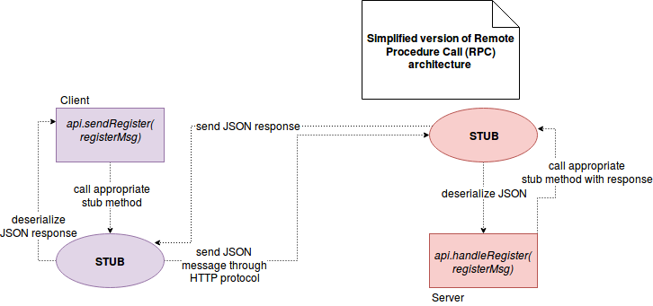
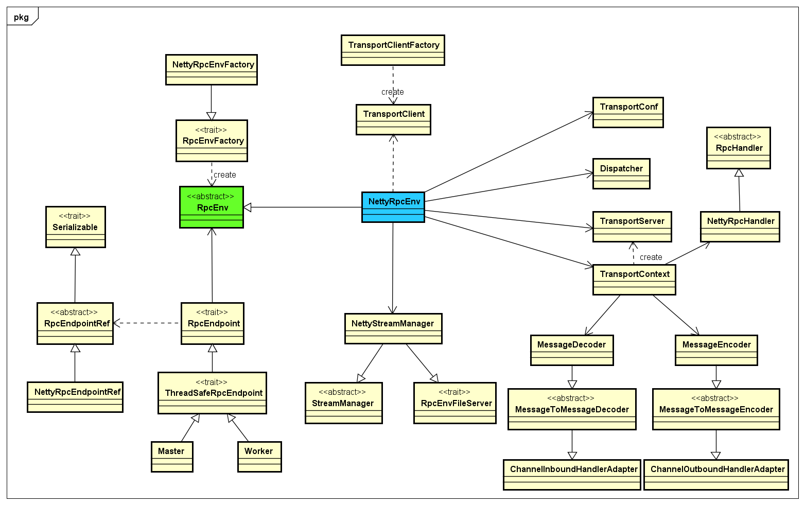
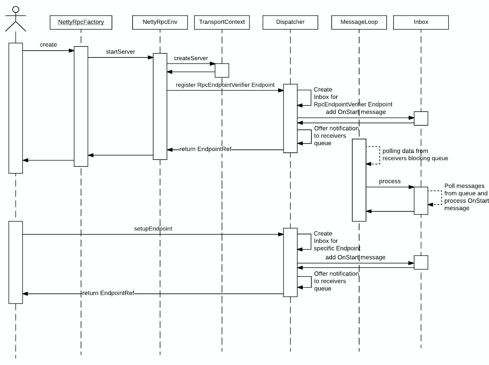
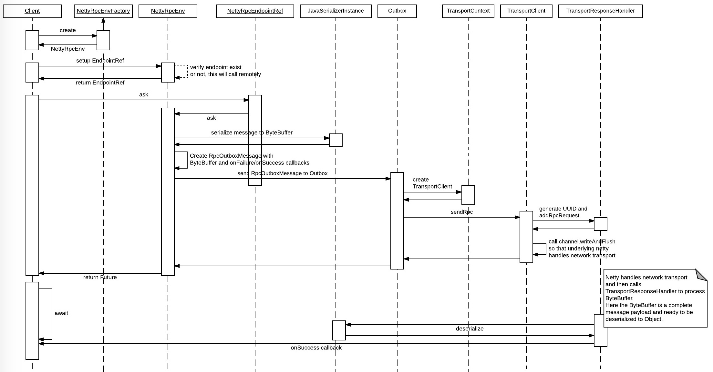
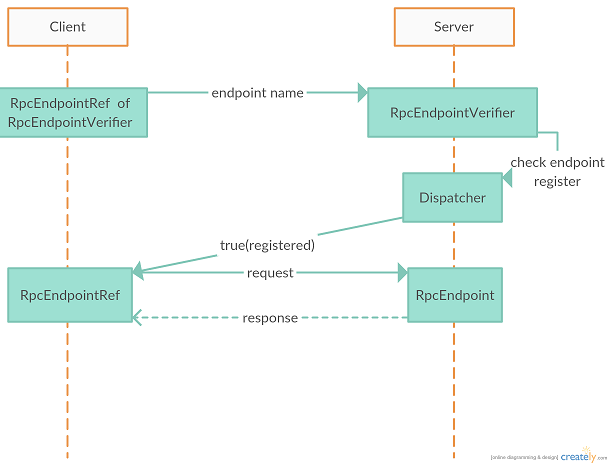
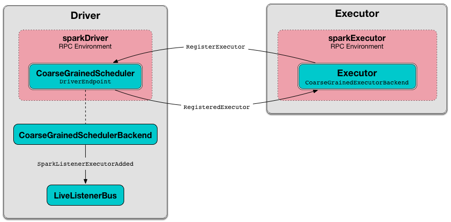

# RPC简介

## 概述

分布式系统中的通信是一个重要的组成部分。集群成员很少共享硬件组件，通信的单一解决方案是在客户机-服务器模型中交换消息。

Spark RPC可以说是Spark分布式集群的基础，而在Spark1.6之前，它的RPC部分还是用akka实现的，但之后底层就换成了netty来实现。为什么要这样做呢？因为啊，这样将Spark和Akka耦合在了一起，如果你系统本身就有使用到Akka，然后又想使用Spark的话，那两个Akka框架版本不一致可怎么办呀，这无疑是很让人头痛的。Spark团队正是考虑到了这一点，所以将Akka替换成了netty。

在Spark中，对于网络调用的底层封装（粘包拆包，编解码，链路管理等）都是在common/network-common包中实现的。来自网络的消息最终是通过调用上层代码的RpcHandler实现类，将消息发送给了上层代码。在Spark中，负责网络调用的上层代码是在rpc包中实现的。rpc包可以看做是对网络调用的高级封装（增加了消息队列，节点注册&发现，失败处理，生命周期管理等功能）。在Spark中，所有需要调用网络发送和接收消息的类只需要实现rpc包中提供的接口，来根据自身需要定制在网络调用不同阶段的功能（如处理节点注册，节点启动，节点收到消息时的逻辑等），而无需关心底层的实现。

## 定义

RPC是Remote Procedure Call（远程过程调用）的缩写。它是一个使用客户机-服务器模型的协议。当客户端执行一个请求时，它被发送到一个叫做存根（stub）的地方。存根知道哪些服务器能够执行请求以及处理请求所需的整个上下文(例如参数)。当请求最终到达适当的服务器时，它也到达服务器端的存根。因此，捕获的请求稍后被转换为服务器端可执行过程。在物理执行之后，结果被发送回客户机。如下图所示：


## 实现

Spark中的RPC是在Netty框架下实现的。最重要的RPC 类保存在org.apache.spark.rpc包中。最主要的是三个类：

RpcEnv
RpcEndpoint
RpcEndpointRef


1. RpcEnv
    RpcEnv 是一个抽象类，表示一个 RPC Environment，管理着整个RpcEndpoint的生命周期，目前唯一的实现类是NettyRpcEnv，具体功能是
    * 注册RpcEndpoint
    * 将来自 RpcEndpointRef的消息发送给相应的RpcEndpoint
    RpcEnv会在所有的通信节点上创建，例如master，worker，driver，executor都会创建一个RpcEnv。spark目前的唯一的实现就是NettyRpcEnv。

2. RpcEndpoint
   RpcEndPoint 代表具体的通信节点，例如Master、Worker、CoarseGrainedSchedulerBackend中的DriverEndpoint、CoarseGrainedExecutorBackend等，都实现了该接口，主要功能是维护RpcEndPoint 的生命周期，可以从它的方法中看到，constructor -> onStart -> receive* -> onStop。RpcEndpoint启动时，需要向RpcEnv注册，对于spark现在的实现来说，实际是注册到NettyRpcEnv内部的Dispatcher。

   ```scala
    private[spark] trait RpcEndpoint {
    
    val rpcEnv: RpcEnv
    
    //这个RpcEndpoint自身在RpcEnv中的引用，当调用onStart之后才有效，当调用onStop之后变为null
    final def self: RpcEndpointRef = {
        require(rpcEnv != null, "rpcEnv has not been initialized")
        rpcEnv.endpointRef(this)
    }
        ...
    def onError(cause: Throwable): Unit = {}
    def onConnected(remoteAddress: RpcAddress): Unit = {}
    def onDisconnected(remoteAddress: RpcAddress): Unit = {}
    def onNetworkError(cause: Throwable, remoteAddress: RpcAddress): Unit = {}
    def onStart(): Unit = {}
    def onStop(): Unit = {}
    
    }
   ```

3. RpcEndpointRef
   RpcEndpointRef是一个对RpcEndpoint的远程引用对象，通过它可以向远程的RpcEndpoint端发送消息以进行通信。RpcEndpointRef封装了大部分的消息处理操作。代码如下:

   ```scala
    private[spark] abstract class RpcEndpointRef(conf: SparkConf)
    extends Serializable with Logging {
    
    
    def address: RpcAddress
    def name: String
    
    def send(message: Any): Unit
    def ask[T: ClassTag](message: Any, timeout: RpcTimeout): Future[T]
    def ask[T: ClassTag](message: Any): Future[T] = ask(message, defaultAskTimeout)
    def askSync[T: ClassTag](message: Any): T = askSync(message, defaultAskTimeout)
    def askSync[T: ClassTag](message: Any, timeout: RpcTimeout): T = {
        val future = ask[T](message, timeout)
        timeout.awaitResult(future)
    }
   ```

## 交互流程

### RpcEnv的创建

#### driver端

RpcEnv在各个节点（driver、executor）启动的时候都会创建， driver端名字是sparkDriver，executor端是sparkExecutor。

driver端的调用链如下：

初始化SparkContext->创建spark执行环境（SparkContext#createSparkEnv）->创建drver端执行环境（SparkEnv.createDriverEnv）->SparkEnv.create()->创建RpcEnv.create->调用Rpc的Netty实现（NettyRpcEnvFactory().create(config)）.


```scala
def create(
      name: String, // "sparkDriver"  or  "sparkExecutor"
      bindAddress: String,  // "spark.driver.bindAddress",类似于：BJ103388-1.megvii.com
      advertiseAddress: String,// "spark.driver.host"
      port: Int,// spark.driver.port or -1
      conf: SparkConf,
      securityManager: SecurityManager,
      numUsableCores: Int,
      clientMode: Boolean): RpcEnv = {
    val config = RpcEnvConfig(conf, name, bindAddress, advertiseAddress, port, securityManager,
      numUsableCores, clientMode)
    new NettyRpcEnvFactory().create(config)
  }


private[rpc] class NettyRpcEnvFactory extends RpcEnvFactory with Logging {
 
  def create(config: RpcEnvConfig): RpcEnv = {
    val sparkConf = config.conf
    // Use JavaSerializerInstance in multiple threads is safe. However, if we plan to support
    // KryoSerializer in future, we have to use ThreadLocal to store SerializerInstance
    val javaSerializerInstance =
      new JavaSerializer(sparkConf).newInstance().asInstanceOf[JavaSerializerInstance]
    // 生产一个nettyEnv
    val nettyEnv =
      new NettyRpcEnv(sparkConf, javaSerializerInstance, config.advertiseAddress,
        config.securityManager, config.numUsableCores)
    if (!config.clientMode) { // 判断是否在driver端
 
      // 定义了一个函数
      val startNettyRpcEnv: Int => (NettyRpcEnv, Int) = { actualPort =>
        nettyEnv.startServer(config.bindAddress, actualPort)
        (nettyEnv, nettyEnv.address.port)
      }
      try {
        // 尝试在指定的端口启动服务，成功后返回NettyRpcEnv
        Utils.startServiceOnPort(config.port, startNettyRpcEnv, sparkConf, config.name)._1
      } catch {
        case NonFatal(e) =>
          nettyEnv.shutdown()
          throw e
      }
    }
    nettyEnv
  }
}
```

创建完启动过程中，会注册一个RpcEndpointVerifier（只在driver端有）， 其作用是，当RpcEndpointRef访问对应的RpcEndpoint前，判断RpcEndpoint是否存在。

```scala
/**
 * 在建立一个远端RpcEndpoint引用时，用来判断RpcEndpoint是否存在
 */
private[netty] class RpcEndpointVerifier(override val rpcEnv: RpcEnv, dispatcher: Dispatcher)
  extends RpcEndpoint {
 
  override def receiveAndReply(context: RpcCallContext): PartialFunction[Any, Unit] = {
    case RpcEndpointVerifier.CheckExistence(name) => context.reply(dispatcher.verify(name))
  }
}
 
private[netty] object RpcEndpointVerifier {
  val NAME = "endpoint-verifier"
 
  case class CheckExistence(name: String)
}
```

#### exectuor端


exector会创建本地的sparkEnv，中间会创建rpcEnv，然后去driver端注册各种消息服务（比如BlockManagerMaster、mapOutputTracker）。

注册时，会通过driver端的RpcEndpointVerifier来询问driver是否有对应的master，如果有的话，本地就封装一个NettyRpcEndpointRef，就相当于获取到了driver的各服务的master。

### 节点注册&发现

上文我们提到，Spark中所有需要进行网络通信的类只要实现rpc包中暴露的接口就可以了，这个接口就是`RpcEndpoint`。`RpcEndpoint`中定义了一套网络通信时的生命周期（如onError，receive等）。在进行网络通信时，来自Spark common/network-common包和core/rpc包中的代码最终会在对应的阶段调用`RpcEndpoint`中的这些方法（比如在建立网络连接后，会调用`RpcEndpoint.onConnected`方法）。所以应用程序只要实现`RpcEndpoint`中对应的方法，就能实现网络调用的全生命周期的处理逻辑。

好了，现在假设我们创建了两个类分别实现了`RpcEndpoint`的方法，那Spark是如何做到让这两个类实现通信的呢？

在实现并创建了`RpcEndpoint`后，要将创建的`RpcEndpoint`注册到`Dispatcher`中，在`Dispatcher`中维护了一个endpointName到`RpcEndpoint`实例的映射关系（关于`Dispatcher`的详细分析见下文）。由于一个节点中可能有多个`RpcEndpoint`，Spark使用endpointName来唯一标识一个节点中的`RpcEndpoint`，当其他节点需要与`RpcEndpoint`通信时，不光要指定要通信的节点地址，还要指定要通信的`RpcEndpoint`的endpointName。在Spark中的注册方法为`NettyRpcEnv.setupEndpoint`：

```scala
//NettyRpcEnvongoing的dispatcher负责消息的路由分发
override def setupEndpoint(name: String, endpoint: RpcEndpoint): RpcEndpointRef = {
  dispatcher.registerRpcEndpoint(name, endpoint)
}
```

最终会调用`Dispatcher.registerRpcEndpoint`方法：

```scala
def registerRpcEndpoint(name: String, endpoint: RpcEndpoint): NettyRpcEndpointRef = {
 
  //构建一个RPC端点的地址标识符，即本地的IP端口和一个名字
  val addr = RpcEndpointAddress(nettyEnv.address, name)
  //新建一个RpcEndpoint引用，引用与实际RpcEndpoint是通过EndpointData关联的
  val endpointRef = new NettyRpcEndpointRef(nettyEnv.conf, addr, nettyEnv)
  synchronized {
    if (stopped) {
      throw new IllegalStateException("RpcEnv has been stopped")
    }
    //放入名字和EndpointData的哈希表中
    if (endpoints.putIfAbsent(name, new EndpointData(name, endpoint, endpointRef)) != null) {
      throw new IllegalArgumentException(s"There is already an RpcEndpoint called $name")
    }
    val data = endpoints.get(name)
    //放入endpoint和引用的哈希表中
    endpointRefs.put(data.endpoint, data.ref)
    //跟踪收件箱中可能包含消息的接收者。
    receivers.offer(data)  // for the OnStart message
  }
  endpointRef
}
```

可见`RpcEndpoint`注册到RpcEnv 中的`Dispatcher`时，会将endpointName和`RpcEndpoint`的映射关系保存到endpoints（哈希表）中，同时`Dispatcher`会为`RpcEndpoint`创建对应的`NettyRpcEndpointRef`实例，并保存到endpointRefs（哈希表）中。这样就完成了`RpcEndpoint`的注册。

还需要注意的是在`RpcEndpoint`所在的server启动时，会向`Dispatcher`注册一个名为endpoint-verifier的`RpcEndpoint`，例如在driver端启动RpcEnv时，会创建一个endpoint-verifier，调用栈为：sparkContext.createSparkEnv ->SparkEnv.createDriverEnv->create->RpcEnv.create->NettyRpcEnvFactory().create→startNettyRpcEnv→nettyEnv.startServer,  启动server的为NettyRpcEnv.startServer方法：

```scala
def startServer(bindAddress: String, port: Int): Unit = {
  val bootstraps: java.util.List[TransportServerBootstrap] =
    if (securityManager.isAuthenticationEnabled()) {
      java.util.Arrays.asList(new AuthServerBootstrap(transportConf, securityManager))
    } else {
      java.util.Collections.emptyList()
    }
  server = transportContext.createServer(bindAddress, port, bootstraps)
  dispatcher.registerRpcEndpoint(
    RpcEndpointVerifier.NAME, new RpcEndpointVerifier(this, dispatcher))
}
```

这个`RpcEndpoint`的作用是什么呢？我们知道由于`RpcEndpoint`都是用户自己实现的，endpointName也是自定义的，那么在客户端在最开始如何向服务端请求来获取endpointName的`RpcEndpoint`的呢？答案就是构造一个`RpcEndpointVerifier`对应的`RpcEndpointRef`，并将需要请求的`RpcEndpoint`对应的endpointName封装在`RpcEndpointVerifier.CheckExistence`中发送给服务端，服务端在收到消息后，会调用`RpcEndpointVerifier.receiveAndReply`方法，而这个方法中会调用`dispatcher.verify`方法，来判断名为endpointName的`RpcEndpoint`是否已经注册到`Dispatcher`中的endpoints中，并将注册结果（true/false）返回给客户端。

```scala
/**
 * An [[RpcEndpoint]] for remote [[RpcEnv]]s to query if an `RpcEndpoint` exists.
 *
  * 获取RpcEndpointRef时，来判断对应的RpcEndpoint是否存在
  *
 * This is used when setting up a remote endpoint reference.
 */
private[netty] class RpcEndpointVerifier(override val rpcEnv: RpcEnv, dispatcher: Dispatcher)
  extends RpcEndpoint {
 
  override def receiveAndReply(context: RpcCallContext): PartialFunction[Any, Unit] = {
    case RpcEndpointVerifier.CheckExistence(name) => context.reply(dispatcher.verify(name))
  }
}
 
private[netty] object RpcEndpointVerifier {
  val NAME = "endpoint-verifier"
 
  /** A message used to ask the remote [[RpcEndpointVerifier]] if an `RpcEndpoint` exists. */
  case class CheckExistence(name: String)
}
```

也就是说`RpcEndpointVerifier`是一个在服务端和客户端提前协商好了的`RpcEndpoint`，主要用来校验客户端请求的`RpcEndpoint`在服务端是否存在，如果存在则客户端就可以在本地创建这个`RpcEndpoint`的句柄`RpcEndpointRef`，之后使用这个句柄与服务端的`RpcEndpoint`进行通信。

在阐述完上述信息后，我们就可以来详细介绍一下节点注册/发现的流程了。当其他节点需要与我们注册了`RpcEndpoint`节点的这个endpoint通信时（这里为了便于阐述，我们将其他节点称为客户端，他们请求的节点称为服务端），首先会向服务端申请获取需要通信的`RpcEndpoint`的`RpcEndpointRef`。客户端会调用`RpcEnv`中的方法来获取`RpcEndpointRef`，其中`RpcEnv`提供了三种调用方法，即asyncSetupEndpointRefByURI，setupEndpointRefByURI，setupEndpointRef这三个方法最终会调用`NettyRpcEnv.asyncSetupEndpointRefByURI`方法：

```scala
def asyncSetupEndpointRefByURI(uri: String): Future[RpcEndpointRef] = {
  val addr = RpcEndpointAddress(uri)
  //先建一个对端endpoint的Ref，如果端对存在就返回这个ref，否则就没用了
  val endpointRef = new NettyRpcEndpointRef(conf, addr, this)
  //创建一个对端RpcEndpointVerifier的ref
  val verifier = new NettyRpcEndpointRef(
    conf, RpcEndpointAddress(addr.rpcAddress, RpcEndpointVerifier.NAME), this)
  //询问对端是否存在这个名字的endpoint
  verifier.ask[Boolean](RpcEndpointVerifier.CheckExistence(endpointRef.name)).flatMap { find =>
    if (find) {
      Future.successful(endpointRef)
    } else {
      Future.failed(new RpcEndpointNotFoundException(uri))
    }
  }(ThreadUtils.sameThread)
}
```

其中传入的参数uri的格式如下：`spark://$name@$host:$port`，即服务端的地址，端口以及请求的`RpcEndpoint`的name。之后在客户端会构造服务端`RpcEndpointVerifier`对应的`NettyRpcEndpointRef`，并发送给服务端，询问请求的endpoint是否已经注册。如果服务端返回true，则将endpoint对应的`NettyRpcEndpointRef`返回给调用者。这个`NettyRpcEndpointRef`最终会保存到客户端本地，之后都用它与服务端对应的`RpcEndpoint`进行通信。最后用一张图来描述Spark中节点通信的流程：


总结一下Spark中节点注册&发现的流程：Spark在rpc层是通过`RpcEndpoint`和`RpcEndpointRef`来实现对网络调用的抽象的，服务端只需要实现`RpcEndpoint`，客户端只需要创建服务端`RpcEndpoint`对应的`RpcEndpointRef`句柄就可以实现消息的接收和发送处理。在Spark中，存在一个预先约定好的`RpcEndpoint`：`RpcEndpointVerifier`。这个`RpcEndpointVerifier`用来验证客户端请求的`RpcEndpoint`是否在服务端已经注册。当客户端需要与服务端对应的`RpcEndpoint`建立通信时，首先使用`RpcEndpointVerifier`对应的`RpcEndpointRef`句柄，向服务端发送连接请求（host， port， endpointName）。服务端在接收到连接请求后，会调用`RpcEndpointVerifier`的方法验证客户端请求的endpointName的`RpcEndpoint`是否已经在服务端注册，如果注册则返回true给客户端。客户端在收到服务端的响应后，会在本地建立服务端`RpcEndpoint`对应的句柄`RpcEndpointRef`，之后会直接使用这个句柄来向服务端发送消息。

实际上，RpcEndpointRef只是对对端（host, port, name）的一个包装，并不是服务端endpoint在内存中句柄的实际引用，只是封装了对端的ip端口和名字，通信都是和对方（host，port）来通信，每一个节点会有一个dispatcher，它收到消息以后会根据消息的名字进行分发处理。

### 接收消息

在介绍上一节时提到了dispatcher，每一个RpcEndpoint其实都是和对方的dispatcher通信的。这个类中维护了一个`EndpointData`类型的队列，`EndpointData`类如下：

```scala
private class EndpointData(
    val name: String,
    val endpoint: RpcEndpoint,
    val ref: NettyRpcEndpointRef) {
  //Inbox在初始化的时候会放入onStart消息，作为第一个要处理的消息
  val inbox = new Inbox(ref, endpoint)
}
```

每当有新的`RpcEndpoint`注册到`Dispatcher`时，就会创建一个`EndpointData`，并保存到队列中。其中name为`RpcEndpoint`的endpointName，endpoint就是注册的`RpcEndpoint`，ref为endpoint对应的`RpcEndpointRef`。同时还会为每个endpoint实例化一个对应的`Inbox`收件箱。每当收到新的消息时，都会找到消息所属的endpoint的`EndpointData`，并将`EndpointData`再次放入队列。而`Inbox`为Spark中从网络收到消息的收件箱，收到的消息实际是保存到`Inbox`中的。

dispatcher收到底层的消息以后会根据对方请求的RpcEndpoint名字来进行消息分发，有多重post*方法，最终都会调用postMessage方法：

```scala
private def postMessage(
    endpointName: String,
    message: InboxMessage,
    callbackIfStopped: (Exception) => Unit): Unit = {
  val error = synchronized {
    val data = endpoints.get(endpointName)
    if (stopped) {
      Some(new RpcEnvStoppedException())
    } else if (data == null) {
      Some(new SparkException(s"Could not find $endpointName."))
    } else {
      //把消息放入对应endpoint的收件箱中
      data.inbox.post(message)
      //把可能有数据的endpoint 放入消息队列，通过处理这个消息队列，来处理它的消息
      receivers.offer(data)
      None
    }
  }
  // We don't need to call `onStop` in the `synchronized` block
  error.foreach(callbackIfStopped)
}
```

现在我们成功将消息保存到队列中了，那么Spark是如何读取这些消息的呢？`Dispatcher`在初始化时会启动线程循环读取`EndpointData`队列中的数据，并调用`Inbox`中的方法执行。我们看一下`Dispatcher`中用来读取消息队列的线程的实现：

```scala
/** Thread pool used for dispatching messages. */
private val threadpool: ThreadPoolExecutor = {
  val availableCores =
    if (numUsableCores > 0) numUsableCores else Runtime.getRuntime.availableProcessors()
  val numThreads = nettyEnv.conf.getInt("spark.rpc.netty.dispatcher.numThreads",
    math.max(2, availableCores))
  val pool = ThreadUtils.newDaemonFixedThreadPool(numThreads, "dispatcher-event-loop")
  for (i <- 0 until numThreads) {
    pool.execute(new MessageLoop)
  }
  pool
}
 
/** Message loop used for dispatching messages. */
private class MessageLoop extends Runnable {
  override def run(): Unit = {
    try {
      while (true) {
        try {
          val data = receivers.take()
          if (data == PoisonPill) {
            // Put PoisonPill back so that other MessageLoops can see it.
            receivers.offer(PoisonPill)
            return
          }
          data.inbox.process(Dispatcher.this)
        } catch {
          case NonFatal(e) => logError(e.getMessage, e)
        }
      }
    } catch {
      case ie: InterruptedException => // exit
    }
  }
}
```

可见读取`EndpointData`队列的是一个线程池，Spark可以通过`spark.rpc.netty.dispatcher.numThreads`参数来配置线程池中有多少个线程，如果没有配置，则默认启动jvm有效核数的线程（最少2个）。接下来的`MessageLoop`类是每个线程的实际执行方法。可以看到通过一个while(true)循环来不断从消息队列中读取消息，并发送给`Inbox.process`方法执行。如果消息队列中的消息是`PoisonPill`的话，当前的线程就会吃掉这个小毒丸，然后直接退出循环。

在`Inbox`中维护了一个消息队列，用来保存收到的消息。`Inbox`中除了`OneWayMessage`，`RpcMessage`这种消息之外，还定义了在`RpcEndpoint`生命周期中相关事件的消息，如`OnStart`，`OnStop`，`RemoteProcessConnected`等。在`Dispatcher`处理`EndpointData`队列的线程中，最终会调用`Inbox.process`方法，来实际处理消息：

```scala
/**
 * Process stored messages.
 */
def process(dispatcher: Dispatcher): Unit = {
  var message: InboxMessage = null
  inbox.synchronized {
    if (!enableConcurrent && numActiveThreads != 0) {//不允许多个线程同时处理消息 && 处理此收件箱消息的线程数！=0 返回
      return
    }
    message = messages.poll()//取一个消息出来
    if (message != null) {//如果消息不为空，消息处理线程+1
      numActiveThreads += 1
    } else {//否则返回
      return
    }
  }
  while (true) {
    safelyCall(endpoint) {
      message match {
        case RpcMessage(_sender, content, context) => //注册时就封装成了RpcMessage
          try {
            endpoint.receiveAndReply(context).applyOrElse[Any, Unit](content, { msg =>
              throw new SparkException(s"Unsupported message $message from ${_sender}")
            })
          } catch {
            case NonFatal(e) =>
              context.sendFailure(e)
              // Throw the exception -- this exception will be caught by the safelyCall function.
              // The endpoint's onError function will be called.
              throw e
          }
 
        case OneWayMessage(_sender, content) =>
          endpoint.receive.applyOrElse[Any, Unit](content, { msg =>
            throw new SparkException(s"Unsupported message $message from ${_sender}")
          })
 
        case OnStart =>
          endpoint.onStart()
          if (!endpoint.isInstanceOf[ThreadSafeRpcEndpoint]) {
            inbox.synchronized {
              if (!stopped) {
                enableConcurrent = true
              }
            }
          }
 
        case OnStop =>
          val activeThreads = inbox.synchronized { inbox.numActiveThreads }
          assert(activeThreads == 1,
            s"There should be only a single active thread but found $activeThreads threads.")
          dispatcher.removeRpcEndpointRef(endpoint)
          endpoint.onStop()
          assert(isEmpty, "OnStop should be the last message")
 
        case RemoteProcessConnected(remoteAddress) =>
          endpoint.onConnected(remoteAddress)
 
        case RemoteProcessDisconnected(remoteAddress) =>
          endpoint.onDisconnected(remoteAddress)
 
        case RemoteProcessConnectionError(cause, remoteAddress) =>
          endpoint.onNetworkError(cause, remoteAddress)
      }
    }
 
    inbox.synchronized {
      // "enableConcurrent" will be set to false after `onStop` is called, so we should check it
      // every time.
      if (!enableConcurrent && numActiveThreads != 1) {
        // If we are not the only one worker, exit
        numActiveThreads -= 1
        return
      }
      message = messages.poll()
      if (message == null) {
        numActiveThreads -= 1
        return
      }
    }
  }
}
```

可见`Inbox`会根据消息类型的不同，调用`Inbox`对应的`RpcEndpoint`中的方法，实现最终将来自网络的消息传递给应用程序自定义的`RpcEndpoint`对应的方法执行。

### 发送消息

在介绍完Spark是如何处理从网络接收到的消息后，接下来我们就要看一下Spark是如何向网络发送消息的。在前文介绍`RpcEndpoint`和`RpcEndpointRef`时，我们提到了客户端是通过创建服务端`RpcEndpoint`的句柄`RpcEndpointRef`来实现与服务端的`RpcEndpoint`进行通信的。所以在Spark中，发送消息就是调用`RpcEndpointRef`中的方法。而我们知道Spark存在Rpc和OneWayMessage两种消息类型，这两种消息类型分别对应`RpcEndpointRef`中的ask和send方法。而在Spark中，`RpcEndpointRef`的实现为`NettyRpcEndpointRef`。由于send和ask方法类似，在这里我们以ask方法为例，看一下Spark发送消息的流程。我们看一下`NettyRpcEndpointRef.ask`方法：

```scala
override def ask[T: ClassTag](message: Any, timeout: RpcTimeout): Future[T] = {
  nettyEnv.ask(new RequestMessage(nettyEnv.address, this, message), timeout)
}
```

见在`NettyRpcEndpointRef.ask`中只是将消息封装为`RequestMessage`，并调用`NettyRpcEnv.ask`，由于`NettyRpcEnv.ask`代码比较复杂，我们这里就列出最关键的部分：

```scala
private[netty] def ask[T: ClassTag](message: RequestMessage, timeout: RpcTimeout): Future[T] = {
  val promise = Promise[Any]()
  val remoteAddr = message.receiver.address
 
  def onFailure(e: Throwable): Unit = {
    ...
  }
 
  def onSuccess(reply: Any): Unit = reply match {
    ...
  }
 
  try {
    if (remoteAddr == address) {
      val p = Promise[Any]()
      p.future.onComplete {
        case Success(response) => onSuccess(response)
        case Failure(e) => onFailure(e)
      }(ThreadUtils.sameThread)
      dispatcher.postLocalMessage(message, p)
    } else {
      val rpcMessage = RpcOutboxMessage(message.serialize(this),
        onFailure,
        (client, response) => onSuccess(deserialize[Any](client, response)))
      postToOutbox(message.receiver, rpcMessage)
      promise.future.failed.foreach {
        case _: TimeoutException => rpcMessage.onTimeout()
        case _ =>
      }(ThreadUtils.sameThread)
    }
 
    val timeoutCancelable = timeoutScheduler.schedule(new Runnable {
      override def run(): Unit = {
        onFailure(new TimeoutException(s"Cannot receive any reply from ${remoteAddr} " +
          s"in ${timeout.duration}"))
      }
    }, timeout.duration.toNanos, TimeUnit.NANOSECONDS)
    promise.future.onComplete { v =>
      timeoutCancelable.cancel(true)
    }(ThreadUtils.sameThread)
  } catch {
    case NonFatal(e) =>
      onFailure(e)
  }
  promise.future.mapTo[T].recover(timeout.addMessageIfTimeout)(ThreadUtils.sameThread)
}
```

可见Spark在发送消息时，会判断消息的接收地址（remoteAddr）是否是当前节点地址。如果是当前节点地址，则直接调用`Dispatcher.postLocalMessage`方法。如果消息接收地址不是当前节点地址，则首先对消息进行序列化，然后将序列化后的消息封装为`RpcOutboxMessage`，并调用`NettyRpcEnv.postToOutbox`方法。发送消息的回调都封装在scala的类型`Promise`中，并返回。`Dispatcher.postLocalMessage`方法与接收消息时介绍的`Dispatcher`中的方法类似，最终都是调用`Dispatcher.postMessage`方法，这里就不再赘述了。我们主要看一下将消息发送到远端的这段逻辑。

Spark在将消息发送到远端时，首先会序列化消息，在`NettyRpcEnv`中是使用Java序列化方法来序列化消息。之后会调用`NettyRpcEnv.postToOutbox`方法：

```scala
private def postToOutbox(receiver: NettyRpcEndpointRef, message: OutboxMessage): Unit = {
  if (receiver.client != null) {
    message.sendWith(receiver.client)
  } else {
    require(receiver.address != null,
      "Cannot send message to client endpoint with no listen address.")
    val targetOutbox = {
      val outbox = outboxes.get(receiver.address)
      if (outbox == null) {
        val newOutbox = new Outbox(this, receiver.address)
        val oldOutbox = outboxes.putIfAbsent(receiver.address, newOutbox)
        if (oldOutbox == null) {
          newOutbox
        } else {
          oldOutbox
        }
      } else {
        outbox
      }
    }
    if (stopped.get) {
      // It's possible that we put `targetOutbox` after stopping. So we need to clean it.
      outboxes.remove(receiver.address)
      targetOutbox.stop()
    } else {
      targetOutbox.send(message)
    }
  }
}
```

我们看到`RpcEndpointRef`被封装到消息中传递到了`NettyRpcEnv.postToOutbox`方法。如果`RpcEndpointRef`中包含了与远端的链接（`TransportClient`），则直接调用`TransportClient`中的方法发送消息。否则，Spark使用发件箱（Outbox）来发送消息。在接收消息时，我们提到Spark会为每一个`RpcEndpoint`建立一个收件箱（Inbox）。而在发送消息时，Spark会为每一个接收消息的地址（host+port）创建一个发件箱。最终会调用`Outbox.send`方法来发送消息。

在发件箱中，Spark维护了一个待发送消息的消息队列。每次在调用`Outbox.send`方法发送消息时，消息首先会被放入队列中，然后调用`Outbox.drainOutbox`方法来循环读取队列，将队列中的消息都发送出去。我们首先看一下`Outbox.send`方法：

```scala
/**
 * Send a message. If there is no active connection, cache it and launch a new connection. If
 * [[Outbox]] is stopped, the sender will be notified with a [[SparkException]].
 */
def send(message: OutboxMessage): Unit = {
  val dropped = synchronized {
    if (stopped) {
      true
    } else {
      messages.add(message)
      false
    }
  }
  if (dropped) {
    message.onFailure(new SparkException("Message is dropped because Outbox is stopped"))
  } else {
    drainOutbox()
  }
}
```

接下来我们看一下`Outbox.drainOutbox`方法：

```scala
/**
 * Drain the message queue. If there is other draining thread, just exit. If the connection has
 * not been established, launch a task in the `nettyEnv.clientConnectionExecutor` to setup the
 * connection.
 */
private def drainOutbox(): Unit = {
  var message: OutboxMessage = null
  synchronized {
    if (stopped) {
      return
    }
    // 如果connectFuture不为空说明正在建立链接，直接返回
    if (connectFuture != null) {
      // We are connecting to the remote address, so just exit
      return
    }
    // 这说明没有线程在建立链接，但是当前又没有可用链接，则当前线程主动建立链接并返回
    if (client == null) {
      // There is no connect task but client is null, so we need to launch the connect task.
      launchConnectTask()
      return
    }
    // 说明有其他线程在调用此方法发送消息，当前线程可以直接返回
    if (draining) {
      // There is some thread draining, so just exit
      return
    }
    message = messages.poll()
    if (message == null) {
      return
    }
    draining = true
  }
  // 将messages中的消息都发送出去
  while (true) {
    try {
      val _client = synchronized { client }
      if (_client != null) {
        // 发送消息
        message.sendWith(_client)
      } else {
        assert(stopped == true)
      }
    } catch {
      case NonFatal(e) =>
        handleNetworkFailure(e)
        return
    }
    synchronized {
      if (stopped) {
        return
      }
      message = messages.poll()
      if (message == null) {
        draining = false
        return
      }
    }
  }
}
```

可以看到，在`Outbox.drainOutbox`方法中，通过同步锁的方式，保证只有一个线程在读取待发送消息队列，线程循环读取队列中的消息，并调用`message.sendWith`方法发送消息。这里可以看出，Spark中，第一个向某个远端地址发送消息的线程会直接被拉来做苦力，不断的发送消息队列中的消息（队列中的消息可能是由其他线程放入的），直到队列为空为止。所以在Spark中调用`RpcEndpointRef.ask`或`RpcEndpointRef.send`方法的线程是有可能一直阻塞不返回的，所以在调用时要注意。

总结一下Spark发送消息的流程：在发送端调用`RpcEndpointRef`中的方法发送消息。如果接收端是本节点，则直接调用`Dispatcher`中的方法，将消息传入本节点的`Inbox`中。如果接收端是远端节点，则会将消息保存到`Outbox`的发送队列中。如果没有线程处理发送队列，则当前发送消息的线程会用来发送队列中的所有消息，直到发送队列为空才退出。发送消息是调用common/network-common包中的`TransportClient`相关方法发送的。

## 例子

调度系统中的通信
driver在初始化sparkContext时，会创建createTaskScheduler，根据不同的部署模式，会创建TaskSchedulerImpl和不同的SchedulerBackend，之后调用TaskSchedulerImpl的initialize方法把SchedulerBackend传进去，比如集群模式会创建CoarseGrainedSchedulerBackend来申请资源，初始化时会DriverEndpoint，在RpcEnv中的名字是CoarseGrainedScheduler：

```scala
override def start() {
   val properties = new ArrayBuffer[(String, String)]
   for ((key, value) <- scheduler.sc.conf.getAll) {
     if (key.startsWith("spark.")) {
       properties += ((key, value))
     }
   }
 
   // driver端SchedulerBackend在RpcEnv中的注册
   driverEndpoint = createDriverEndpointRef(properties)
 }
 
 
 protected def createDriverEndpointRef(
     properties: ArrayBuffer[(String, String)]): RpcEndpointRef = {
   //名字是CoarseGrainedScheduler
   rpcEnv.setupEndpoint(ENDPOINT_NAME, createDriverEndpoint(properties))
 }
 
 
 protected def createDriverEndpoint(properties: Seq[(String, String)]): DriverEndpoint = {
   new DriverEndpoint(rpcEnv, properties)
 }
```

在TaskSchedulerImpl.submitTaskson中，会调用SchedulerBackend发送reviveOffers消息（都是本地消息），即

```scala
override def reviveOffers() {
  //给CoarseGrainedSchedulerBackend发送消息
  driverEndpoint.send(ReviveOffers)
}
```

CoarseGrainedSchedulerBackend调用makeOffers来申请资源，并会调用TaskSchedulerImpl来分配资源，之后把分配好的task序列化信息发给executor

```scala
private def launchTasks(tasks: Seq[Seq[TaskDescription]]) {
  for (task <- tasks.flatten) {
    val serializedTask = TaskDescription.encode(task)
    if (serializedTask.limit() >= maxRpcMessageSize) {
      Option(scheduler.taskIdToTaskSetManager.get(task.taskId)).foreach { taskSetMgr =>
        try {
          var msg = "Serialized task %s:%d was %d bytes, which exceeds max allowed: " +
            "spark.rpc.message.maxSize (%d bytes). Consider increasing " +
            "spark.rpc.message.maxSize or using broadcast variables for large values."
          msg = msg.format(task.taskId, task.index, serializedTask.limit(), maxRpcMessageSize)
          taskSetMgr.abort(msg)
        } catch {
          case e: Exception => logError("Exception in error callback", e)
        }
      }
    }
    else {
      val executorData = executorDataMap(task.executorId)
      executorData.freeCores -= scheduler.CPUS_PER_TASK
 
      logDebug(s"Launching task ${task.taskId} on executor id: ${task.executorId} hostname: " +
        s"${executorData.executorHost}.")
 
      executorData.executorEndpoint.send(LaunchTask(new SerializableBuffer(serializedTask)))
    }
  }
}
```

executorEndpoint是什么时候注册到CoarseGrainedSchedulerBackend上的呢？

executor在启动的时候会向driver端发送注册消息

