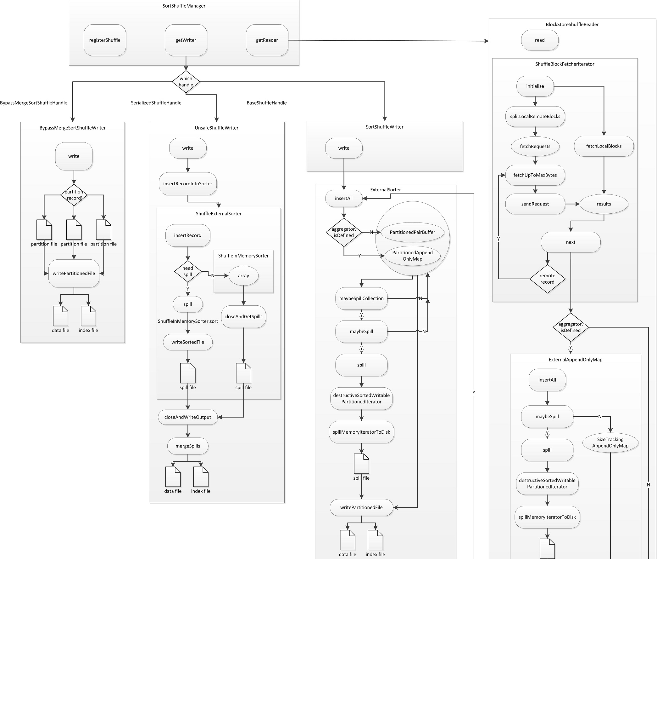

# Shuffle原理

## 什么是shuffle？

shuffle是spark用来在不同executors甚至机器之间重新分配数据的一种机制。当我们在RDD或DataFrame上执行某些转换操作（如groupByKey, reduceByKey,join）时，会触发shuffle操作。

Spark Shuffle是一个昂贵的操作，因为它包含以下内容：

* 磁盘I/O
* 数据序列化和反序列化
* 网络I/O

这些操作相对比较耗时间，往往会成为一个分布式计算任务的瓶颈，spark 也为此花了大力气进行spark shuffle的优化。

在创建RDD或DataFrame时，Spark没必要存储分区中所有键的数据，因为在创建时我们无法为数据集设置键值。因此，当我们运行reduceByKey()操作来聚合键上的数据时，Spark将执行以下操作：

1. Spark首先在所有分区上运行map task任务，按键值进行分组
2. map task任务的结果保存在内存中
3. 当结果太大无法装入内存时，Spark将数据存储到磁盘中
4. Spark跨分区传递map task的数据，有时它还将数据存储到磁盘中，以便在需要重新计算时重用
5. 最后基于key在每一个分区上运行reduce task任务

## 为什么需要shuffle？

shuffle的演进？各优缺点？

spark shuffle 演进的历史

* Spark 0.8及以前 Hash Based Shuffle

在Shuffle Write过程按照Hash的方式重组Partition的数据，不进行排序。每个map端的任务为每个reduce端的Task生成一个文件，通常会产生大量的文件（即对应为M*R个中间文件，其中M表示map端的Task个数，R表示reduce端的Task个数），伴随大量的随机磁盘IO操作与大量的内存开销。Shuffle Read过程如果有combiner操作，那么它会把拉到的数据保存在一个Spark封装的哈希表（AppendOnlyMap）中进行合并。

这里的Task个数，其实就是分区数。


* Spark 0.8.1 为Hash Based Shuffle引入File Consolidation机制

通过文件合并，中间文件的生成方式修改为每个执行单位（一个Executor中的执行单位等于Core的个数除以每个Task所需的Core数）为每个reduce端的任务生成一个文件。最终可以将文件个数从M*R修改为E*C/T*R，其中，E表示Executor的个数，C表示每个Executor中可用Core的个数，T表示Task所分配的Core的个数。（相当于同时运行的task个数，比上一代有所减少）
是否采用Consolidate机制，需要配置spark.shuffle.consolidateFiles参数.


* Spark 0.9 引入ExternalAppendOnlyMap

在 Reduce 阶段，Reduce Task 拉取数据做 Combine 时不再是采用 HashMap，而使用ExternalAppendOnlyMap，该数据结构在combine的时候，如果内存不足，可以将数据spill到磁盘，然后通过堆排序merge，很大程度的保证了鲁棒性，避免大数据情况下的 OOM。（可以参考这篇[文章](https://github.com/JerryLead/SparkInternals/blob/master/markdown/4-shuffleDetails.md)，了解其具体实现）

* Spark 1.1 引入Sort Based Shuffle，但默认仍为Hash Based Shuffle

在Sort Based Shuffle的Shuffle Write阶段，map端的任务会按照Partition id以及key对记录进行排序。同时将全部结果写到一个数据文件中，同时生成一个索引文件，reduce端的Task可以通过该索引文件获取相关的数据。


* Spark 1.2 默认的Shuffle方式改为Sort Based Shuffle

* Spark 1.4 引入Tungsten-Sort Based Shuffle

它的做法是将数据记录用二进制的方式存储，直接在序列化的二进制数据上 Sort 而不是在 Java 对象上，这样一方面可以减少内存的使用和 GC 的开销，另一方面避免 Shuffle 过程中频繁的序列化以及反序列化。在排序过程中，它提供 cache-efficient sorter，使用一个 8 bytes 的指针，把排序转化成了一个指针数组的排序，极大的优化了排序性能。但是使用 Tungsten-Sort Based Shuffle 有几个限制，Shuffle 阶段不能有 aggregate 操作，分区数不能超过一定大小（2^24-1，这是可编码的最大 Parition Id），所以像 reduceByKey 这类有 aggregate 操作的算子是不能使用 Tungsten-Sort Based Shuffle，它会退化采用 Sort Shuffle。

* Spark 1.6 Tungsten-sort并入Sort Based Shuffle由SortShuffleManager自动判断选择最佳Shuffle方式，如果检测到满足Tungsten-sort条件会自动采用Tungsten-sort Based Shuffle，否则采用Sort Based Shuffle。

* Spark 2.0 Hash Based Shuffle退出历史舞台,从此Spark只有Sort Based Shuffle。

## shuffle原理

原理概要如下图所示


目前spark只有一种shuffleManager，即SortShuffleManager，它会根据不同条件选择不同的shuffleHandle，三种shuffleHnader对应三种shuffleWriter，如下所示：



### BypassMergeSortShuffleWriter

这个类实现了基于排序的洗牌的散列样式的洗牌回退路径。这个写路径将传入的记录写入单独的文件(每个reduce分区一个文件)，然后将这些每个分区的文件连接起来，形成单个输出文件，其中的区域提供给reducers。记录不被缓冲在内存中。对于大量reduce分区，此写路径效率低下，因为它同时为所有分区打开单独的序列化器和文件流。

### UnsafeShuffleWriter

使用这种writer的前提是Serializer支持relocation，即，Serializer可以对已经序列化的对象进行排序，这种排序起到的效果和先对数据排序再序列化一致。

它通过一种新的缓存友好的直接操作二进制数据的排序算法来增强现有的基于排序的洗牌。这个补丁的目标是降低洗牌期间的内存使用和Java对象开销，并加快排序速度。它还为后续补丁奠定了基础，这些补丁将支持对序列化的记录进行端到端处理。

UnsafeShuffleManager的设计类似于Spark现有的SortShuffleManager。在基于排序的洗牌中，传入的记录根据它们的目标分区id进行排序，然后写入单个映射输出文件。压缩器获取该文件的相邻区域，以便读取它们在映射输出中的部分。在映射输出数据太大而无法装入内存的情况下，可以将已排序的输出子集溢出到磁盘，并合并那些磁盘上的文件以生成最终的输出文件。

UnsafeShuffleManager通过几种方式优化这个过程:

* 它的排序操作的是序列化的二进制数据，而不是Java对象，这减少了内存消耗和GC开销。此优化要求记录序列化器具有某些属性，以便在不需要反序列化的情况下对序列化的记录进行重新排序。有关更多细节，请参阅SPARK-4550，该优化就是在这里首次提出并实现的。
* 它使用一种专门的高效缓存排序器(UnsafeShuffleExternalSorter)对压缩记录指针数组和分区id进行排序。通过在排序数组中为每个记录只使用8字节的空间，可以将更多的数组放入缓存中。
* 溢出合并过程对属于同一分区的序列化记录块进行操作，并且在合并期间不需要反序列化记录。
* 当溢出压缩编解码器支持压缩数据的串联时，溢出合并只是将序列化的和压缩的溢出分区串联起来，以产生最终的输出分区。这允许使用高效的数据复制方法，如NIO的transferTo，并避免在合并期间分配解压缩或复制缓冲区。

## shuffle怎么使用？

### 创建

总的流程如下：

1. driver和exectour在初始化创建sparkEnv时，会创建shuffleManager，默认是SortShuffleManager。driver端会创建MapOutputTrackerMaster，负责跟踪map stage输出结果的位置，exector会创建MapOutputTrackerWorker，去driver端的MapOutputTrackerMaster读取map的输出信息。
2. 在RDD的转换算子中，会确定RDD之间的依赖关系，在创建依赖关系的时候，会自动注册shuffleManager，程序会自动判断选择合适的ShuffleHandle（BypassMergeSortShuffleHandle，SerializedShuffleHandle，BaseShuffleHandle）
3. driver在划分DAG图的时候，遇到宽依赖，会划分一个ShuffleMapStage，这个stage会创建ShuffleMapTask，然后出发RDD的计算，在计算时会调用shuffleManager.getWriter，根据上一步中的ShuffleHandle选择合适的ShuffleWriter，计算并输出map结果.

在ShuffleDependency中，会自动创建ShuffleHandle：

```scala
class ShuffleDependency[K: ClassTag, V: ClassTag, C: ClassTag](....., val shuffleWriterProcessor: ShuffleWriteProcessor = new ShuffleWriteProcessor)
  extends Dependency[Product2[K, V]] {
  ......
 
  val shuffleId: Int = _rdd.context.newShuffleId()
  //自动注册shuffleHandle
  val shuffleHandle: ShuffleHandle = _rdd.context.env.shuffleManager.registerShuffle(
    shuffleId, _rdd.partitions.length, this)
 
  ......
}
 
  //自动选择shuffleHandle
  override def registerShuffle[K, V, C](
      shuffleId: Int,
      numMaps: Int,
      dependency: ShuffleDependency[K, V, C]): ShuffleHandle = {
    
    if (SortShuffleWriter.shouldBypassMergeSort(conf, dependency)) {
      //第一种
      new BypassMergeSortShuffleHandle[K, V](
        shuffleId, numMaps, dependency.asInstanceOf[ShuffleDependency[K, V, V]])
    } else if (SortShuffleManager.canUseSerializedShuffle(dependency)) {
      //第二种
      new SerializedShuffleHandle[K, V](
        shuffleId, numMaps, dependency.asInstanceOf[ShuffleDependency[K, V, V]])
    } else {
      //第三种
      new BaseShuffleHandle(shuffleId, numMaps, dependency)
    }
  }
```

选择不同shuffleHandle的条件：

* BypassMergeSortShuffleHandle：1). 不在map端聚合, 且；2) 分区个数少于等于spark.shuffle.sort.bypassMergeThreshold（默认200）。
* SerializedShuffleHandle：1). 序列化器支持对象重定位， 且； 2). 不在map端聚合， 且  3). 分区个数小于等于最大分区个数（16777215）。
* 不组满以上条件的情况下，都是用这种方式。

### 写

在DAG调度stage时，遇到shuffleMapStage，会启动ShuffleMapTask，在ShuffleMapTask里，计算RDD，然后输出map端的结果

```scala
override def runTask(context: TaskContext): MapStatus = {
   //省略...
   //计算RDD，输出map端结果，这里的shuffleWriterProcessor就是创建ShuffleDependency时的shuffleWriterProcessor
   dep.shuffleWriterProcessor.write(rdd, dep, partitionId, context, partition)
 }
 
 //计算过程
 def write(/*参数省略*/): MapStatus = {
   var writer: ShuffleWriter[Any, Any] = null
   try {
     val manager = SparkEnv.get.shuffleManager
     //getWriter会根据shuffleHandle类型选择合适的writer
     writer = manager.getWriter[Any, Any](/*参数省略*/)
     writer.write(
       rdd.iterator(partition, context).asInstanceOf[Iterator[_ <: Product2[Any, Any]]])
     writer.stop(success = true).get
   } catch {
     //省略异常处理
 }
```

三种writer对应三种shuffleHandle，具体流程如下：

* BypassMergeSortShuffleWriter:
  
  1. 如果RDD没有数据可写，那么数据文件为空，索引文件中各个segment的大小为0，返回初始化的MapStatus；
  2. 有多少个reducer，就创建多少个临时文件，并同时打开，然后遍历每一个要写入的记录值，并且取出记录的key值，根据Partitioner的getPartition函数确定其reduce到的目标分区索引，然后根据计算出的索引确定负责写数据的DiskBlockObjectWriter对象，然后根据该对象将键值对写入到临时分区文件
  3. 当每一个要写入的记录值遍历操作完毕，遍历每一个分区，将该分区对应的partitionWriter执行commitAndGet操作，返回该分区的FileSegment对象。
  4. 根据shuffleId和mapid创建一个正式的数据文件dataFile和临时文件tmpFile，把步骤2中的所有临时文件写到tmpFile中，然后分区大小写入inex文件，从0开始的一个long型整数，两个相邻偏移量的差就表时一个分区的大小
  5. 封装mapStatus，括任务运行的blockManager地址和对应每个reducer的输出大小.
* UnsafeShuffleWriter:
  
  1. RDD内容序列化后循环插入ShuffleExternalSorter中：
     1. 首先判断ShuffleInMemorySorter中的记录数目是否达到最大值numElementsForSpillThreshold（默认为Integer.MAX_VALUE），如果达到，则溢写到磁盘
     2. 检查ShuffleInMemorySorter中是否有足够空间来写入下一条记录，如果不够，则申请扩大一倍内存，如果内存页面过大或者没有内存，就溢写到磁盘
     3. 吧记录插入ShuffleInMemorySorter
  2. 关闭并输出ShuffleExternalSorter。
     1. 更新内存使用峰值；
     2. 关闭sorter，所有的缓冲数据进行排序并写入磁盘，返回所有相关文件的信息。使用radixSort算法（默认）或者TimSort来对内存中的数据排序；
     3. 创建一个临时文件，名称类似：shuffleId_ mapId_0.data
     4. 把spill的文件合并到一起（根据不同情况，选择合适的合并方式），合并完成之后删除溢写的文件
     5. 写偏移量文件，记录每个分区数据的便宜。
* SortShuffleWriter

### 结果通知

### 读

1. shuffle读的起点是由ShuffleRDD.computer发起的，在该方法中会调用ShuffleManager的getReader方法，目前的实现只有SortShuffleManager中的BlockStoreShuffleReader一种。

   ```scala
    override def compute(split: Partition, context: TaskContext): Iterator[(K, C)] = {
    val dep = dependencies.head.asInstanceOf[ShuffleDependency[K, V, C]]
    SparkEnv.get.shuffleManager.getReader(
        dep.shuffleHandle, split.index, split.index + 1, context, metrics)
        .read()
        .asInstanceOf[Iterator[(K, C)]]
    }
   ```

2. 在BlockStoreShuffleReader.read方法中先实例化ShuffleBlockFetcherIterator，在该实例化过程中，先通过MapOutputTracker的getMapSizesByExecutorId获取上游ShuffleMapTask输出数据的元数据。尝试在本地的MapStatus中获取，获取不到，则通过RPC发送消息给MapOutputTrackerMaster,请求获取该ShuffleMapTask输出数据的元数据。在实例化过程中，会调用自身的initialize()，改方法会读取数据。
3. 读取数据以后，回到BlockStoreShuffleReader.read方法，判断是否定义聚合来进行聚合操作。然后使用外部排序讲结果放入内存中.

## 参考文档

<http://sharkdtu.com/posts/spark-shuffle.html>
<https://0x0fff.com/spark-architecture-shuffle/>
<https://github.com/apache/spark/pull/5868>
<https://issues.apache.org/jira/browse/SPARK-4550>
