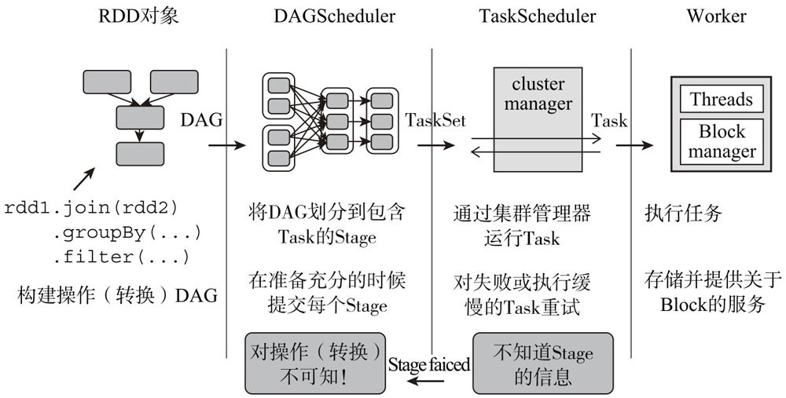
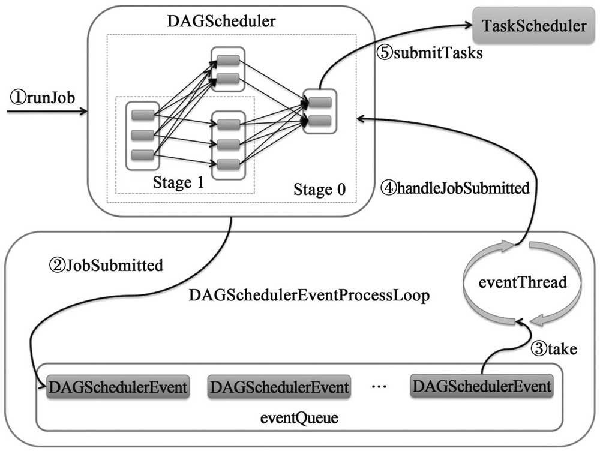
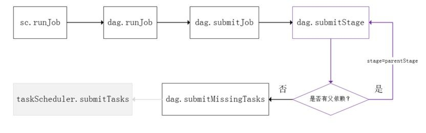
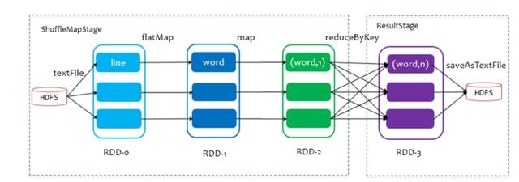
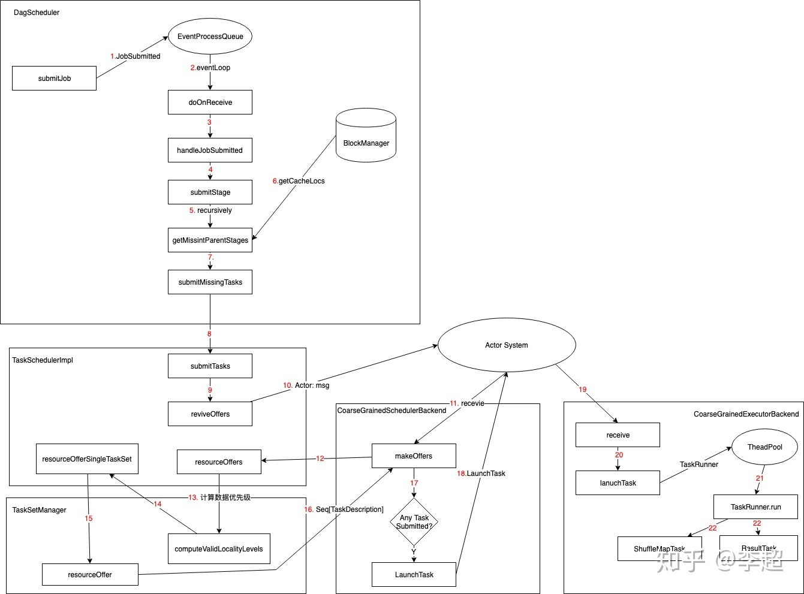
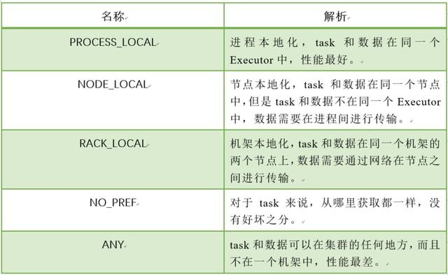
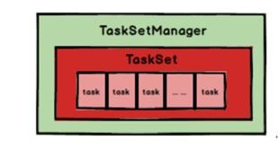
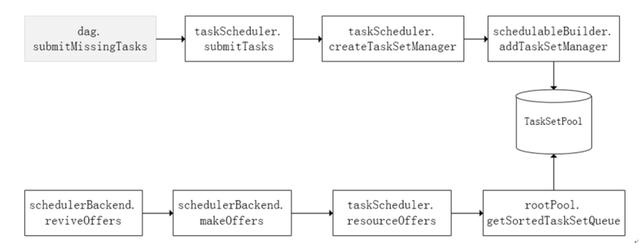

# 任务调度

## 概述

Spark的作业和任务调度系统是核心，它能够有效的进行调度的原因是对任务的划分DAG和容错，使得它对底层到顶层的各个模块之间的调用和处理显得游刃有余。

* JOB：RDD中由行动操作产生的一个或多个调度阶段；
* 调度阶段（stage）：每个作业会因为RDD之间的依赖拆分为多组任务集合，称为调度阶段，也叫任务集。调度阶段的划分是由DAGScheduler来划分。
* 任务（task）：分发到Executor上的工作任务，是Spark实际执行应用的最小单元。
* DAGScheduler：DAGScheduler是面向调度阶段的任务调度器，负责接收Spark应用提交的作业，根据RDD的依赖关系划分调度阶段，并提交调度阶段给TaskScheduler。
* TaskScheduler：TaskScheduler是面向任务的调度器，接收DAGScheduler提交过来的调度阶段，然后把任务分发到Work节点运行，由Work节点的Executor来运行。

Spark的作业调度主要是基于RDD的一系列操作构成一个作业，然后在Executor中执行，其中操作分为转换和行动操作，对于转换操作的计算是Lazy级别的，只有action操作才能触发作业的提交。

1. Spark程序提交后根据RDD之间的依赖关系构建DAG，交给DAGScheduler进行解析。
2. DAGScheduler面向调度阶段的高层次调度器，把DAG按照RDD依赖是否为宽依赖拆分成相互依赖的调度阶段，同时监控运行调度阶段的过程，如果调度失败，则重新提交该调度阶段。每个阶段包含一个或者多个任务集，提交到TaskScheduler进行调度执行。
3. 每个TaskScheduler接收DAGScheduler发过来的任务集，然后将任务分发到集群Worker节点中的Executor中运行。任务失败或者某个任务一直未执行完，TaskScheduler负责重试或者启动相同的任务。
4. Worker中的Executor接收到TaskScheduler发过来的任务后，多线程去运行，每个线程负责一个任务，运行结束后返回给TaskScheduler。

spark调度系统的主要工作流程如下：

Spark的调度系统主要由DAGScheduler和TaskScheduler组成，一路是Stage级的调度，一路是Task级的调度，总体调度流程如下图所示：

Spark RDD通过其Transactions操作，形成了RDD血缘关系图，即DAG，最后通过Action的调用，触发Job并调度执行。DAGScheduler负责Stage级的调度，主要是将job切分成若干Stages，并将每个Stage打包成TaskSet交给TaskScheduler调度。TaskScheduler负责Task级的调度，将DAGScheduler给过来的TaskSet按照指定的调度策略分发到Executor上执行，调度过程中SchedulerBackend负责提供可用资源，其中SchedulerBackend有多种实现，分别对接不同的资源管理系统。

Spark的任务调度是从DAG切割开始，主要是由DAGScheduler来完成。当遇到一个Action操作后就会触发一个Job的计算，并交给DAGScheduler来提交，下图是涉及到Job提交的相关方法调用流程图。


Job由最终的RDD和Action方法封装而成，SparkContext将Job交给DAGScheduler提交，它会根据RDD的血缘关系构成的DAG进行切分，将一个Job划分为若干Stages，具体划分策略是，由最终的RDD不断通过依赖回溯判断父依赖是否是宽依赖，即以Shuffle为界，划分Stage，窄依赖的RDD之间被划分到同一个Stage中，可以进行pipeline式的计算，如上图紫色流程部分。划分的Stages分两类，一类叫做ResultStage，为DAG最下游的Stage，由Action方法决定，另一类叫做ShuffleMapStage，为下游Stage准备数据，下面看一个简单的例子WordCount。

Job由saveAsTextFile触发，该Job由RDD-3和saveAsTextFile方法组成，根据RDD之间的依赖关系从RDD-3开始回溯搜索，直到没有依赖的RDD-0，在回溯搜索过程中，RDD-3依赖RDD-2，并且是宽依赖，所以在RDD-2和RDD-3之间划分Stage，RDD-3被划到最后一个Stage，即ResultStage中，RDD-2依赖RDD-1，RDD-1依赖RDD-0，这些依赖都是窄依赖，所以将RDD-0、RDD-1和RDD-2划分到同一个Stage，即ShuffleMapStage中，实际执行的时候，数据记录会一气呵成地执行RDD-0到RDD-2的转化。不难看出，其本质上是一个深度优先搜索算法。

一个Stage是否被提交，需要判断它的父Stage是否执行，只有在父Stage执行完毕才能提交当前Stage，如果一个Stage没有父Stage，那么从该Stage开始提交。Stage提交时会将Task信息（分区信息以及方法等）序列化并被打包成TaskSet交给TaskScheduler，一个Partition对应一个Task，另一方面TaskScheduler会监控Stage的运行状态，只有Executor丢失或者Task由于Fetch失败才需要重新提交失败的Stage以调度运行失败的任务，其他类型的Task失败会在TaskScheduler的调度过程中重试。


## DAGScheduler调度原理

DAGScheduler主要负责分析用户提交的应用，并根据计算任务的依赖关系建立DAG，然后将DAG划分为不同的Stage，其中每个Stage由可以执行的一组Task构成，这些Task的执行逻辑完全相同，只是作用于不同的数据，而且DAGScheduler在不同的资源管理框架下的实现是相同的，DAGScheduler将这组Task划分完成后，会将这组Task提交到TaskScheduler，TaskScheduler通过Cluster Manager在集群的某个Worker的Executor上启动任务。

DAGScheduler是sparkContext类中的一个变量，随着sparkContext的创建而创建,所以一个sparkcontext只会有一个DAGScheduler。
DAGScheduler类中有一个eventProcessLoop事件循环，用于从调用方接收事件并处理事件线程中的所有事件。它将启动一个独占事件线程来处理所有事件。如果多线程来来执行action，也是顺序投递到eventProcessLoop队列中。而通常说的调度策略，是指更细粒度的级别，即TaskScheduler的调度算法。

当一个action算子被触发时，最终会调用DAGScheduler中的submitJob()来提交任务，其实就是把消息放入事件队列，

```scala
def submitJob[T, U](
    rdd: RDD[T],
    func: (TaskContext, Iterator[T]) => U,
    partitions: Seq[Int],
    callSite: CallSite,
    resultHandler: (Int, U) => Unit,
    properties: Properties): JobWaiter[U] = {
  ...
 
  val waiter = new JobWaiter(this, jobId, partitions.size, resultHandler)
  eventProcessLoop.post(JobSubmitted( //把消息放入队列，稍后会处理，会调用此文件中的onReceive()方法
  jobId, rdd, func2, partitions.toArray, callSite, waiter,
  SerializationUtils.clone(properties)))
  ...
  waiter
}
```

eventProcessLoop是一个后台独立的循环线程，它会阻塞地等待消息，收到消息后，根据不同的消息类型，调用DAGScheduler不同的函数进行处理。

```scala
private def doOnReceive(event: DAGSchedulerEvent): Unit = event match {
  case JobSubmitted(jobId, rdd, func, partitions, callSite, listener, properties) =>
    dagScheduler.handleJobSubmitted(jobId, rdd, func, partitions, callSite, listener, properties)
  case StageCancelled(stageId, reason) =>
      dagScheduler.handleStageCancellation(stageId, reason)
  case JobCancelled(jobId, reason) =>
      dagScheduler.handleJobCancellation(jobId, reason)
    ...
}
```

提交任务时，dagScheduler会调用submitMissingTasks生成TaskSet，并且把它交给TaskScheduler调度，具体的转换过程如下：TODO

### 本地化调度

DAGScheduler切割Job，划分Stage, 通过调用submitStage来提交一个Stage对应的tasks，submitStage会调用submitMissingTasks，submitMissingTasks 确定每个需要计算的 task 的preferredLocations，通过调用getPreferrdeLocations()得到partition 的优先位置，由于一个partition对应一个task，此partition的优先位置就是task的优先位置，对于要提交到TaskScheduler的TaskSet中的每一个task，该task优先位置与其对应的partition对应的优先位置一致。

具体流程如下：

1. 首先从缓存中查找是否有此分区的位置信息，因为DAGScheduler会在本地保存一个rdd和分区位置的映射关系，查到一个就缓存一个。如果rdd的存储级别是NONE时，就直接返回一个空的列表。不为None时，才会从blockmanager获取rdd分区缓存的位置信息。
2. 如果上一步结果不为空，直接返回，否则进行下一步。
3. 如果RDD有位置偏好，获取rdd的位置偏好信息，首先从checkpoint中查找，没有的话再查找rdd的位置偏好信息，因为每个rdd在定义的时候都会实现5个函数，就包括位置偏好函数，一般都是从父rdd继承过来的位置信息。
4. 如果上一步不为空，则返回，否则进行一下步。
5. 如果rdd是窄依赖，则取第一个rdd的位置信息。

从调度队列中拿到TaskSetManager后，那么接下来的工作就是TaskSetManager按照一定的规则一个个取出task给TaskScheduler，TaskScheduler再交给SchedulerBackend去发到Executor上执行。前面也提到，TaskSetManager封装了一个Stage的所有task，并负责管理调度这些task。

根据每个task的优先位置，确定task的Locality级别，Locality一共有五种，优先级由高到低顺序：


在调度执行时，Spark调度总是会尽量让每个task以最高的本地性级别来启动，当一个task以X本地性级别启动，但是该本地性级别对应的所有节点都没有空闲资源而启动失败，此时并不会马上降低本地性级别启动而是在某个时间长度内再次以X本地性级别来启动该task，若超过限时时间则降级启动，去尝试下一个本地性级别，依次类推。

可以通过调大每个类别的最大容忍延迟时间，在等待阶段对应的Executor可能就会有相应的资源去执行此task，这就在在一定程度上提到了运行性能。

## Spark Task级调度

Spark Task的调度是由TaskScheduler来完成，由前文可知，DAGScheduler将Stage打包到TaskSet交给TaskScheduler，TaskScheduler会将TaskSet封装为TaskSetManager加入到调度队列中，TaskSetManager结构如下图所示。


TaskSetManager负责监控管理同一个Stage中的Tasks，TaskScheduler就是以TaskSetManager为单元来调度任务。

前面也提到，TaskScheduler初始化后会启动SchedulerBackend，它负责跟外界打交道，接收Executor的注册信息，并维护Executor的状态，所以说SchedulerBackend是管“粮食”的，同时它在启动后会定期地去“询问”TaskScheduler有没有任务要运行，也就是说，它会定期地“问”TaskScheduler“我有这么余量，你要不要啊”，TaskScheduler在SchedulerBackend“问”它的时候，会从调度队列中按照指定的调度策略选择TaskSetManager去调度运行，大致方法调用流程如下图所示：


图中，将TaskSetManager加入rootPool调度池中之后，调用SchedulerBackend的riviveOffers方法给driverEndpoint发送ReviveOffer消息；driverEndpoint收到ReviveOffer消息后调用makeOffers方法，过滤出活跃状态的Executor（这些Executor都是任务启动时反向注册到Driver的Executor），然后将Executor封装成WorkerOffer对象；准备好计算资源（WorkerOffer）后，taskScheduler基于这些资源调用resourceOffer在Executor上分配task。
