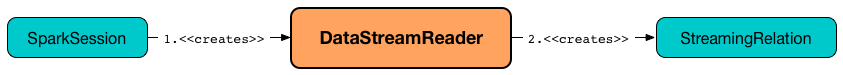

## 前言


一般的Structrued Streaming代码流程如下：
```scala
// 1. 设置数据源
val df = spark.readStream
      .format("kafka")
      .option("kafka.bootstrap.servers", bootstrapServers)
      .option("topic")
      .load()

// 2. 各种transform
// ...

// 3. 创建sink输出
val query = df.writeStream
        .outputMode("complete")
        .format("console")
        .option("checkpointLocation", "/tmp")
        .start()

query.awaitTermination()
```
我们将按这个流程分析。


## 创建数据源
DataStreamReader是生成流的入口所在，描述了数据如何从流数据源加载到DataFrame，可以设置数据的类型、schema和各种option，其中关键方法是load。


可以使用`SparkSession.readStream`来创建一个`DataStreamReader`。
```scala
import org.apache.spark.sql.SparkSession
val spark: SparkSession = ...

val streamReader = spark.readStream
```

`DataStreamReader`支持很多数据源，也支持自定义数据源。

在描述了从外部流数据源读取数据的流管道之后，最终会使用load操作符来触发加载。

Structured Streaming提供了两个流执行引擎（ stream execution engines）执行流查询:
* MicroBatchExecution 
* ContinuousExecution

下面看一下load函数的关键实现。
```scala
def load(): DataFrame = {
    // ... 

    // 先根据format函数指定的source来查找DataSource并实例化
    val ds = DataSource.lookupDataSource(source, sparkSession.sqlContext.conf).
      getConstructor().newInstance()/* 通过名字找到datasource的类并实例化 */

    // 根据不同的数据源类型构造不同的DataFrame
    ds match {
      case s: MicroBatchReadSupportProvider =>
      case s: ContinuousReadSupportProvider =>
}
```
（1）调用DataStreamReader.load()函数开始获取数据源的数据，并把数据保存成DataFrame。

（2）load()函数调用DataSource.lookupDataSource来获取数据源的类对象，并通过返回的类对象来创建数据源对象。可以支持多种数据源对象，比如：kafka、各种文件格式orc等。

（3）根据sparksession的选项（微批，还是持续流（默认））。若是微批，则调用对应的MicroBatchReadSupport实现类的createMicroBatchReader来创建数据源读取对象，若是kafka则会创建：KafkaMicroBatchReader对象。

（4）根据创建的对象，来创建DataFrame：Dataset.ofRows(…)

此时实际上是创建了一个查询计划，后面的各种操作都会基于该执行计划来进行计划的添加。

## 启动查询：start()

启动流的查询和处理是在dataset被创建完成后进行的写数据流中进行的，其实就是调用:Dataset#writeStream函数。该函数返回一个DataStreamWriter对象。

当调用DataStreamWriter#start()函数时，就开始执行流数据的读取和处理。start()函数会根据source的不同而进行不同的处理。source的类型主要有：
* memory
* foreach
* foreachBatch
* 非以上三种类型（一般模式）

start()函数的总体流程如下：

当调用DataStreamWriter#start()时会根据以创建的dataframe，调用startQuery开始流数据的获取和处理。

（1）创建数据源读取的对象。根据不同的模式创建的流读取对象也不同。比如：微批的kafka数据读取类为：KafkaMicroBatchReader等等。

（2）读取sparksession的配置选项

（3）调用df.sparkSession.sessionState.streamingQueryManager.startQuery()开始流数据的读取和处理。

```scala
def start(): StreamingQuery = {
    // ...

    // 四种soruce都会调用startQuery来启动数据流
    if (source == "memory"){startQuery}
    else if  (source == "foreach") {startQuery}
    else if (source == "foreachBatch") {startQuery}
    else {startQuery}

    // ... 
}
```


