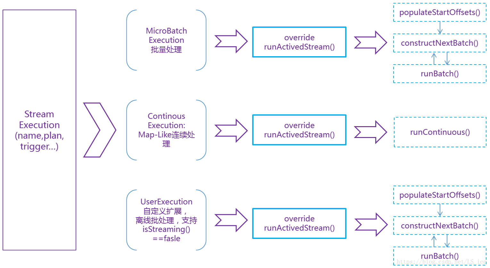
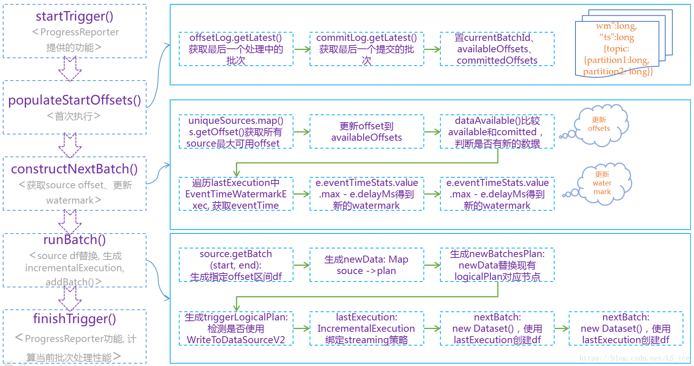

# 概述

## 前言

一般的Structrued Streaming代码流程如下：

```scala
// 1. 设置数据源
val df = spark.readStream
      .format("kafka")
      .option("kafka.bootstrap.servers", bootstrapServers)
      .option("topic")
      .load()

// 2. 各种transform
// ...

// 3. 创建sink输出
val query = df.writeStream
        .outputMode("complete")
        .format("console")
        .option("checkpointLocation", "/tmp")
        .start()

query.awaitTermination()
```

我们将按这个流程分析。

## 几个重要的类

### StreamingQueryManager

StreamingQueryManager是SparkSession的活动流查询的管理接口。StreamingQueryManager用于创建StreamingQuery(及其StreamExecution)。


在创建sparkSession过程中，会创建SessionState，SessionState的构造函数种的一个参数就是新创建的streamingQueryManager。streamingQueryManager管理着这个sparksession所有的查询流。


```scala
  def active: Array[StreamingQuery] = activeQueriesLock.synchronized {
    activeQueries.values.toArray
  }
  def get(id: UUID): StreamingQuery = activeQueriesLock.synchronized {
    activeQueries.get(id).orNull
  }
```

其中的StreamingQuery就是一个一个实时流，对应代码就是DataStreamWriter#start返回的结果。

```scala
def start(): StreamingQuery = {
  df.sparkSession.sessionState.streamingQueryManager.startQuery(
        extraOptions.get("queryName"),
        extraOptions.get("checkpointLocation"),
        df,
        extraOptions.toMap,
        sink,
        outputMode,
        useTempCheckpointLocation = true,
        trigger = trigger)
}
```

startQuery中会调用createQuery创建StreamingQueryWrapper，也就是StreamingQuery。StreamingQueryWrapper用函数方式包装了不可序列化的StreamExecution。用户侧用到的都是StreamingQueryWrapper。

### StreamExecution

StreamExecution是流查询引擎的基础，管理在单独线程上的一个Spark SQL query查询流。

StreamExecution是流查询的执行环境，它在每个触发器中执行，最后将结果添加到接收器中。


先定义好 Dataset/DataFrame 的产生、变换和写出，再启动 StreamExection 去持续查询。这些 Dataset/DataFrame 的产生、变换和写出的信息就对应保存在 StreamExecution 非常重要的 3 个成员变量中：

* sources: streaming data 的产生端（比如 kafka 等）
* logicalPlan: DataFrame/Dataset 的一系列变换（即计算逻辑）
* sink: 最终结果写出的接收端（比如 file system 等）

StreamExection 另外的重要成员变量是：

* currentBatchId: 当前执行的 id
* batchCommitLog: 已经成功处理过的批次有哪些
* offsetLog, availableOffsets, committedOffsets: 当前执行需要处理的 source data 的 meta 信息
* offsetSeqMetadata: 当前执行的 watermark 信息（event time 相关，本文暂不涉及、另文解析）等

我们将 Source, Sink, StreamExecution 及其重要成员变量标识在下图。


## 创建数据源

DataStreamReader是生成流的入口所在，描述了数据如何从流数据源加载到DataFrame，可以设置数据的类型、schema和各种option，其中关键方法是load。


可以使用`SparkSession.readStream`来创建一个`DataStreamReader`。

```scala
import org.apache.spark.sql.SparkSession
val spark: SparkSession = ...

val streamReader = spark.readStream
```

`DataStreamReader`支持很多数据源，也支持自定义数据源。

在描述了从外部流数据源读取数据的流管道之后，最终会使用load操作符来触发加载。

Structured Streaming提供了两个流执行引擎（ stream execution engines）执行流查询:

* MicroBatchExecution
* ContinuousExecution

下面看一下load函数的关键实现。

```scala
def load(): DataFrame = {
    // ... 

    // 先根据format函数指定的source来查找DataSource并实例化
    val ds = DataSource.lookupDataSource(source, sparkSession.sqlContext.conf).
      getConstructor().newInstance()/* 通过名字找到datasource的类并实例化 */

    // 根据不同的数据源类型构造不同的DataFrame
    ds match {
      case s: MicroBatchReadSupportProvider =>
      case s: ContinuousReadSupportProvider =>
}
```

（1）调用DataStreamReader.load()函数开始获取数据源的数据，并把数据保存成DataFrame。

（2）load()函数调用DataSource.lookupDataSource来获取数据源的类对象，并通过返回的类对象来创建数据源对象。可以支持多种数据源对象，比如：kafka、各种文件格式orc等。

（3）根据sparksession的选项（微批，还是持续流（默认））。若是微批，则调用对应的MicroBatchReadSupport实现类的createMicroBatchReader来创建数据源读取对象，若是kafka则会创建：KafkaMicroBatchReader对象。

（4）根据创建的对象，来创建DataFrame：Dataset.ofRows(…)

此时实际上是创建了一个查询计划，后面的各种操作都会基于该执行计划来进行计划的添加。

## 启动查询：start()

启动流的查询和处理是在dataset被创建完成后进行的写数据流中进行的，其实就是调用:Dataset#writeStream函数。该函数返回一个DataStreamWriter对象。

当调用DataStreamWriter#start()函数时，就开始执行流数据的读取和处理。start()函数会根据source的不同而进行不同的处理。source的类型主要有：

* memory
* foreach
* foreachBatch
* 非以上三种类型（一般模式）

start()函数的总体流程如下：

当调用DataStreamWriter#start()时会根据以创建的dataframe，调用startQuery开始流数据的获取和处理。

（1）创建数据源读取的对象。根据不同的模式创建的流读取对象也不同。比如：微批的kafka数据读取类为：KafkaMicroBatchReader等等。

（2）读取sparksession的配置选项

（3）调用df.sparkSession.sessionState.streamingQueryManager.startQuery()开始流数据的读取和处理。

```scala
def start(): StreamingQuery = {
    // ...

    // 四种soruce都会调用startQuery来启动数据流
    if (source == "memory"){startQuery}
    else if  (source == "foreach") {startQuery}
    else if (source == "foreachBatch") {startQuery}
    else {startQuery}

    // ... 
}
```

startQuery里会创建StreamingQueryWrapper，然后启动query.streamingQuery.start()，真正的数据处理就在这一步。

```scala
  def start(): Unit = {
    logInfo(s"Starting $prettyIdString. Use $resolvedCheckpointRoot to store the query checkpoint.")
    queryExecutionThread.setDaemon(true)
    queryExecutionThread.start()
    startLatch.await()  // Wait until thread started and QueryStart event has been posted
  }
```

实际是执行queryExecutionThread的run()方法：

```scala
 val queryExecutionThread: QueryExecutionThread =
    new QueryExecutionThread(s"stream execution thread for $prettyIdString") {
      override def run(): Unit = {
        // To fix call site like "run at <unknown>:0", we bridge the call site from the caller
        // thread to this micro batch thread
        sparkSession.sparkContext.setCallSite(callSite)
        runStream()
      }
    }
```

runStream()分为环境的初始化、启动和执行过程中的异常处理try{…}catch{…}结构、其核心方法是runActivatedStream(sparkSessionForStream)，具体的实现在MicroBatchExecution（批量处理）、ContinuousExecution（连续处理）这个两个子类中均有各自具体的实现。

runActivatedStream执行每批次流处理的整体逻辑：


* startTrigger()和finishTrigger()： 是ProgressReporter提供的功能，用于统计流处理性能
* populateStartOffset()：从配置的checkPoint目录读取offsets、commit子目录最大数字序号的文件内容，替换内存中watermark、availableOffsets、committedOffsets对象，比较提交的版本，决定是否恢复上次程序运行的流处理进度;
* constructNextBatch()：获取sources的最大offsets、 lastExecution.executedPlan.collect()方式获取上个批次的EventTimeWatermarkExec并更新watermark。offsetLog.purge()方法保存最近100个BatchID

## checkpoint root目录内容分析

* commits目录的创建在StreamExecution：val commitLog = new CommitLog(sparkSession, checkpointFile(“commits”))，使用commitLog.add(currentBatchId)添加新版本，commitLog.getLatest()获取最近提交的版本号
* metadata文件对应StreamExecution的streamMetadata成员遍历，记录的是当前目录的id: UUID，可用于计算进度恢复
* offsets目录的创建在StreamExecution：val offsetLog = new OffsetSeqLog(sparkSession, checkpointFile(“offsets”))，使用offsetLog .add()添加新版本，offsetLog .getLatest()获取最近运行的batchID信息
* sources目录在MicroBatchExecution的logicalPlan创建过程中定义，即val metadataPath = s”nextSourceId”，
* state目录存储的是StateStore聚合状态的数据


