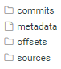

#

实时计算很简单，难的是准确性和可靠性。

如果Strunctred Streaming实时计算作业遇到了某个错误挂掉了，那么我们可以配置容错机制让它自动重启，同时继续之前的进度运行下去。这是通过checkpoint和wal机制完成的。

checkpoint目录格式如下;



* __metadata:__ 
  
  这个文记录了这个query的id，id采用java的UUID来生成，在k中，一次完整的source-sink可以当成是一个query，代码而言就是再调用DataFrameWriter.start()的时候，创建一个query，并且把这个id存在checkpoint中，以后恢复继续使用这个id。内容为：

  `{"id":"fb0538f5-e9bb-42e3-a803-0fff50ad96f0"}`

* __soures:__
  
  目录结构：`$checkpoint/sources/$sourceId/$batchId`

  这个目录用于辅助source，方便source存储一些自己需要的数据，拿kafka来说，sources目录下存储了初始化的topic，partition，offset数据。啊、从实际作用上并不是必须的，因此这个功能也可以理解为方便再次获取这些数据，起到辅助作用。
  
  ```json
  v1
  {"MessageFace":{"8":0,"2":0,"5":0,"4":0,"7":0,"1":0,"9":0,"3":0,"6":0,"0":0}}
  ```

* __offset:__
  
  目录结构：`$checkpoint/offset/$batchId`

  这个目录记录了source的元数据，offset是针对消费数据的记录索引，并用batchId作为文件名，记录每个batch的offset，比如soure是kafka的时候，offset里就记录了消费的kafka的topic，partition以及offset。内容如下：

  ```json
  v1
  {"batchWatermarkMs":0,"batchTimestampMs":1640159700001,"conf":{"spark.sql.streaming.stateStore.providerClass":"org.apache.spark.sql.execution.streaming.state.HDFSBackedStateStoreProvider","spark.sql.streaming.flatMapGroupsWithState.stateFormatVersion":"2","spark.sql.streaming.multipleWatermarkPolicy":"min","spark.sql.streaming.aggregation.stateFormatVersion":"2","spark.sql.shuffle.partitions":"8"}}
  {"MessageFace":{"8":102427,"2":103123,"5":103448,"4":103021,"7":102996,"1":103267,"9":103378,"3":103160,"6":103776,"0":103131}}
  ```

* __commits:__
  
  目录结构：`$checkpoint/commits/$batchId`

  这个目录记录了已经成功执行完成的batch，当一个batch开始执行时，spark会在hdfs上记录一个offset文件，当这个batch执行完成后，spark会在hdfs上记录一个commits文件，表明这个batch正常，不需要回滚。内容如下：

  ```json
  v1
  {"nextBatchWatermarkMs":0}
  ```

* __state:__
  
  目录结构：`$checkpoint/state/xxx.delta` 或者  `$checkpoint/state/xxx.snapshot`

  这个目录里存放sql的中间结果数据，针对几种规则做一些快照，比如聚合操作，就需要记录每个batch的聚合结果，试想一下，累加一个字段，那么recover后就需要把之前累加的值还原，否则最后的结果就会变小，这个checkpoint就形同虚设了。除了聚合，常见的还有去重，limit等操作。state也有很多限制，spark默认实现了一个基于HDFS的StateStore。

下面以MicroBatchExecution为例说一下checkpoint的用法。

当DataStreamReader调用start()启动一个流时，内部会创建一个MicroBatchExecution，然后调用runActivatedStream启动流查询。MicroBatchExecution继承自StreamExecution，它有几个成员表变量会自动初始化：

```scala
/** The current batchId or -1 if execution has not yet been initialized. */
protected var currentBatchId: Long = -1
val offsetLog = new OffsetSeqLog(sparkSession, checkpointFile("offsets"))
val commitLog = new CommitLog(sparkSession, checkpointFile("commits"))
```

之后调用MicroBatchExecution#runActivatedStream启动实时流查询。如果是第一次启动或者重启，需要从上次停止的地方读数据，就需要恢复offset信息。

```scala
// We'll do this initialization only once every start / restart
if (currentBatchId < 0) {
    populateStartOffsets(sparkSessionForStream)
}
```

populateStartOffset函数作用就是恢复当前batch的start offsets。就是错误恢复的第一步，找到之前处理数据的开始偏移量。这个函数会对 `currentBatchId`、`committedOffsets`、`availableOffsets`进行填充。

该方法的基本流程如下:

1. 从offset日志中找到之前batch保存的最大的一个偏移量文件；
2. 如果存在：
   1. 将下一个要执行的批次设置为最后一个恢复的批次
   2. 检查commit日志，查看最后提交的是哪个批次
   3. 如果offset恢复出来的最后一个批次等于commit最后一个批次：
      1. 使用最后一批开始和结束偏移量调用getBatch（因为有些源假设最后一个批处理总是重新执行），这是一个空调用，读出来的数据不会进行任何处理。
      2. 结束
3. 如果不存在，这是一个新的实时流。

恢复完offset以后，就开始处理数据了，首先判断一下是否需要执行：

* 有新的数据到来
* 某些状态操作符需要超时或者清除操作

满足上面任一条件，都会执行下一循环。
如果有新数据需要处理，就会按照每批次处理的最大数据量（可配）来更新availableOffsets，如果需要执行当前批次的话，会写offset文件，持久化一些这批次处理的数据范围。
继续之前，还会对offset文件做一些清理，默认只保留100个文件

如果判断需要继续执行，则开始运行runBatch，运行成功后，会修改commit文件，提交已处理数据的偏移量。

这样就循环处理，checkpoint中的offset和commit都会不断往前移动。

## 总结

这里介绍了实时计算中checkpoint的offset和commit文件是怎么读取和写入的，总结一下：

1. 首先第一次启动或重启的时候，先从offset和commit中恢复偏移量，都是按照batchId来读取文件的，如果offset目录中的最大batchId和commit目录中的最大BatchId相等，就说明上一批次已经处理成功了，然后对某些source，可能会再读取一下数据，但是不真正处理，然后修改一下偏移量；
2. 如果第一次启动恢复偏移量以后，发现上一次没有处理成功，就会再按照上一次ofset和commit中的偏移量处理一次，处理的数据和上一次一模一样，不会从数据源读取新数据；
3. 如果第一次启动恢复偏移量后，发现上一次处理成功，则就会从数据源读取可用的最大偏移量，然后再结合配置的每批次可处理的=最大数据量来更新availableOffsets，然后调用runBatch处理，完了以后提交commit
