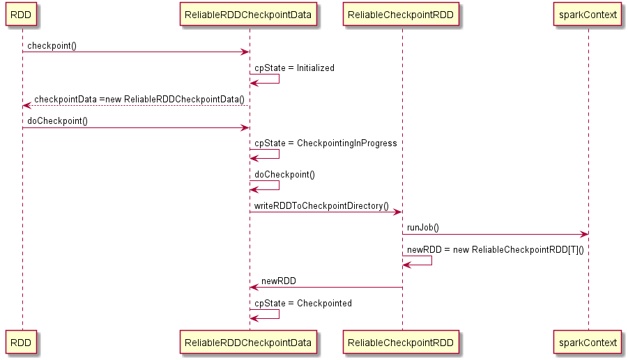

# Checkpoint原理

## Checkpoint是什么

checkpoint是一个截断RDD血缘关系并将其保存到可靠的分布式(HDFS)或本地文件系统的过程。

有两种类型的checkpoint:

* reliable ， 在 Spark (core), 将实际的中间RDD数据保存到可靠的分布式文件系统的checkpoint, e.g. HDFS.
* local ，在 Spark Streaming或者 GraphX，截断RDD血缘关系的checkpoint.

## 什么时候需要checkpoint？

CheckPoint 是用来保证数据的容错和高可用而产生的，在一个复杂的 Spark 作业中，从初始的 RDD 到最后的结果，中间有大量的操作，整个程序运行时间较长，而如果此时某个节点故障，或者其他原因导致数据丢失，那么此时，后续的计算就无法继续，我们知道通常一个 RDD 是由上一个 RDD 计算的来，如果经常要复用某个 RDD，此时 RDD 数据丢失，只能根据数据来源重新计算，前面说过如果这过程复杂而耗时，那么将会浪费大量的时间来处理这种故障，这显然是不应该的，但是这种故障对于高负载的集群来说可能是经常性发生的问题。那么如何解决这种问题呢，答案就是CheckPoint机制。

## checkpoint和cache/persisit的区别

cache/persisit 和 checkpoint 是有显著区别的， cache/persisit把 RDD 计算出来然后放在内存或者磁盘中，由exector的bloclManager维护， RDD 的依赖关系仍然保留， 不会丢掉， 当某个点某个 executor 宕了， 上面cache 的RDD就会丢掉， 需要通过 依赖链重新计算出来， 不同的是， checkpoint 是把 RDD 保存在 HDFS中， 是多副本可靠存储，依赖关系被丢掉了， 是通过复制实现的高容错。

## spark core中的checkpoint

使用checkpoint的一般流程如下：

```scala
sc.setCheckpointDir(checkpointDir.toString)
val rdd = sc.makeRDD(1 to 20, numSlices = 1)
rdd.cache()
rdd.checkpoint()
rdd.count()
```

首先设置checkpoint目录，一般为hdfs目录，因为checkpoint也是转换，只有等action的时候才会触发计算，并且在正常的Job计算完成之后会单独灵气一个任务来计算checkpoint，所以最好对RDD事先缓存起来，避免重复计算。

## checkpoint的创建过程

checkpoint的创建过程大概如下：


## checkpoint的创建过程源码分析

1. RDD调用checkpoint(), 标记此RDD需要持久化，checkpoint状态设为Initialized.

   ```scala
   /**
    * Mark this RDD for checkpointing. It will be saved to a file inside the checkpoint
    * directory set with `SparkContext#setCheckpointDir` and all references to its parent
    * RDDs will be removed. This function must be called before any job has been
    * executed on this RDD. It is strongly recommended that this RDD is persisted in
    * memory, otherwise saving it on a file will require recomputation.
    */
    def checkpoint(): Unit = RDDCheckpointData.synchronized {
        // NOTE: we use a global lock here due to complexities downstream with ensuring
        // children RDD partitions point to the correct parent partitions. In the future
        // we should revisit this consideration.
        if (context.checkpointDir.isEmpty) {
            throw new SparkException("Checkpoint directory has not been set in the SparkContext")
        } else if (checkpointData.isEmpty) {
            //创建一个ReliableRDDCheckpointData对象，在它的基类RDDCheckpointData里会初始化checkpoint状态为Initialized
           checkpointData = Some(new ReliableRDDCheckpointData(this))
        }
    }
   ```

2. 当一个job完成以后，spark会调用doCheckpoint()，开始checkpoint流程，所以RDD最好cache到内存中，避免二次计算.

    ```scala
    def runJob[T, U: ClassTag](
    rdd: RDD[T],
    func: (TaskContext, Iterator[T]) => U,
    partitions: Seq[Int],
    resultHandler: (Int, U) => Unit): Unit = {

    ...
    dagScheduler.runJob(rdd, cleanedFunc, partitions, callSite, resultHandler, localProperties.get)
        progressBar.foreach(_.finishAll())
        //job计算完成以后，调用doCheckpoint()
        rdd.doCheckpoint()
    }

    /**
    * Performs the checkpointing of this RDD by saving this. It is called after a job using this RDD
    * has completed (therefore the RDD has been materialized and potentially stored in memory).
    * doCheckpoint() is called recursively on the parent RDDs.
    */
    private[spark] def doCheckpoint(): Unit = {
    RDDOperationScope.withScope(sc, "checkpoint", allowNesting = false, ignoreParent = true) {
        if (!doCheckpointCalled) {
        doCheckpointCalled = true
        if (checkpointData.isDefined) {
            if (checkpointAllMarkedAncestors) {
            // TODO We can collect all the RDDs that needs to be checkpointed, and then checkpoint
            // them in parallel.
            // Checkpoint parents first because our lineage will be truncated after we
            // checkpoint ourselves
            dependencies.foreach(_.rdd.doCheckpoint())
            }
            //ReliableRDDCheckpointData的checkpoint
            checkpointData.get.checkpoint()  
        } else {
            dependencies.foreach(_.rdd.doCheckpoint())
        }
        }
        }
    }
    ```

3. RDD的doCheckpoint()方法会调用ReliableRDDCheckpointData的checkpoint().

    ```scala
    /**
    * Materialize this RDD and persist its content.
    * This is called immediately after the first action invoked on this RDD has completed.
    */
    final def checkpoint(): Unit = {
    // Guard against multiple threads checkpointing the same RDD by
    // atomically flipping the state of this RDDCheckpointData
    RDDCheckpointData.synchronized {
        if (cpState == Initialized) {
        //修改checkpoint状态为CheckpointingInProgress
        cpState = CheckpointingInProgress
        } else {
        return
        }
    }
    
    //进行RDD的checkpoint
    val newRDD = doCheckpoint()
    
    // Update our state and truncate the RDD lineage
    RDDCheckpointData.synchronized {
        cpRDD = Some(newRDD)
        //更新状态为Checkpointed
        cpState = Checkpointed
        rdd.markCheckpointed()
    }
    }
 
 
    
    /**
    * Materialize this RDD and write its content to a reliable DFS.
    * This is called immediately after the first action invoked on this RDD has completed.
    */
    protected override def doCheckpoint(): CheckpointRDD[T] = {
    val newRDD = ReliableCheckpointRDD.writeRDDToCheckpointDirectory(rdd, cpDir)
    
    // Optionally clean our checkpoint files if the reference is out of scope
    if (rdd.conf.getBoolean("spark.cleaner.referenceTracking.cleanCheckpoints", false)) {
        rdd.context.cleaner.foreach { cleaner =>
        cleaner.registerRDDCheckpointDataForCleanup(newRDD, rdd.id)
        }
    }
    
    logInfo(s"Done checkpointing RDD ${rdd.id} to $cpDir, new parent is RDD ${newRDD.id}")
    newRDD
    }   
    ```

4. 然后ReliableRDDCheckpointData调用ReliableCheckpointRDD.writeRDDToCheckpointDirectory启动任务去写checkpoint文件

    ```scala
    /**
    * Write RDD to checkpoint files and return a ReliableCheckpointRDD representing the RDD.
    */
   def writeRDDToCheckpointDirectory[T: ClassTag](
       originalRDD: RDD[T],
       checkpointDir: String,
       blockSize: Int = -1): ReliableCheckpointRDD[T] = {
     val checkpointStartTimeNs = System.nanoTime()
    
     val sc = originalRDD.sparkContext
    
     // Create the output path for the checkpoint
     val checkpointDirPath = new Path(checkpointDir)
     val fs = checkpointDirPath.getFileSystem(sc.hadoopConfiguration)
     if (!fs.mkdirs(checkpointDirPath)) {
       throw new SparkException(s"Failed to create checkpoint path $checkpointDirPath")
     }
    
     // Save to file, and reload it as an RDD
     val broadcastedConf = sc.broadcast(
       new SerializableConfiguration(sc.hadoopConfiguration))
     // TODO: This is expensive because it computes the RDD again unnecessarily (SPARK-8582)
     sc.runJob(originalRDD,
       writePartitionToCheckpointFile[T](checkpointDirPath.toString, broadcastedConf) _)
    
     if (originalRDD.partitioner.nonEmpty) {
       writePartitionerToCheckpointDir(sc, originalRDD.partitioner.get, checkpointDirPath)
     }
    
     val checkpointDurationMs =
       TimeUnit.NANOSECONDS.toMillis(System.nanoTime() - checkpointStartTimeNs)
     logInfo(s"Checkpointing took $checkpointDurationMs ms.")
    
     val newRDD = new ReliableCheckpointRDD[T](
       sc, checkpointDirPath.toString, originalRDD.partitioner)
     if (newRDD.partitions.length != originalRDD.partitions.length) {
       throw new SparkException(
         "Checkpoint RDD has a different number of partitions from original RDD. Original " +
           s"RDD [ID: ${originalRDD.id}, num of partitions: ${originalRDD.partitions.length}]; " +
           s"Checkpoint RDD [ID: ${newRDD.id}, num of partitions: " +
           s"${newRDD.partitions.length}].")
     }
     newRDD
   }
    ```

## checkpoint的创建过程

checkpoint的读取过程比较简单，就是RDD在读取父RDD分区时，会找到checkpointRDD,然后通过checkpointRDD加载checkpoint文件。

## checkpoint的读取过程源码分析

1. spark真正调用计算方法的逻辑runTask调用 rdd.iterator() 去计算该 rdd 的 partition.

    ```scala
    /**
    * Internal method to this RDD; will read from cache if applicable, or otherwise compute it.
    * This should ''not'' be called by users directly, but is available for implementors of custom
    * subclasses of RDD.
    */
   final def iterator(split: Partition, context: TaskContext): Iterator[T] = {
     if (storageLevel != StorageLevel.NONE) {
       getOrCompute(split, context)//当一个RDD缓存时，获取或者计算它
     } else {如果没有缓存，计算它
       computeOrReadCheckpoint(split, context)
     }
   }
    
    
    
    
   /**
    * Compute an RDD partition or read it from a checkpoint if the RDD is checkpointing.
    */
   private[spark] def computeOrReadCheckpoint(split: Partition, context: TaskContext): Iterator[T] =
   {
     if (isCheckpointedAndMaterialized) {
       //最终会调到checkpointRDD的compute
       firstParent[T].iterator(split, context)
     } else {
       compute(split, context)
     }
   }
    ```

2. checkpointRDD的compute（以ReliableCheckpointRDD为例）

    ```scala
    /**
    * Read the content of the checkpoint file associated with the given partition.
    */
   override def compute(split: Partition, context: TaskContext): Iterator[T] = {
     val file = new Path(checkpointPath, ReliableCheckpointRDD.checkpointFileName(split.index))
     ReliableCheckpointRDD.readCheckpointFile(file, broadcastedConf, context)
   }
    
    
    
    
   /**
    * Read the content of the specified checkpoint file.
    */
   def readCheckpointFile[T](
       path: Path,
       broadcastedConf: Broadcast[SerializableConfiguration],
       context: TaskContext): Iterator[T] = {
     val env = SparkEnv.get
     val fs = path.getFileSystem(broadcastedConf.value.value)
     val bufferSize = env.conf.getInt("spark.buffer.size", 65536)
     val fileInputStream = {
       val fileStream = fs.open(path, bufferSize)
       if (env.conf.get(CHECKPOINT_COMPRESS)) {
         CompressionCodec.createCodec(env.conf).compressedInputStream(fileStream)
       } else {
         fileStream
       }
     }
     val serializer = env.serializer.newInstance()
     val deserializeStream = serializer.deserializeStream(fileInputStream)
    
     // Register an on-task-completion callback to close the input stream.
     context.addTaskCompletionListener[Unit](context => deserializeStream.close())
    
     deserializeStream.asIterator.asInstanceOf[Iterator[T]]
   }
    ```

## spark streaming中的checkpoint（TODO）
