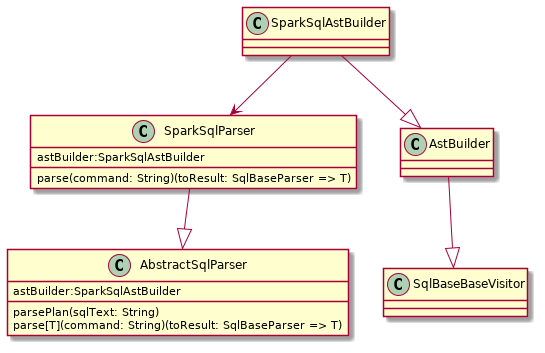
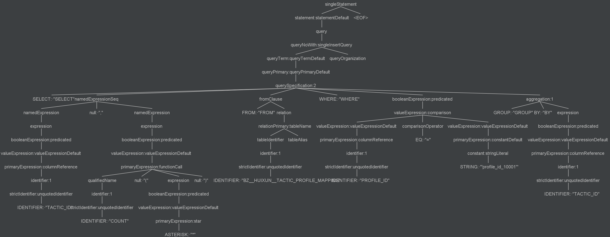
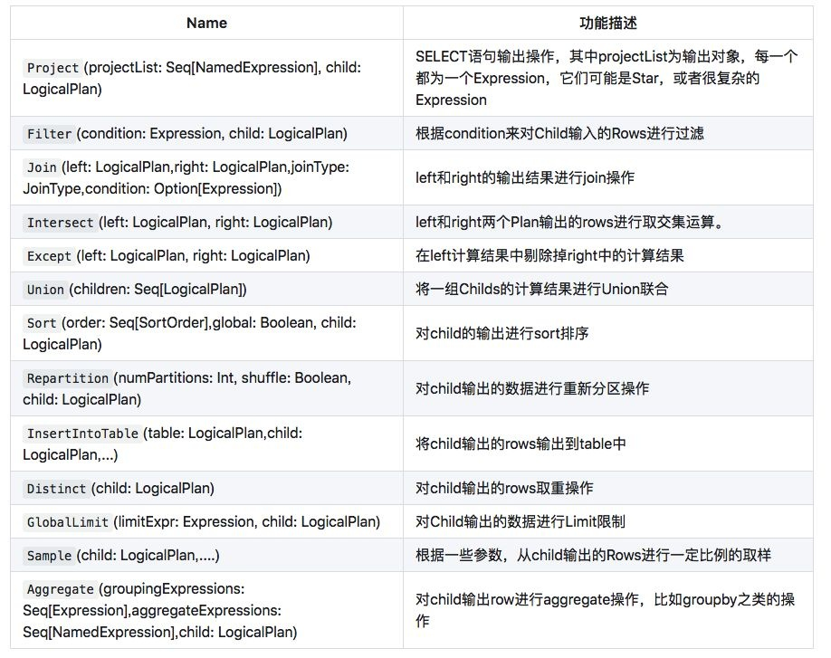

# 入口

[TOC]

spark程序的入口就是sparkSession，sparkSession提供了用户与spark各项功能打交道的统一对象。

## sparkSession的初始化

sparkSession在初始化的时候，会创建各种组件，这些关键的组件在后面将会发挥关键作用。

```scala
def build(): SessionState = {
  new SessionState(
    session.sharedState,
    conf,
    experimentalMethods,
    functionRegistry,
    udfRegistration,
    () => catalog, //元数据信息
    sqlParser,    //语法解析器
    () => analyzer,    //分析器
    () => optimizer,   //优化器
    planner,  //优化后的逻辑计划转变为物理计划
    streamingQueryManager,
    listenerManager,
    () => resourceLoader,
    createQueryExecution, //QueryExecution生成器
    createClone)
}
```

* sqlParser：解析器，从SQL文本中提取表达式、计划、表标识符等。目前spark都使用ANTLR来进行语法解析；
* analyzer：逻辑查询计划分析器，用于和元数据绑定，解析sql中具体的字段和类型；
* optimizer：逻辑计划的优化器，用于优化解析后的逻辑计划；
* planner：把优化后的逻辑计划转换为物理可执行计划；
* QueryExecution：封装了整个spark sql执行的工作流。是用户可以很轻松访问查询计划的中间状态。

## sql语法的解析

spark sql的语法解析主要依赖Antlr。当调用spark.sql("xxx")时，按照SqlBase.g4定义的语法规则，触发sql的解析。



```scala
//1. sqlParser默认使用SparkSqlParser解析器（可以自定义扩展）
def sql(sqlText: String): DataFrame = {
    Dataset.ofRows(self, sessionState.sqlParser.parsePlan(sqlText))
  }
 
//2. SparkSqlParser会创建具体的语法解析树SparkSqlAstBuilder
class SparkSqlParser(conf: SQLConf) extends AbstractSqlParser {
  val astBuilder = new SparkSqlAstBuilder(conf)
 
  private val substitutor = new VariableSubstitution(conf)
 
  protected override def parse[T](command: String)(toResult: SqlBaseParser => T): T = {
    super.parse(substitutor.substitute(command))(toResult)
  }
}
 
  //ParseDriver.scala中的AbstractSqlParser类
  /** Creates LogicalPlan for a given SQL string. */
  override def parsePlan(sqlText: String): LogicalPlan = parse(sqlText) { parser =>
    astBuilder.visitSingleStatement(parser.singleStatement()) match {
      case plan: LogicalPlan => plan
      case _ =>
        val position = Origin(None, None)
        throw new ParseException(Option(sqlText), "Unsupported SQL statement", position, position)
    }
  }
```

SparkSqlAstBuilder -> AstBuilder -> SqlBaseBaseVisitor

SqlBaseBaseVisitor是 antlr自动生成的访问者类，在遍历语法树节点的时候会自动调用相应的处理函数，默认实现都是空的。SparkSqlAstBuilder 和AstBuilder 继承并重写了SqlBaseBaseVisitor自动生成的函数。

antlr解析完sql语句，生成如下语法树：


SparkSqlAstBuilder 覆盖重写了SqlBaseBaseVisitor大部分函数，它把antlr的语法树转换成了LogicalPlan（其实也就是TreeNode），比如，把select节点转换成Project节点，where节点转换成filter节点。

一些常用的LogicalPlan：


## 构造Dataset

一般调用spark sql的方法是sparkSession中的sql()方法。具体看一下sql方法的实现：

```scala
    val tracker = new QueryPlanningTracker
    val plan = tracker.measurePhase(QueryPlanningTracker.PARSING) {
      sessionState.sqlParser.parsePlan(sqlText)
    }
    Dataset.ofRows(self, plan, tracker)
```

其中：

* sessionState.sqlParser.parsePlan(sqlText)是把字符串sql语句解析成语法树，只限sql的语法解析，然后形成逻辑计划。
  sqlParser是SessionState初始化的时候创建的，默认是调用SparkSqlParser的解析方法，也可以自定义扩展。

  ```scala
    protected lazy val sqlParser: ParserInterface = {
      extensions.buildParser(session, new SparkSqlParser(conf))
    }
  ```

* Dataset.ofRows(self, plan, tracker)中会通过逻辑计划，进行规则优化，生成物理计划，然后再调用dataset的action算子的时候，再触发计算。

ofRows里就分为了两部分，
里会从逻辑计划一步一步构造物理执行计划，然后就是dataset的计算。

下面是ofRows函数，可以很明显看到，里面两部分功能泾渭分明，QueryExecution生成物理计划，new Dataset生成Dataset，这两部分设计的内容都很庞大复杂，后面再一点一点解释。

```scala
  def ofRows(sparkSession: SparkSession, logicalPlan: LogicalPlan, tracker: QueryPlanningTracker)
    : DataFrame = {
    // 这里生成物理计划
    val qe = new QueryExecution(sparkSession, logicalPlan, tracker)
    qe.assertAnalyzed()

    // 这里构造dataset
    new Dataset[Row](sparkSession, qe, RowEncoder(qe.analyzed.schema))
  }
}
```
