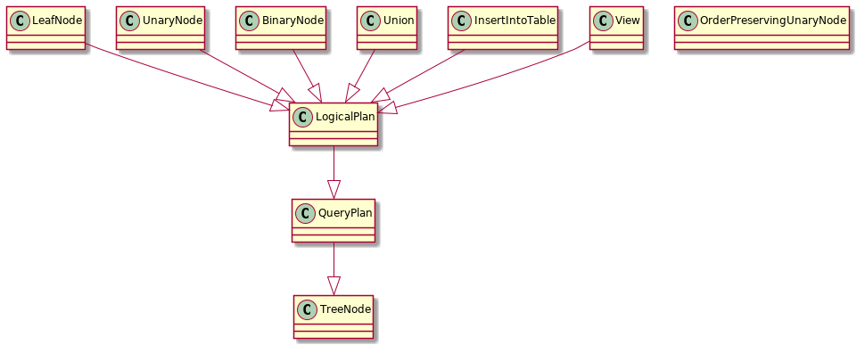
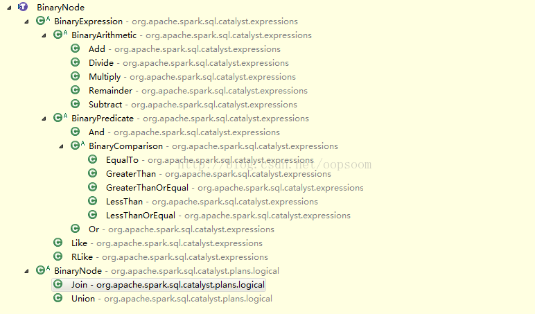
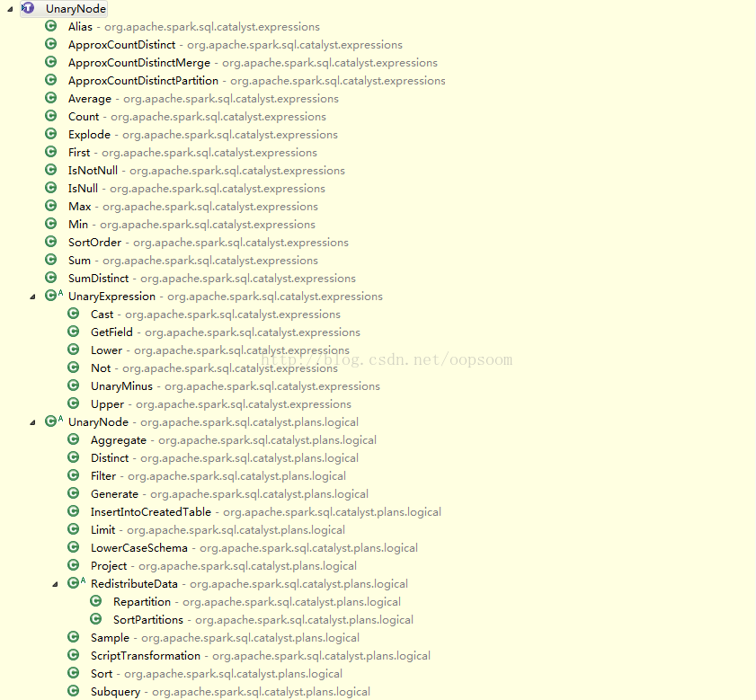
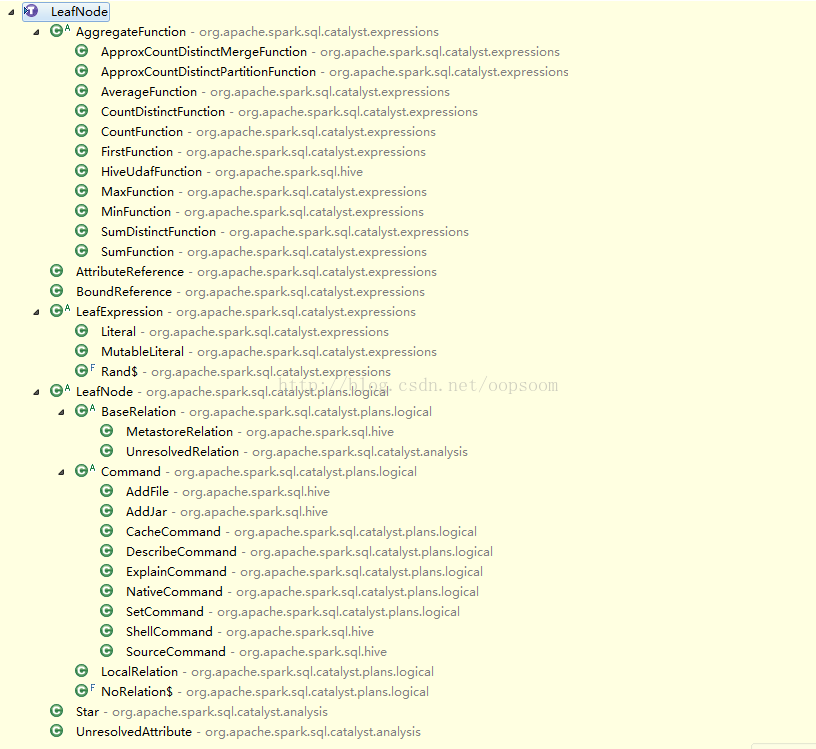

TreeNode是Catalyst的核心类库，语法树的构建都是由一个个TreeNode组成。TreeNode本身是一个BaseType <: TreeNode[BaseType] 的类型，首先它是一个抽象类，其子类分为两种，逻辑计划 LogicalPlan，物理计划 SparkPlan。

TreeNode还继承了 Product 接口，支持遍历构造方法的参数。
TreeNode有三种形态：BinaryNode、UnaryNode、LeafNode. 
在Catalyst里，这些Node都是继承自Logical Plan，可以说每一个TreeNode节点就是一个Logical Plan(包含Expression）（直接继承自TreeNode）



TreeNode的作用就是定了语法树最近本的各种操作，比如树的前序中序后续遍历、节点的查找、转换等等基本操作，


## BinaryNode 
二元节点，即有左右孩子的二叉节点。 节点定义比较简单，左孩子，右孩子都是BaseType。 children是一个Seq（left, right）。
```scala
[[TreeNode]] that has two children, [[left]] and [[right]]. 
trait BinaryNode[BaseType <: TreeNode[BaseType]] { 
  def left: BaseType 
  def right: BaseType 
  def children = Seq(left, right) 
} 
abstract class BinaryNode extends LogicalPlan with trees.BinaryNode[LogicalPlan] { 
  self: Product => 
}
```

面列出主要继承二元节点的类，



## UnaryNode

一元节点，即只有一个孩子节点.
```scala
A [[TreeNode]] with a single [[child]]. 
trait UnaryNode[BaseType <: TreeNode[BaseType]] { 
  def child: BaseType 
  def children = child :: Nil 
} 
abstract class UnaryNode extends LogicalPlan with trees.UnaryNode[LogicalPlan] { 
  self: Product => 
}
```
下面列出主要继承一元节点的类，



## Leaf Node 

叶子节点，没有孩子节点的节点。
```scala
A [[TreeNode]] with no children. 
trait LeafNode[BaseType <: TreeNode[BaseType]] { 
  def children = Nil 
} 
abstract class LeafNode extends LogicalPlan with trees.LeafNode[LogicalPlan] { 
  self: Product => 
  // Leaf nodes by definition cannot reference any input attributes. 
  override def references = Set.empty 
}
```



