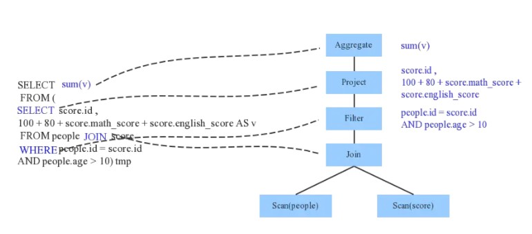

# Parser模块简介

从sql字符串到可执行的物理计划，首先要解决的就是sql语法的解析，只有理解了sql语句的含义，才能做各种优化，然后生成可执行代码。

Parser模块就是将SQL字符串切分成一个个Token，再根据一定语义规则解析为一棵语法树。Spark1.x版本使用的是scala原生的parser语法解析器，从2.x后改用的是第三方语法解析工具ANTLR4， 在性能上有了较大的提升。

antlr4的使用需要定义一个语法文件，sparksql的语法文件的路径在sql/catalyst/src/main/antlr4/org/apache/spark/sql/catalyst/parser/SqlBase.g4

antlr可以使用插件自动生成词法解析和语法解析代码，在SparkSQL中词法解析器SqlBaseLexer和语法解析器SqlBaseParser，遍历节点有两种模式Listener和Visitor。

Listener模式是被动式遍历，antlr生成类ParseTreeListener，这个类里面包含了所有进入语法树中每个节点和退出每个节点时要进行的操作。我们只需要实现我们需要的节点事件逻辑代码即可，再实例化一个遍历类ParseTreeWalker，antlr会自上而下的遍历所有节点，以完成我们的逻辑处理；

Visitor则是主动遍历模式，需要我们显示的控制我们的遍历顺序。该模式可以实现在不改变各元素的类的前提下定义作用于这些元素的新操作。SparkSql用的就是此方式来遍历节点的。

通过词法解析和语法解析将SQL语句解析成了ANTLR 4的语法树结构ParseTree。然后在parsePlan中，使用AstBuilder将ANTLR 4语法树结构转换成catalyst表达式逻辑计划logical plan。

```scala
// 代码1
def sql(sqlText: String): DataFrame = {
    Dataset.ofRows(self, sessionState.sqlParser.parsePlan(sqlText))
}

// 代码2
override def parsePlan(sqlText: String): LogicalPlan = parse(sqlText) { parser =>
    astBuilder.visitSingleStatement(parser.singleStatement()) match {
      case plan: LogicalPlan => plan
      case _ =>
        val position = Origin(None, None)
        throw new ParseException(Option(sqlText), "Unsupported SQL statement", position, position)
    }
  }

// 代码3
protected def parse[T](command: String)(toResult: SqlBaseParser => T): T = {
    logInfo(s"Parsing command: $command")

    val lexer = new SqlBaseLexer(new ANTLRNoCaseStringStream(command))
    lexer.removeErrorListeners()
    lexer.addErrorListener(ParseErrorListener)

    val tokenStream = new CommonTokenStream(lexer)
    val parser = new SqlBaseParser(tokenStream)
    parser.addParseListener(PostProcessor)
    parser.removeErrorListeners()
    parser.addErrorListener(ParseErrorListener)

    try {
      try {
        // first, try parsing with potentially faster SLL mode
        parser.getInterpreter.setPredictionMode(PredictionMode.SLL)
        toResult(parser)
      ...
      }
      ...
    }
    ...
}
```

代码1中的sqlParser为 SparkSqlParser，其成员变量val astBuilder = new SparkSqlAstBuilder(conf)是将antlr语法结构转换为catalyst表达式的关键类。

代码3负责解析sql语句，生成AST。

代码2把代码3生成的结果再处理一遍，转换成spark的LogicalPlan。可以看到首先调用的是visitSingleStatement，singleStatement为spark sql语法文件中定义的最顶级节点，接下来就是利用antlr的visitor模式显示的遍历整个语法树，将所有的节点都替换成了LogicalPlan 或者TableIdentifier。

最终得到的语法树如图所示：

