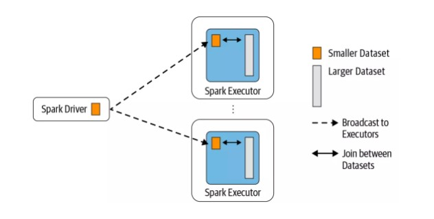
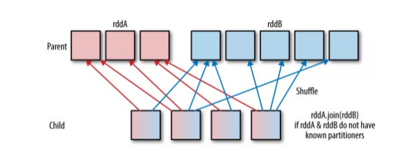

[TOC]

在 Spark 的物理计划（physical plan）阶段，Spark 的 JoinSelection 类会根据 Join hints 策略、Join 表的大小、 Join 是等值 Join（equi-join） 还是不等值（non-equi-joins）以及参与 Join 的 key 是否可以排序等条件来选择最终的 Join 策略（join strategies），最后 Spark 会利用选择好的 Join 策略执行最终的计算。当前 Spark（Apache Spark 3.0）一共支持五种 Join 策略：
* Broadcast hash join (BHJ)
* Shuffle hash join（SHJ）
* Shuffle sort merge join (SMJ)
* Shuffle-and-replicate nested loop join，又称笛卡尔积（Cartesian product join).）
* Broadcast nested loop join (BNLJ)

其中 BHJ 和 SMJ 这两种 Join 策略是我们运行 Spark 作业最常见的。不同的 Join 策略在执行上效率差别很大,

首先，如果为等值Join，优先从下面选择：
* Broadcast hash join (BHJ):
    BHJ不支持full outer join。对于right outer join，只能广播左表。对于left outer, left semi, left anti，只能广播右表。对于inner like join（？），两表都可以广播，但会选一个小表广播。通常来说BHJ比其他方式要快，但是BHJ对网络敏感，而且也有可能OOM。
    如果有broadcast hint，即使表大于阈值，也会广播。

* Shuffle hash join: 如果单个分区的平均大小足够小，可以构建散列表。

* Sort merge: 如果join值支持排序。

其次，如果join没有key, 从下面选择：
*  BroadcastNestedLoopJoin (BNLJ):
    BNLJ支持所有类型的Join，但是为下面场景做了优化：
    对于right outer join，广播左表。对于left outer, left semi, left anti，广播右表。对于inner like joins，两个表都可以广播。
* CartesianProduct: 对于inner like join, CartesianProduct是备选方案。
* BroadcastNestedLoopJoin (BNLJ):对于其他join类型，BNLJ是备选方案。
  
 ## Broadcast hash join (BHJ)
 BHJ 又称 map-side-only join，从名字可以看出，Join 是在 map 端进行的。这种 Join 要求一张表很小，小到足以将表的数据全部放到 Driver 和 Executor 端的内存中，而另外一张表很大。

 Broadcast Hash Join 的实现是将小表的数据广播（broadcast）到 Spark 所有的 Executor 端，这个广播过程和我们自己去广播数据没什么区别，先利用 collect 算子将小表的数据从 Executor 端拉到 Driver 端，然后在 Driver 端调用 sparkContext.broadcast 广播到所有 Executor 端；然后在 Executor 端这个广播出去的数据会和大表进行 Join 操作，这种 Join 策略避免了 Shuffle 操作。(一种优化方案就是不广播到driver，直接从Executor广播到Executor)
 

## Shuffle Hash Join（SHJ）
Shuffle hash join 同样是在大表和小表进行 Join 的时候选择的一种策略，它的计算思想是：把大表和小表按照相同的分区算法和分区数进行分区（根据参与 Join 的 keys 进行分区），这样就保证了 hash 值一样的数据都分发到同一个分区中，然后在同一个 Executor 中两张表 hash 值一样的分区就可以在本地进行 hash Join 了。在进行 Join 之前，还会对小表 hash 完的分区构建 hash map。Shuffle hash join 利用了分治思想，把大问题拆解成小问题去解决。


### Shuffle Hash Join 的适用条件:

* 仅支持等值 Join，不要求参与 Join 的 Keys 可排序；
* spark.sql.join.preferSortMergeJoin 参数必须设置为 false，参数是从 Spark 2.0.0 版本引入的，默认值为 true，也就是默认情况下选择 Sort Merge Join；
* 小表的大小（plan.stats.sizeInBytes）必须小于 spark.sql.autoBroadcastJoinThreshold * spark.sql.shuffle.partitions；而且小表大小（stats.sizeInBytes）的三倍必须小于等于大表的大小（stats.sizeInBytes），也就是 a.stats.sizeInBytes * 3 < = b.stats.sizeInBytes

## Shuffle Sort Merge Join (SMJ)
前面两种 Join 策略对表的大小都有条件的，如果参与 Join 的表都很大，这时候就得考虑用 Shuffle Sort Merge Join 了。Shuffle Sort Merge Join 的实现思想：也是对两张表参与 Join 的 Keys 使用相同的分区算法和分区数进行分区，目的就是保证相同的 Keys 都落到相同的分区里面。分区完之后再对每个分区按照参与 Join 的 Keys 进行排序，最后 Reduce 端获取两张表相同分区的数据进行 Merge Join，也就是 Keys 相同说明 Join 上了。

### Shuffle Sort Merge Join 的适用条件
Shuffle Sort Merge Join 并不是一定就使用的，也需要满足以下条件：
* 仅支持等值 Join，并且要求参与 Join 的 Keys 可排序；

## Cartesian product join
如果 Spark 中两张参与 Join 的表没指定 where 条件（ON 条件）那么会产生 Cartesian product join，这个 Join 得到的结果其实就是两张行数的乘积。

### Cartesian product join 的适用条件
* 必须是 inner Join，其支持等值和不等值 Join。

## Broadcast nested loop join (BNLJ)
可以把 Broadcast nested loop join 的执行看做下面的计算：
```scala
for record_1 in relation_1:
  for record_2 in relation_2:
    # join condition is executed
```
可以看出 Broadcast nested loop join 在某些情况会对某张表重复扫描多次，可见效率非常低下。从名字可以看出，BNLJ 会根据相关条件对小表进行广播，以减少表的扫描次数。触发广播的需要满足以下三个条件之一:
* right outer join 是会广播左表；
* left outer, left semi, left anti 或者 existence join 时会广播右表；
* inner join 的时候两张表都会广播。

### Broadcast nested loop join 的适用条件
* roadcast nested loop join 支持等值和不等值 Join，支持所有的 Join 类型。

## Spark 如何选择 Join 策略
Spark 有五种 Join 策略，那么 Spark 是按照什么顺序来选择呢？(spark3.0)

1. 先判断是不是等值 Join，那么是按照下面顺序选择 Join 策略：
 > 1. 用户是不是指定了 BROADCAST hint （BROADCAST、BROADCASTJOIN 以及 MAPJOIN 中的一个），如果指定了，那就用 Broadcast Hash Join；
 > 2. 用户是不是指定了 SHUFFLE MERGE hint （SHUFFLE_MERGE、MERGE 以及 MERGEJOIN 中的一个），如果指定了，那就用 Shuffle sort merge join；
 > 3. 用户是不是指定了 Shuffle Hash Join hint （SHUFFLE_HASH），如果指定了，那就用 Shuffle Hash Join；
 > 4. 用户是不是指定了 shuffle-and-replicate nested loop join hint （SHUFFLE_REPLICATE_NL），如果指定了，那就用 Cartesian product join；
 > 5. 如果用户没有指定任何 Join hint，那根据 Join 的适用条件按照 Broadcast Hash Join -> Shuffle Hash Join -> Sort Merge Join ->Cartesian Product Join -> Broadcast Nested Loop Join 顺序选择 Join 策略。

 2. 如果是不等值 Join，那么是按照下面顺序选择 Join 策略：
   > 1. 用户是不是指定了 BROADCAST hint （BROADCAST、BROADCASTJOIN 以及 MAPJOIN 中的一个），如果指定了，那就广播对应的表，并选择 Broadcast Nested Loop Join；
   >2. 用户是不是指定了 shuffle-and-replicate nested loop join hint （SHUFFLE_REPLICATE_NL），如果指定了，那就用 Cartesian product join；
   >3. 如果用户没有指定任何 Join hint，那根据 Join 的适用条件按照 Broadcast Nested Loop Join ->Cartesian Product Join -> Broadcast Nested Loop Join 顺序选择 Join 策略


spark2.4的选择顺序
1. 等值且指定了BROADCAST hint ，就用 Broadcast Hash Join；
2. 等值没有指定BROADCAST hint，但是可以从表大小和配置文件中推断出来，也可以用Broadcast Hash Join；
3. 没有指定sortMergeJoin,key可排序，表足够小可以创建本地hashmap，用 ShuffledHashJoin。
4. 等值key可排序，用SortMergeJoin；
5. 不等值但是有BROADCAST hint，用BroadcastNestedLoopJoin；
6. 不等值但是表足够小可以广播，用BroadcastNestedLoopJoin；
7. 如果是innerjoin，用CartesianProduct；
8. 其他的用BroadcastNestedLoopJoin。


## 参考资料
1. [每个 Spark 工程师都应该知道的五种 Join 策略](https://mp.weixin.qq.com/s?__biz=MzA5MTc0NTMwNQ==&mid=2650723614&idx=1&sn=0c0a47b722ecbb31809c9dd14684508f&chksm=887dc868bf0a417e135065927bdfa6a1a604b15620385584c8520754c14a646d8fa0f078c08a&scene=21#wechat_redirect)
