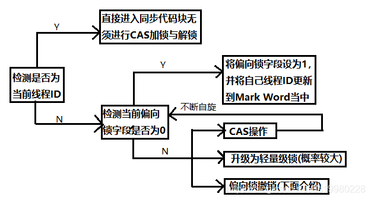
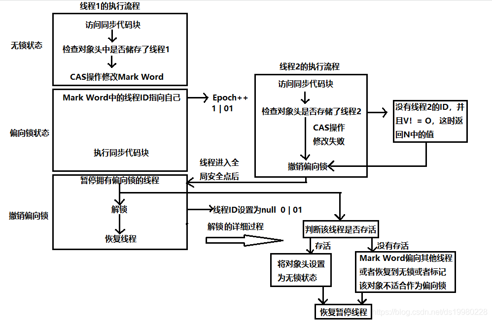
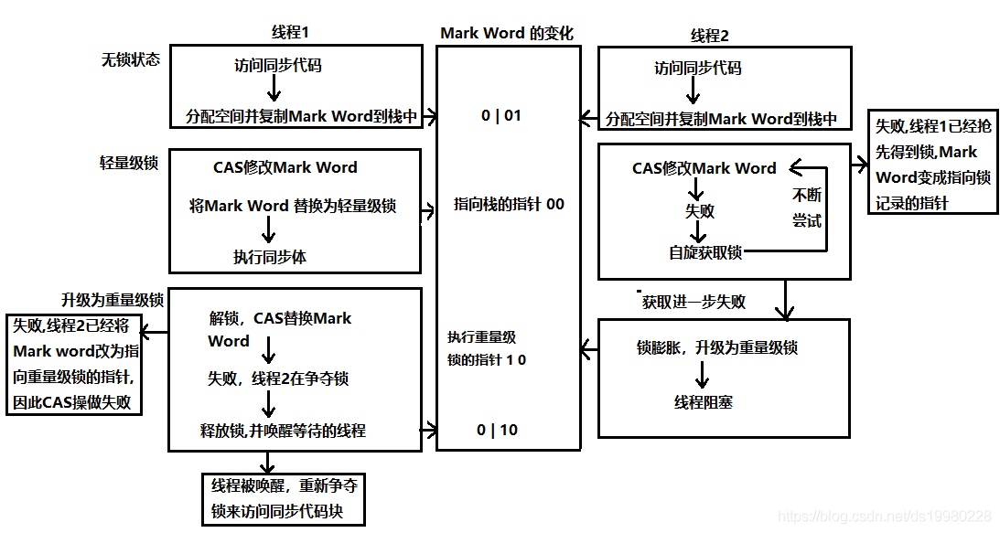

# 锁

[TOC]

## 前言

Java提供了种类丰富的锁，每种锁因其特性的不同，在适当的场景下能够展现出非常高的效率。

Java中往往是按照是否含有某一特性来定义锁，我们通过特性将锁进行分组归类，再使用对比的方式进行介绍，帮助大家更快捷的理解相关知识。下面给出本文内容的总体分类目录：


## 乐观锁 VS 悲观锁

乐观锁与悲观锁是一种广义上的概念，体现了看待线程同步的不同角度。

对于同一个数据的并发操作，悲观锁认为自己在使用数据的时候一定有别的线程来修改数据，因此在获取数据的时候会先加锁，确保数据不会被别的线程修改。Java中，synchronized关键字和Lock的实现类都是悲观锁。

而乐观锁认为自己在使用数据时不会有别的线程修改数据，所以不会添加锁，只是在更新数据的时候去判断之前有没有别的线程更新了这个数据。如果这个数据没有被更新，当前线程将自己修改的数据成功写入。如果数据已经被其他线程更新，则根据不同的实现方式执行不同的操作（例如报错或者自动重试）。

乐观锁在Java中是通过使用无锁编程来实现，最常采用的是CAS算法，Java原子类中的递增操作就通过CAS自旋实现的。


根据从上面的概念描述我们可以发现：

* 悲观锁适合写操作多的场景，先加锁可以保证写操作时数据正确。
* 乐观锁适合读操作多的场景，不加锁的特点能够使其读操作的性能大幅提升。

下面看一下示例：

```java
// ------------------------- 悲观锁的调用方式 -------------------------
// synchronized
public synchronized void testMethod() {
    // 操作同步资源
}
// ReentrantLock
private ReentrantLock lock = new ReentrantLock(); // 需要保证多个线程使用的是同一个锁
public void modifyPublicResources() {
    lock.lock();
    // 操作同步资源
    lock.unlock();
}

// ------------------------- 乐观锁的调用方式 -------------------------
private AtomicInteger atomicInteger = new AtomicInteger();  // 需要保证多个线程使用的是同一个AtomicInteger
atomicInteger.incrementAndGet(); //执行自增1
```

通过调用方式示例，我们可以发现悲观锁基本都是在显式的锁定之后再操作同步资源，而乐观锁则直接去操作同步资源。那么，为何乐观锁能够做到不锁定同步资源也可以正确的实现线程同步呢？我们通过介绍乐观锁的主要实现方式 “CAS” 的技术原理来为大家解惑。

CAS全称 Compare And Swap（比较与交换），是一种无锁算法，且是一个原子指令。在不使用锁（没有线程被阻塞）的情况下实现多线程之间的变量同步。java.util.concurrent包中的原子类就是通过CAS来实现了乐观锁。

CAS算法涉及到三个操作数：

* 需要读写的内存值 V。
* 进行比较的值 A。
* 要写入的新值 B。

原理可以用以下伪代码表示：

```java
boolean cas(p: pointer to int, old: int, new: int)
    if *p ≠ old
        return false

    *p ← new

    return true
```

但是基于CAS的算法会有ABA的问题。即可能在读取旧值和尝试CAS之间，其他线程已经多次更改该内存中的值，但是最终的值恰好与原旧值一样，从而导致cas得以继续执行。如果这个内存中的修改过后的值(看起来与旧的值完全一样)有不同的含义，就会出现问题:例如，删除一个对象并在原地址重建一个对象，地址是相同的，会导致ABA，或者一个环绕的版本计数器。通常的解决办法就是使用一个计数器（counter）或者版本号(verson),每次cas的时候，这个计数器或版本号都增一，来检测是否被修改过。（禁用中断也是一种不太成熟的方法）。

## 自旋锁 VS 适应性自旋锁

阻塞或唤醒一个Java线程需要操作系统切换CPU状态来完成，这种状态转换需要耗费处理器时间。如果同步代码块中的内容过于简单，状态转换消耗的时间有可能比用户代码执行的时间还要长。

在许多场景中，同步资源的锁定时间很短，为了这一小段时间去切换线程，线程挂起和恢复现场的花费可能会让系统得不偿失。如果物理机器有多个处理器，能够让两个或以上的线程同时并行执行，我们就可以让后面那个请求锁的线程不放弃CPU的执行时间，看看持有锁的线程是否很快就会释放锁。

而为了让当前线程“稍等一下”，我们需让当前线程进行自旋，如果在自旋完成后前面锁定同步资源的线程已经释放了锁，那么当前线程就可以不必阻塞而是直接获取同步资源，从而避免切换线程的开销。这就是自旋锁。


自旋锁本身是有缺点的，它不能代替阻塞。自旋等待虽然避免了线程切换的开销，但它要占用处理器时间。如果锁被占用的时间很短，自旋等待的效果就会非常好。反之，如果锁被占用的时间很长，那么自旋的线程只会白浪费处理器资源。所以，自旋等待的时间必须要有一定的限度，如果自旋超过了限定次数（默认是10次，可以使用-XX:PreBlockSpin来更改）没有成功获得锁，就应当挂起线程。

自旋锁的实现原理同样也是CAS，AtomicInteger中调用unsafe进行自增操作的源码中的do-while循环就是一个自旋操作，如果修改数值失败则通过循环来执行自旋，直至修改成功。


自适应意味着自旋的时间（次数）不再固定，而是由前一次在同一个锁上的自旋时间及锁的拥有者的状态来决定。如果在同一个锁对象上，自旋等待刚刚成功获得过锁，并且持有锁的线程正在运行中，那么虚拟机就会认为这次自旋也是很有可能再次成功，进而它将允许自旋等待持续相对更长的时间。如果对于某个锁，自旋很少成功获得过，那在以后尝试获取这个锁时将可能省略掉自旋过程，直接阻塞线程，避免浪费处理器资源。

## 无锁 VS 偏向锁 VS 轻量级锁 VS 重量级锁

这四种锁是指锁的状态，专门针对synchronized的。在介绍这四种锁状态之前还需要介绍一些额外的知识。

首先为什么Synchronized能实现线程同步？

在回答这个问题之前我们需要了解两个重要的概念：“Java对象头”、“Monitor”。

### Java对象头

synchronized是悲观锁，在操作同步资源之前需要给同步资源先加锁，这把锁就是存在Java对象头里的，而Java对象头又是什么呢？

我们以Hotspot虚拟机为例，Hotspot的对象头主要包括两部分数据：Mark Word（标记字段）、Klass Pointer（类型指针）。

__Mark Word__：默认存储对象的HashCode，分代年龄和锁标志位信息。这些信息都是与对象自身定义无关的数据，所以Mark Word被设计成一个非固定的数据结构以便在极小的空间内存存储尽量多的数据。它会根据对象的状态复用自己的存储空间，也就是说在运行期间Mark Word里存储的数据会随着锁标志位的变化而变化。

__Klass Point__：对象指向它的类元数据的指针，虚拟机通过这个指针来确定这个对象是哪个类的实例。

### Monitor

Monitor可以理解为一个同步工具或一种同步机制，通常被描述为一个对象。每一个Java对象就有一把看不见的锁，称为内部锁或者Monitor锁。

Monitor是线程私有的数据结构，每一个线程都有一个可用monitor record列表，同时还有一个全局的可用列表。每一个被锁住的对象都会和一个monitor关联，同时monitor中有一个Owner字段存放拥有该锁的线程的唯一标识，表示该锁被这个线程占用。

现在话题回到synchronized，synchronized通过Monitor来实现线程同步，Monitor是依赖于底层的操作系统的Mutex Lock（互斥锁）来实现的线程同步。

如同我们在自旋锁中提到的“阻塞或唤醒一个Java线程需要操作系统切换CPU状态来完成，这种状态转换需要耗费处理器时间。如果同步代码块中的内容过于简单，状态转换消耗的时间有可能比用户代码执行的时间还要长”。这种方式就是synchronized最初实现同步的方式，这就是JDK 6之前synchronized效率低的原因。这种依赖于操作系统Mutex Lock所实现的锁我们称之为“重量级锁”，JDK 6中为了减少获得锁和释放锁带来的性能消耗，引入了“偏向锁”和“轻量级锁”。

所以目前锁一共有4种状态，级别从低到高依次是：__无锁、偏向锁、轻量级锁和重量级锁__。锁状态只能升级不能降级。

下面我们给出四种锁状态对应的的Mark Word内容，然后再分别讲解四种锁状态的思路以及特点：

|锁状态|存储内容|存储内容
|----|----|----|
|无锁|对象的hashCode、对象分代年龄、是否是偏向锁（0）|01|
|偏向锁|偏向线程ID、偏向时间戳、对象分代年龄、是否是偏向锁（1）|01|
|轻量级锁|指向栈中锁记录的指针|00|
|重量级锁|指向互斥量（重量级锁）的指针|10|

#### 无锁

无锁没有对资源进行锁定，所有的线程都能访问并修改同一个资源，但同时只有一个线程能修改成功。

无锁的特点就是修改操作在循环内进行，线程会不断的尝试修改共享资源。如果没有冲突就修改成功并退出，否则就会继续循环尝试。如果有多个线程修改同一个值，必定会有一个线程能修改成功，而其他修改失败的线程会不断重试直到修改成功。上面我们介绍的CAS原理及应用即是无锁的实现。无锁无法全面代替有锁，但无锁在某些场合下的性能是非常高的。

#### 偏向锁

偏向锁是指一段同步代码一直被一个线程所访问，那么该线程会自动获取锁，降低获取锁的代价。

当一个线程访问同步代码块并获取锁时，会在Mark Word里存储锁偏向的线程ID。在线程进入和退出同步块时不再通过CAS操作来加锁和解锁，而是检测Mark Word里是否存储着指向当前线程的偏向锁。引入偏向锁是为了在无多线程竞争的情况下尽量减少不必要的轻量级锁执行路径，因为轻量级锁的获取及释放依赖多次CAS原子指令，而偏向锁只需要在置换ThreadID的时候依赖一次CAS原子指令即可。

偏向锁只有遇到其他线程尝试竞争偏向锁时，持有偏向锁的线程才会释放锁，线程不会主动释放偏向锁。偏向锁的撤销，需要等待全局安全点（在这个时间点上没有字节码正在执行），它会首先暂停拥有偏向锁的线程，判断锁对象是否处于被锁定状态。撤销偏向锁后恢复到无锁（标志位为“01”）或轻量级锁（标志位为“00”）的状态。


偏向锁的获得和撤销流程


#### 轻量级锁

是指当锁是偏向锁的时候，被另外的线程所访问，偏向锁就会升级为轻量级锁，其他线程会通过自旋的形式尝试获取锁，不会阻塞，从而提高性能。

在代码进入同步块的时候，如果同步对象锁状态为无锁状态（锁标志位为“01”状态，是否为偏向锁为“0”），虚拟机首先将在当前线程的栈帧中建立一个名为锁记录（Lock Record）的空间，用于存储锁对象目前的Mark Word的拷贝，然后拷贝对象头中的Mark Word复制到锁记录中。

拷贝成功后，虚拟机将使用CAS操作尝试将对象的Mark Word更新为指向Lock Record的指针，并将Lock Record里的owner指针指向对象的Mark Word。

如果这个更新动作成功了，那么这个线程就拥有了该对象的锁，并且对象Mark Word的锁标志位设置为“00”，表示此对象处于轻量级锁定状态。

如果轻量级锁的更新操作失败了，虚拟机首先会检查对象的Mark Word是否指向当前线程的栈帧，如果是就说明当前线程已经拥有了这个对象的锁，那就可以直接进入同步块继续执行，否则说明多个线程竞争锁。

若当前只有一个等待线程，则该线程通过自旋进行等待。但是当自旋超过一定的次数，或者一个线程在持有锁，一个在自旋，又有第三个来访时，轻量级锁升级为重量级锁。

轻量级锁及膨胀流程图


#### 重量级锁

升级为重量级锁时，锁标志的状态值变为“10”，此时Mark Word中存储的是指向重量级锁的指针，此时等待锁的线程都会进入阻塞状态。

综上，偏向锁通过对比Mark Word解决加锁问题，避免执行CAS操作。而轻量级锁是通过用CAS操作和自旋来解决加锁问题，避免线程阻塞和唤醒而影响性能。重量级锁是将除了拥有锁的线程以外的线程都阻塞。

## 公平锁 VS 非公平锁

公平锁是指多个线程按照申请锁的顺序来获取锁，线程直接进入队列中排队，队列中的第一个线程才能获得锁。公平锁的优点是等待锁的线程不会饿死。缺点是整体吞吐效率相对非公平锁要低，等待队列中除第一个线程以外的所有线程都会阻塞，CPU唤醒阻塞线程的开销比非公平锁大。

非公平锁是多个线程加锁时直接尝试获取锁，获取不到才会到等待队列的队尾等待。但如果此时锁刚好可用，那么这个线程可以无需阻塞直接获取到锁，所以非公平锁有可能出现后申请锁的线程先获取锁的场景。非公平锁的优点是可以减少唤起线程的开销，整体的吞吐效率高，因为线程有几率不阻塞直接获得锁，CPU不必唤醒所有线程。缺点是处于等待队列中的线程可能会饿死，或者等很久才会获得锁。

综上，公平锁就是通过同步队列来实现多个线程按照申请锁的顺序来获取锁，从而实现公平的特性。非公平锁加锁时不考虑排队等待问题，直接尝试获取锁，所以存在后申请却先获得锁的情况。

## 可重入锁 VS 非可重入锁

可重入锁又名递归锁，是指在同一个线程在外层方法获取锁的时候，再进入该线程的内层方法会自动获取锁（前提锁对象得是同一个对象或者class），不会因为之前已经获取过还没释放而阻塞。Java中ReentrantLock和synchronized都是可重入锁，可重入锁的一个优点是可一定程度避免死锁。下面用示例代码来进行分析：

```java
public class Widget {
    public synchronized void doSomething() {
        System.out.println("方法1执行...");
        doOthers();
    }

    public synchronized void doOthers() {
        System.out.println("方法2执行...");
    }
}
```

在上面的代码中，类中的两个方法都是被内置锁synchronized修饰的，doSomething()方法中调用doOthers()方法。因为内置锁是可重入的，所以同一个线程在调用doOthers()时可以直接获得当前对象的锁，进入doOthers()进行操作。

如果是一个不可重入锁，那么当前线程在调用doOthers()之前需要将执行doSomething()时获取当前对象的锁释放掉，实际上该对象锁已被当前线程所持有，且无法释放。所以此时会出现死锁。

## 独享锁 VS 共享锁

独享锁和共享锁同样是一种概念。我们先介绍一下具体的概念，然后通过ReentrantLock和ReentrantReadWriteLock的源码来介绍独享锁和共享锁。

独享锁也叫排他锁，是指该锁一次只能被一个线程所持有。如果线程T对数据A加上排它锁后，则其他线程不能再对A加任何类型的锁。获得排它锁的线程即能读数据又能修改数据。JDK中的synchronized和JUC中Lock的实现类就是互斥锁。

共享锁是指该锁可被多个线程所持有。如果线程T对数据A加上共享锁后，则其他线程只能对A再加共享锁，不能加排它锁。获得共享锁的线程只能读数据，不能修改数据。

## 参考资料

1. [Java锁的那些事儿](https://mp.weixin.qq.com/s/6rGkNeXR8MpLLJ7I4TzL9g)
