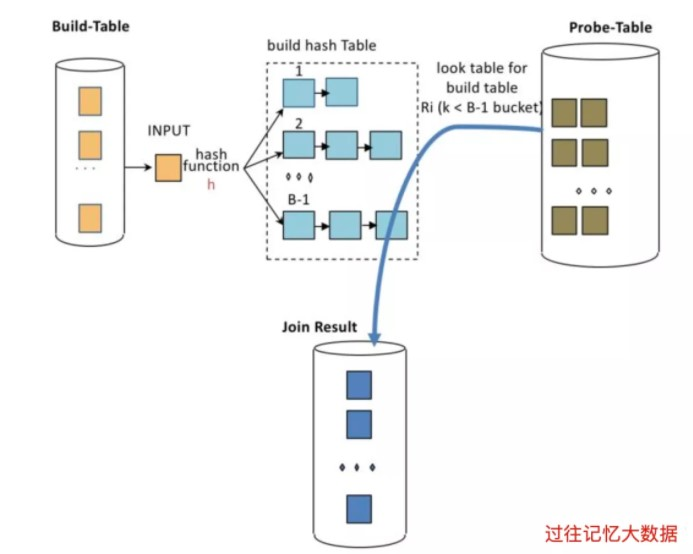

## JOIN 的实现
几乎所有的数据库引擎一次只 JOIN 两个表。即使在 SQL 查询中有两个以上的表要联接，数据库也会联接前两个表并将输出与第三个表联接起来，然后对其余表继续这样做。数据库工程师将连接操作中涉及的这两个表称为构建表（Build Table）和探测表（Probe Table）。

__Build Table__  
构建表是用于创建内存索引的表。通常，在读取探测表之前必须完整读取构建表。

__Probe Table__  
一旦构建表被读取并存储在内存中，探测表就会被逐行读取。从探测表读取的每一行都将根据 join criteria 与构建表进行连接。  



Presto 使用优化后的逻辑计划中的右表作为构建表，将逻辑计划中的左表作为探测表。请注意，逻辑计划中的表不必与它们在 SQL 查询中的顺序相同。Presto 有一些基于成本的优化器，它们可以重新排序连接以将最小的表（即构建表）保留在右侧，以便它可以放入内存中。如果连接重新排序优化器被禁用或连接器特定的统计信息（例如 Hive 统计信息）被禁用，则 Presto 将不会对连接查询重新排序。在这种情况下，建议将最小的表保留在连接的右侧，以便 Presto 可以将其用作构建表。

## JOIN 算法
数据库根据数据类型和连接类型使用不同的算法来连接两个表。例如，SQL Server 使用 Nested Loop 算法、Merge Join 算法、Hash Join 算法和 Adaptive Join 算法。在撰写本文时，开源的 Presto SQL 引擎采用 Nested Loop 算法和 Hash Join 算法来支持 Presto 中所有不同联接类型。本节简要说明Nested Loop 算法和 Hash Join 算法，并讨论其他算法在 Presto 中的适用性以提高性能。


### Nested Loop Algorithm
顾名思义，嵌套循环算法使用嵌套循环连接两个表。下面使用一个数组连接示例来解释嵌套循环连接算法。假设你有两个整数数组，并要求你打印这些数组的笛卡尔积，你会如何解决这个问题？下面给出了一种简单的方法来打印两个数组的笛卡尔积。
```java
public class IteblogNestedLoop {
    public static void main(String[] args) {
        // Construct two arrays
        int[] tableA = {1, 2, 3, 4, 5, 6};
        int[] tableB = {10, 20, 30, 40};
        // Nested loop to print the Cartesian product of two arrays
        for (int x : tableA) {
            for (int y : tableB) {
                System.out.println(x + ", " + y);
            }
        }
    }
}
```

上面的代码使用两个循环来打印两个数组的笛卡尔积。嵌套循环算法的时间复杂度为 O(n²)，因为它必须将探测表中的每一行与构建表中的每一行连接起来。由于需要每个组合，交叉连接操作的执行时间复杂度不能超过 O(n²)。Presto 使用嵌套循环算法来执行 cross join 操作，这就是为什么如果连接表非常大，cross join 需要很长时间。由于 O(n²) 时间复杂度，不建议在没有连接条件的情况下连接两个大表。

### Hash Join Algorithm
哈希连接算法为构建表中的列生成哈希键，这些列是用于 JOIN 条件中的，比如 left.x = right.y AND left.z = right.w。每个这样的相等条件称为连接相等条件（join equi criteria）。尽管 equi criteria 术语在数据库领域被广泛使用，但它们也被称为相等条件。为了使用哈希算法，让我们考虑一个打印所有客户及其订单信息的问题。这个问题中使用的 Customer 和 Order 类定义如下。请注意，这两个类都有一个共同的属性：custKey
```java
class Order {
    String orderKey;
    String custKey;
    double totalPrice;
    public Order(String orderKey, String custKey, double totalPrice) {
        this.orderKey = orderKey;
        this.custKey = custKey;
        this.totalPrice = totalPrice;
    }
    @Override
    public String toString() {
        return "Order: " + orderKey + ", " + custKey + ", " + totalPrice;
    }
}
class Customer {
    String custKey;
    String name;
    public Customer(String custKey, String name) {
        this.custKey = custKey;
        this.name = name;
    }
    @Override
    public String toString() {
        return "Customer: " + name + ", " + custKey;
    }
}
```
尽管嵌套循环连接可以达到我们的要求，但它的效率很低，因为它在给定 n 个客户和 n 个订单的情况下迭代 n² 次。一个有效的解决方案可以使用一个 Hashtable 来存储所有订单，使用相同的连接条件：custKey 作为哈希键。然后在遍历 Customer 列表时，可以生成 Customer 的散列值。获取具有相同custKey 的订单列表，如下所示：
```java
import java.util.*;
public class IteblogHashJoin {
    public static void main(String[] args) {
        List<Customer> probe = List.of(new Customer("c_001", "Alice"),
                                        new Customer("c_002", "Bob"),
                                        new Customer("c_003", "David"));
        List<Order> build = List.of(new Order("o_01", "c_001", 100.0),
                                        new Order("o_01", "c_001", 100.0),
                                        new Order("o_02", "c_001", 150.0),
                                        new Order("o_03", "c_002", 90.0),
                                        new Order("o_04", "c_003", 120.0));
        // Build the hash map index
        Map<Integer, List<Order>> index = new Hashtable<>();
        for (Order order : build) {
            int hash = Objects.hash(order.custKey);
            index.putIfAbsent(hash, new LinkedList<>());
            index.get(hash).add(order);
        }
        // Hash Join algorithm
        for (Customer customer : probe) {
            int hash = Objects.hash(customer.custKey);
            List<Order> orders = index.get(hash);
            if (orders != null) {
                for (Order order : orders) {
                    if (Objects.equals(customer.custKey, order.custKey)) {
                        System.out.println(customer + " -> " + order);
                    }
                }
            }
        }
    }
}
```
在上述算法中，使用单独的 LinkedList 来避免哈希冲突，因为同一客户下多个订单的可能性很高。使用 equijoin criteria 里面列的哈希值用于将构建表存储在存储桶中。然后将相同的散列算法应用于探测表的 equijoin criteria 列以查找包含匹配项的桶。尽管 Hash Join 算法的最坏情况时间复杂度是 O(n²)，但平均情况下预计为 O(n)。

上述问题可以定义为下面给出的 SQL 查询，以将 Customer 表与 Orders 表连接起来。
```sql
SELECT * 
FROM iteblog.customer c 
LEFT JOIN iteblog.orders o 
ON c.custkey=o.orderkey;
```
具有等连接条件的所有连接操作都使用Presto中的哈希连接算法执行。  
Presto 使用带 filter 的嵌套循环算法而不是散列连接算法来执行具有非等连接条件的连接。