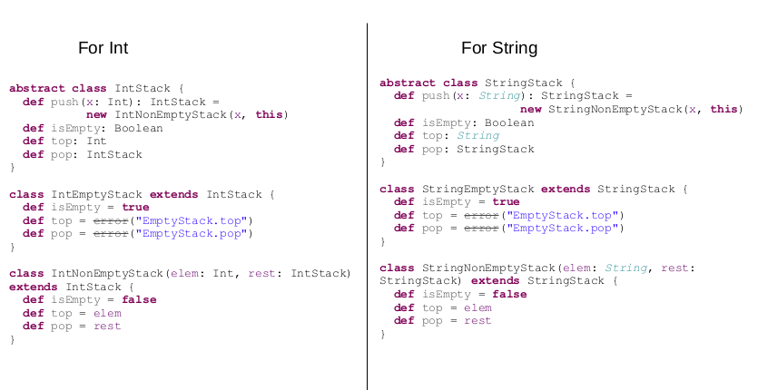
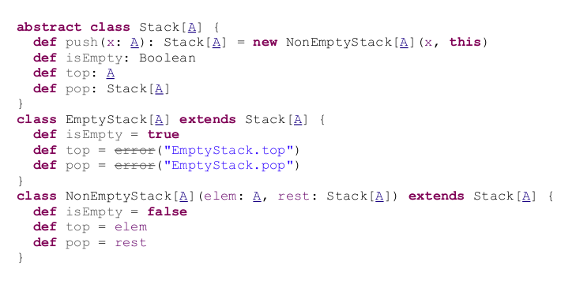

## 什么是类型？
* 任何class, trait或者object都是一个类型
* 任务呗type关键字定义的都是类型
* 比如，type A = String

## 为什么要使用泛型？
泛型允许你编写通用的class和trait。例如，set是泛型的，它接受一个类型参数: 定义为Set[T]。因此，可能的set实例有set [String]、set [Int]等等——它必须是某类东西的集合。

泛型可以增加系统的稳定性。

## 泛型类
泛型类是接受类型作为参数的类。它们对集合类特别有用。定义泛型类使用方括号[]中的类型作为参数。最常见的约定是使用字母A，通过任何参数名称都可以使用。



## 泛型类型分解
```scala
val typeTest : Any = "String"
 
  typeTest match {
    case i : Int => println("Integer type")
    case d : Double => println("Double type")
    case f : Float => println("Float type")
    case s : String => println("String type")
    case _ : BigDecimal => println("Big decimal type")
    case _ => println("Unknown type")
  }
```
这里明确指定了typeTest的类型是Any，这不是一个好的方法，因为会涉及到类型转换。更好的方式就是使用泛型
```scala

def identifyType[A](value:A)  = {
 
  value match {
    case i : Int => println("Integer type")
    case d : Double => println("Double type")
    case f : Float => println("Float type")
    case s : String => println("String type")
    case _ : BigDecimal => println("Big decimal type")
    case _ => println("Unknown type")
  }
 
}
```
方法名称后面的[A]是必要的，用于指示该方法对泛型类型进行操作。

## 自限定泛型
`class SelfBounded<T extends SelfBounded<T>>`
解释：一个类继承一个带有泛型的父类 父类泛型类型为该类的类型，也就是说基类用其导出类作为泛型的类型，基类中所使用的泛型类型都是该导出类
```scala
/**
 * @ClassName SelfBounded
 * @Description 自限定泛型类
 **/
public class SelfBounded<T extends SelfBounded<T>> {
 
    private T element;
 
    public SelfBounded<T> setElement(T t){
        element = t;
        return this;
    }
 
    public T getElement(){
        return element;
    }
 
    public void f(){
        System.out.println(element.getClass().getName());
    }
 
}
 
/**
 * @ClassName A
 **/
public class A extends SelfBounded<A> {
}
 
public static void main(String[] args) {
        A a = new A();
        a.setElement(new A());//参数传递A类型
        A element = a.getElement();//返回的也是A类型
         
}
```
和前面的普通泛型比较你发现有什么区别吗 ？
看方法传递的参数：
普通类型方法参数和返回是使用其他类型
自限定类型的方法参数和放回值类型只能是它自己的类型，可以保证类型参数和正在被定义的类相同
## scala的类型边界
### 上界：
`class Parking[A <: Vehicle]，A必须是类型Vehicle，或者Vehicle的子类`

### 下界：
`class Parking[A >: Vehicle], A必须是类型Vehicle，或者Vehicle的父类`

### 协变：
```scala
class VendingMachine[+A] {
  // .. don't worry about implementation yet
}
 
def install(softDrinkVM: VendingMachine[SoftDrink]): Unit = {
  // Installs the soft drink vending machine
}
 
// Covariant subtyping
               A  <:                B
VendingMachine[A] <: VendingMachine[B]
```
如果A是B的子类，那么 VendingMachine[A] 也应该是 VendingMachine[B]的子类。 