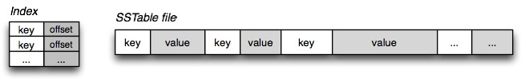
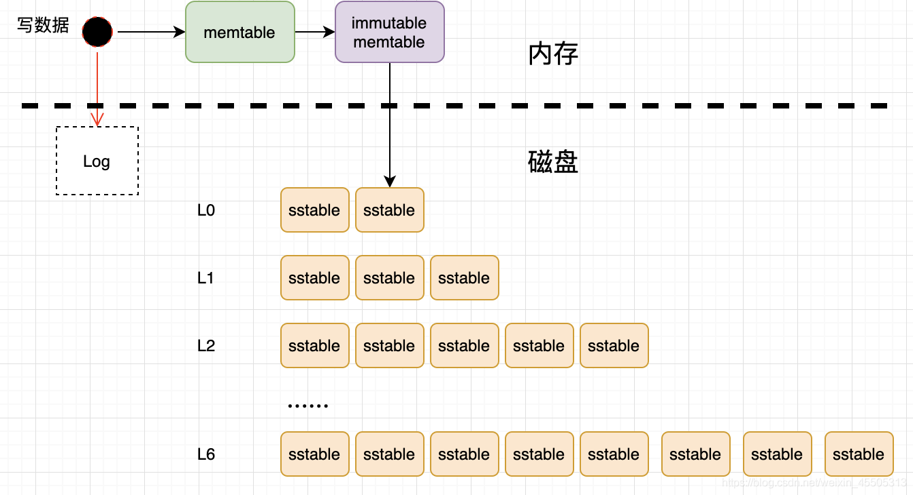

# LSM原理简介

## 什么是LSM-Tree？

LSM一词最早来自于Partrick O'Neil et al.发表的文章[1]，全称为"Log-Structured Merged-Tree"。后来，Google发表的Bigtable论文[2]将其发扬光大。

不同于传统的基于B+树的数据库存储引擎，对于大量写入操作的场景下，B-Tree的写入会带来额外的I/O开销，基于LSM的引擎尤其适合于写多读少的场景。

LSM-Tree的核心思想就是将写入推迟(Defer)并转换为批量(Batch)写，首先将大量写入缓存在内存，当积攒到一定程度后，将他们批量写入文件中，这要一次I/O可以进行多条数据的写入，充分利用每一次I/O。

## 为什么要有LSM-Tree?

这个问题的本质还是磁盘随机操作慢，顺序读写快的老问题。这二种操作存在巨大的差距，无论是磁盘还是SSD。顺序读写磁盘（不管是SATA还是SSD）快于随机读写，而且快至少三个数量级。这说明我们要避免随机读写，最好设计成顺序读写。

## LSM树的结构

LSM树的结构是横跨内存和磁盘的，包含memtable、immutable memtable、SSTable等多个部分(不同的实现可能不一样)。

### memtable

顾名思义，memtable是在内存中的数据结构，用以保存最近的一些更新操作，当写数据到memtable中时，会先通过WAL的方式备份到磁盘中，以防数据因为内存掉电而丢失。

预写式日志（Write-ahead logging，缩写 WAL）是关系数据库系统中用于提供原子性和持久性（ACID属性中的两个）的一系列技术。在使用WAL的系统中，所有的修改在提交之前都要先写入log文件中。

memtable可以使用跳跃表或者搜索树等数据结构来组织数据以保持数据的有序性。当memtable达到一定的数据量后，memtable会转化成为immutable memtable，同时会创建一个新的memtable来处理新的数据。

### immutable memtable

顾名思义，immutable memtable在内存中是不可修改的数据结构，它是将memtable转变为SSTable的一种中间状态。目的是为了在转存过程中不阻塞写操作。写操作可以由新的memtable处理，而不用因为锁住memtable而等待。

### SSTable

SSTable(Sorted String Table)即为有序键值对集合，是LSM树组在磁盘中的数据的结构。如果SSTable比较大的时候，还可以根据键的值建立一个索引来加速SSTable的查询。下图是一个简单的SSTable结构示意：

memtable中的数据最终都会被转化为SSTable并保存在磁盘中，后续还会有相应的SSTable日志合并操作，也是LSM树结构的重点。最终LSM树的结构可以由下图简单表示：

SSTable是一种简单的抽象，用于高效存储大量键值对，同时优化高吞吐量和顺序读/写工作负载。

## LSM Tree优化方式

a、Bloom filter: 就是个带随即概率的bitmap,可以快速的告诉你，某一个小的有序结构里有没有指定的那个数据的。于是就可以不用二分查找，而只需简单的计算几次就能知道数据是否在某个小集合里啦。效率得到了提升，但付出的是空间代价。

b、compact:小树合并为大树:因为小树他性能有问题，所以要有个进程不断地将小树合并到大树上，这样大部分的老数据查询也可以直接使用log2N的方式找到，不需要再进行(N/m)*log2n的查询了.

## LSM-Tree 的劣势

基于 LSM-Tree 分层存储能够做到写的高吞吐，带来的副作用是整个系统必须频繁的进行 compaction ，写入量越大， Compaction 的过程越频繁。而 compaction 是一个 compare & merge 的过程，非常消耗 CPU 和存储 IO ，在高吞吐的写入情形下，大量的 compaction 操作占用大量系统资源，必然带来整个系统性能断崖式下跌，对应用系统产生巨大影响，当然我们可以禁用自动 Major Compaction ，在每天系统低峰期定期触发合并，来避免这个问题。

另外 LSM-Tree 的更新、删除全部是通过增加新数据间接实现，那么 Key 值必然存在多版本，而且事务锁的机制与 B-Tree 相比而言会宽松很多，而且键值重复很多，这也就导致了它不适合事务要求非常强的结构化数据处理场景。

## 参考资料

1. Patrick O’Neil, Edward Cheng, Dieter Gawlick, and Elizabeth O’Neil: “The Log- Structured Merge-Tree (LSM-Tree),” Acta Informatica, volume 33, number 4, pages 351–385, June 1996. doi:10.1007/s002360050048
2. Fay Chang, Jeffrey Dean, Sanjay Ghemawat, et al.: “Bigtable: A Distributed Storage System for Structured Data,” at 7th USENIX Symposium on Operating System Design and Implementation (OSDI), November 2006.
3. <https://kernelmaker.github.io/lsm-tree>
4. <https://www.daimajiaoliu.com/daima/4ed59992c10041c>
5. <https://www.igvita.com/2012/02/06/sstable-and-log-structured-storage-leveldb/>