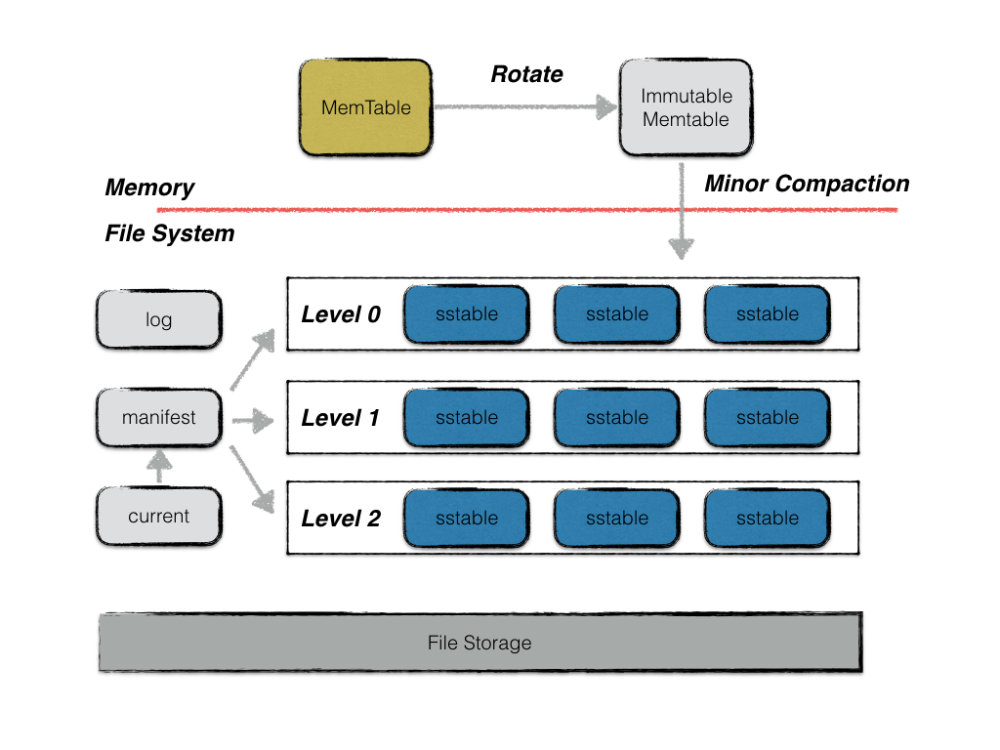
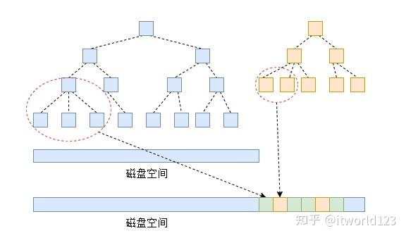
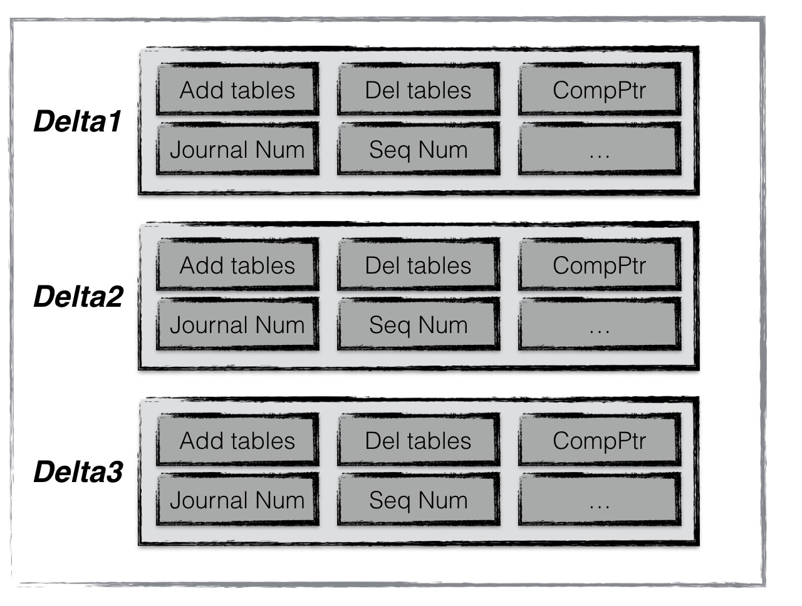
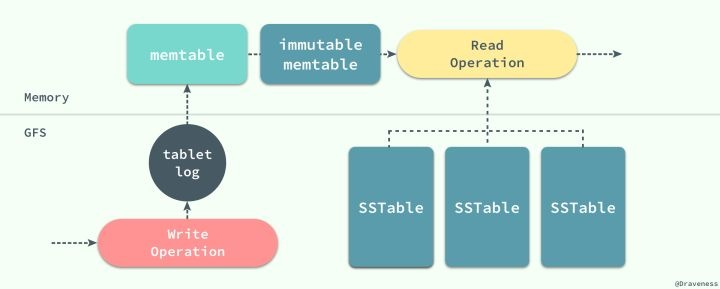
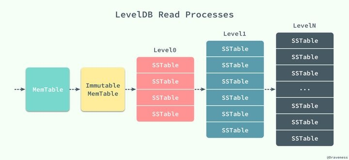
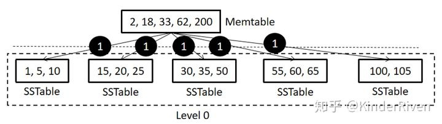
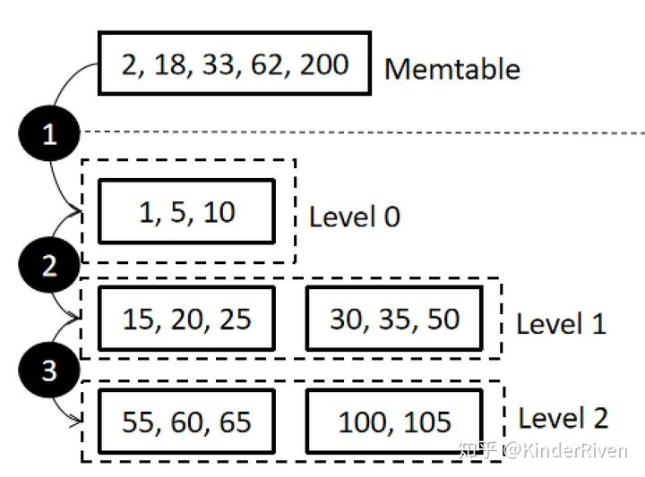

# 常用的KV存储引擎简介

[toc]

## 摘要

非关系型数据库，也叫NoSQL数据库，通常采用非关系型、分布式的数据存储系统，支持高性能、高并发，并有良好的扩展性，但大都以牺牲一致性为代价。NoSQL数据库用于存储非结构化数据，适用于联机分析（OLAP）的应用场景。此外，NoSQL数据库不支持SQL语言，尤其不支持连接（JOIN）操作。

根据数据模型，NoSQL数据库一般有以下几种类型：基于键值对的，如：levelDB、Berkeley DB、Rocks DB、redis、Dynamo等；基于列存储的，如：Bigtable、HBASE等，基于文档的，如：MangoDB，其他如基于图的Neo4j，基于时间序列数据的InfluxDB等。

这里简单介绍一下用于KV存储引擎的NoSQL数据库。

## 存储引擎的类型

那么存储引擎是什么？它主要解决什么问题呢？

首先，我们认为存储引擎就是如何为了解决存储数据、如何为存储的数据建立索引和如何更新、查询数据等技术的实现方法。用户可以根据应用的需求选择更适合自己应用场景的存储引擎来提高数据库的性能和数据的访问效率。

当前市面上能见到的数据库有340多种， 每一种数据库会有一个或者多个数据引擎， 通过对这些存储引擎的分类， 能够帮助我们了解一些共性的东西。
为什么我们需要不同类型的存储引擎？ 因为我们希望能够读写的性能能够最优， 不同的操作引擎， 对于一个写操作或者读操作， 需要的操作是不同的； 相同的操作应用于不同的介质速度也是不同的。 如下是从网上的得到的不同介质的访问时间：

| 操作类型 | 需要时间|
| - | - |
|L1 cache reference 读取CPU的一级缓存 | 0.5 ns |
|Branch mispredict(转移、分支预测)|5 ns|
|L2 cache reference 读取CPU的二级缓存|7 ns|
|Mutex lock/unlock 互斥锁\解锁|100 ns|
|Main memory reference 读取内存数据|100 ns|
|Compress 1K bytes with Zippy 1k字节压缩|10 us|
|Send 2K bytes over 1 Gbps network 在1Gbps的网络上发送2k字节|20 us|
|Read 1 MB sequentially from memory 从内存顺序读取1MB|250 us|
|Round trip within same datacenter 从一个数据中心往返一次，ping一下|500 us|
|Disk seek 磁盘搜索|10 ms|
|Read 1 MB sequentially from network 从网络上顺序读取1兆的数据|10 ms|
|Read 1 MB sequentially from disk 从磁盘里面读出1MB|30 ms|
|Send packet CA->Netherlands->CA 一个包的一次远程访问|150 ms|

不同的数据结构， 有不同的读写特性， 针对不同的场景， 比如， B-tree的读写性能比较平均， LSM结构适合写多读少的场景， Hash的读写比较平均， 但是通常不适合大数据量， 等等。

根据索引的数据结构分类：

|类型|全称|常见数据库|特点|
|-|-|-|-|
|btree|B-tree|MongoDB、BoltDB、LMDB| 1. m阶B-Tree满足以下条件:每个节点最多拥有m个子树；2. 根节点至少有2个子树；3. 分支节点至少拥有m/2颗子树（除根节点和叶子节点外都是分支节点）；4. 所有叶子节点都在同一层、每个节点最多可以有m-1个key，并且以升序排列；|
|B+tree|B+tree|MySQL|B+树的非叶子节点不保存关键字记录的指针，这样使得B+树每个节点所能保存的关键字大大增加；B+树叶子节点保存了父节点的所有关键字和关键字记录的指针，每个叶子节点的关键字从小到大链接；B+树的根节点关键字数量和其子节点个数相等;B+的非叶子节点只进行数据索引，不会存实际的关键字记录的指针，所有数据地址必须要到叶子节点才能获取到，所以每次数据查询的次数都一样；|
|LSH|Log-Structured Hash Table|bitcast||
|LSM|Log-Structured Merge Tree|LevelDB、hbase、Cassandra、goleveldb、levigo、rocksdb、gorocksdb、mongo-rocks、|LSM tree存储实现思路是将随机写转化为顺序写，尽量保持日志型数据库的写性能优势，并提供相对较好的读性能。具体实现方式如下：当有写操作(或update操作)时，写入位于内存的buffer，内存中通过某种数据结构(如skiplist)保持key有序；一般的实现也会将数据追加写到磁盘Log文件，以备必要时恢复；内存中的数据定时或按固定大小地刷到磁盘，更新操作只不断地写到内存，并不更新磁盘上已有文件；随着越来越多写操作，磁盘上积累的文件也越来越多，这些文件不可写且有序；定时对文件进行合并操作(compaction)，消除冗余数据，减少文件数量；参考：<https://www.zhihu.com/question/19887265>|
|Hash Table|哈希索引|redis|查询或者修改的效率高；适合随机查询， 不适合范围查询；不适合存储大数据量；hash函数的设计够好， 才能使得分布均匀；|
|FractalTree|分型树|PerconaFT||

## 常用的存储引擎

### LevelDB

leveldb是一个写性能十分优秀的存储引擎，是典型的LSM树(Log Structured-Merge Tree)实现。LSM树的核心思想就是放弃部分读的性能，换取最大的写入能力。整体架构如下：

### 设计思路

LSM-Tree的思路是将索引树结构拆成一大一小两颗树，较小的一个常驻内存，较大的一个持久化到磁盘，他们共同维护一个有序的key空间。写入操作会首先操作内存中的树，随着内存中树的不断变大，会触发与磁盘中树的归并操作，而归并操作本身仅有顺序写。如下图所示：

图中2个红色区域是要进行归并的数据块，计算出顺序后会存储到如图下面的磁盘空间，而这种存储方式是追加式的，也就是顺序写入磁盘。 随着数据的不断写入，磁盘中的树会不断膨胀，为了避免每次参与归并操作的数据量过大，以及优化读操作的考虑，LevelDB将磁盘中的数据又拆分成多层，每一层的数据达到一定容量后会触发向下一层的归并操作，每一层的数据量比其上一层成倍增长。这也就是LevelDB的名称来源。

leveldb中主要由以下几个重要的部件构成：

* memtable
* immutable memtable
* log(journal)
* sstable
* manifest
* current

#### memtable

之前提到，leveldb的一次写入操作并不是直接将数据刷新到磁盘文件，而是首先写入到内存中作为代替，memtable就是一个在内存中进行数据组织与维护的结构。memtable中，所有的数据按用户定义的排序方法排序之后按序存储，等到其存储内容的容量达到阈值时（默认为4MB），便将其转换成一个不可修改的memtable，与此同时创建一个新的memtable，供用户继续进行读写操作。memtable底层使用了一种跳表数据结构，这种数据结构效率可以比拟二叉查找树，绝大多数操作的时间复杂度为O(log n)。

#### immutable memtable

memtable的容量到达阈值时，便会转换成一个不可修改的memtable，也称为immutable memtable。这两者的结构定义完全一样，区别只是immutable memtable是只读的。当一个immutable memtable被创建时，leveldb的后台压缩进程便会将利用其中的内容，创建一个sstable，持久化到磁盘文件中。

#### log

leveldb的写操作并不是直接写入磁盘的，而是首先写入到内存。假设写入到内存的数据还未来得及持久化，leveldb进程发生了异常，抑或是宿主机器发生了宕机，会造成用户的写入发生丢失。因此leveldb在写内存之前会首先将所有的写操作写到日志文件中，也就是log文件。当以下异常情况发生时，均可以通过日志文件进行恢复：

1. 写log期间进程异常；
2. 写log完成，写内存未完成；
3. write动作完成（即log、内存写入都完成）后，进程异常；
4. Immutable memtable持久化过程中进程异常；
5. 其他压缩异常（较为复杂，首先不在这里介绍）；

当第一类情况发生时，数据库重启读取log时，发现异常日志数据，抛弃该条日志数据，即视作这次用户写入失败，保障了数据库的一致性；

当第二类，第三类，第四类情况发生了，均可以通过redo日志文件中记录的写入操作完成数据库的恢复。

每次日志的写操作都是一次顺序写，因此写效率高，整体写入性能较好。

此外，leveldb的用户写操作的原子性同样通过日志来实现。

log跟memtable是对应的，当memtable转换成immutable 时，log文件也会变成frozen log，持久化完成后，frozen log被删除。

#### sstable

虽然leveldb采用了先写内存的方式来提高写入效率，但是内存中数据不可能无限增长，且日志中记录的写入操作过多，会导致异常发生时，恢复时间过长。因此内存中的数据达到一定容量，就需要将数据持久化到磁盘中。除了某些元数据文件，leveldb的数据主要都是通过sstable来进行存储。

虽然在内存中，所有的数据都是按序排列的，但是当多个memetable数据持久化到磁盘后，对应的不同的sstable之间是存在交集的，在读操作时，需要对所有的sstable文件进行遍历，严重影响了读取效率。因此leveldb后台会“定期“整合这些sstable文件，该过程也称为compaction。随着compaction的进行，sstable文件在逻辑上被分成若干层，由内存数据直接dump出来的文件称为level 0层文件，后期整合而成的文件为level i 层文件，这也是leveldb这个名字的由来。

注意，所有的sstable文件本身的内容是不可修改的，这种设计哲学为leveldb带来了许多优势，简化了很多设计。具体将在接下来的文章中具体解释。

#### manifest

leveldb中有个版本的概念，一个版本中主要记录了每一层中所有文件的元数据，元数据包括（1）文件大小（2）最大key值（3）最小key值。该版本信息十分关键，除了在查找数据时，利用维护的每个文件的最大／小key值来加快查找，还在其中维护了一些进行compaction的统计值，来控制compaction的进行。

当每次compaction完成（或者换一种更容易理解的说法，当每次sstable文件有新增或者减少），leveldb都会创建一个新的version，创建的规则是:

versionNew = versionOld + versionEdit

versionEdit指代的是基于旧版本的基础上，变化的内容（例如新增或删除了某些sstable文件）。

manifest文件就是用来记录这些versionEdit信息的。一个versionEdit数据，会被编码成一条记录，写入manifest文件中。例如下图便是一个manifest文件的示意图，其中包含了3条versionEdit记录，每条记录包括（1）新增哪些sst文件（2）删除哪些sst文件（3）当前compaction的下标（4）日志文件编号（5）操作seqNumber等信息。通过这些信息，leveldb便可以在启动时，基于一个空的version，不断apply这些记录，最终得到一个上次运行结束时的版本信息。

#### current

这个文件的内容只有一个信息，就是记载当前的manifest文件名。

因为每次leveldb启动时，都会创建一个新的Manifest文件。因此数据目录可能会存在多个Manifest文件。Current则用来指出哪个Manifest文件才是我们关心的那个Manifest文件。

#### 写流程

数据库的写入顺序如下：

1. 先写Log文件。也就是WAL Log。
2. 再把数据更新到Memtable。Memtable是一个内存实现的KV表。
3. 当Memtable size超过一定限制的时候，把Memtable整理成一个ImuTable。也就是不可更改的KV表。
4. 把不可更改的KV表写入到磁盘。然后释放相应的Log文件的空间。
5. 当Level0 SST文件大小太多的时候，Level 0 SST会与后面的层级进行合并，保证有序性。
6. Level 1 SST与更高的层次的合并也是这样。

需要注意的是，大多数时候，写入流程进行到1和2就可以结束了。但是当数据量特别大的时候，后台有可能是在进行数据的合并操作。这个时候对于写入速度会打一定的折扣。

#### 读流程

读KV的流程也是类似。

1. 先去Memtable中查找相应的键值，看一下是否存在。如果存在。那么返回相应的Value。这个时候读是最快的。
2. 不过运气一般都没有那么好。读的时候数据不一定在这个活跃的内存里面。这个时候就需要去ImuTable这个不可变的内存块里面碰运气了。如果运气好，如果能够直接找到。那么这个时候速度还算是够快的。因为都是在内存里面进行操作。
3. 如果在Memtable和imuTable里面都没有找到。那么这个时候就需要去磁盘块里面查找了。
4. 从数据的新旧程度上来说。Level 0里面的数据块是最新的。Level 1其次。所以在查找的时候，也是照着这个顺序查找。一个一个翻文件，如果翻到了就返回。如果没有翻到，那么就只能说读取失败。
5. 

#### leveldb为什么要设计为多层结构？

1.首先直接说结论：为了分摊写放大。

2.下面举个例子来说明一下，如果leveldb只有一层level0（这里我假设level0是有序的，因为这样才能有效索引数据，否则一次搜索要对所有的sst进行遍历）如图：

那么假设，此时有一个memtable写满了，需要从内存刷入磁盘，而此时恰好该memtable内的数据范围正好完全覆盖了整个level0中的所有SSTable，那么会造成一个很恐怖的事情：需要将level0中所有的SSTable和Memtable中的数据做合并，也就是说，需要将每个SSTable读到内存后，将Memtable里面符合其范围的数据插入到该SSTable中。这就造成了该时间段内的大量磁盘IO并阻塞前端写入。

而用多级结构则可以有效分摊这个过程，如下图，是一个正常的LSM数据迁移过程。

可以看到，数据从内存写到level0，随着上层又有新数据写入，可能被转移到level1甚至level2，虽然这个过程（内存->level0->level1->level2）造成的写放大并不比single level少，甚至比其要大很多，但是不要忘记步骤1,2,3这个过程并不是在同一时间进行的，而是被分摊在了不同的时间段内，因此在某一时间点内这种方法造成的磁盘IO和对前端的影响比single level模式是要小的。

3.使用single level的结构也并非不可以，学术界也有基于LSM single level的工作。比如：<SLM-DB: Single-Level Key-Value Store with Persistent Memory>就是FAST19的一篇文章，它采用的是B+-Tree + LSM(single level)的思路，对于LSM只留一层非排序的level 0，但由于level0的无序性会导致数据索引困难，因此它在NVM中维护了一个全局B+树去保证数据的高效索引。而对于single level的垃圾数据回收问题，它单独设计了相关的算法。

### Berkeley DB

Berkeley DB是嵌入式数据库，支持C、C++、Java、Perl、Python、PHP、Tcl等，提供一系列可直接访问数据库的函数，可被加载到进程，通过进程内调用访问。BerkeleyDB不是关系/对象型数据库，不提供数据库常见的高级功能（如存储过程，触发器等），不支持网络访问，程序通过进程内的API访问数据库。

BerkeleyDB支持四种数据存储结构及相应算法：哈希表（Hash Table）、B树（BTree）、队列（Queue）、记录号（Recno）。

Berkeley DB是Oracle公司的一个产品，也常被用作其他NoSQL数据库的存储引擎。

### Rocks DB

Rocks DB 是Facebook开源的单机版数据库，数据库内容以磁盘文件形式存储。与Level DB类似，RocksDB的存储也是基于LSM的数据结构，但对闪存、固态硬盘、HDFS做了优化。

RocksDB与LevelDB的比较：

* RocksDB的底层存储支持分布式存储HDFS。而LevelDB则只支持本地文件存储；
* RocksDB支持一次获取多个K-V，且支持Key的范围查找。而LevelDB每次只能获取单个Key；
* RocksDB除了支持的Put、Delete外，还支持Merge，可对多个Put进行合并；
* RocksDB提供一些方便的工具，可解析sst文件中的K-V记录、MANIFEST文件的内容等。而LevelDB则没有相应的工具，只能通过程序读取sst文件中的K-V信息；
* RocksDB合并时支持多线程，而LevelDB只支持单线程；
* RocksDB合并时有过滤器功能，可对不符合条件的K-V进行丢弃；
* 压缩时RocksDB可支持多种压缩算法，而LevelDB只支持snappy。
* RocksDB支持增量备份和全量备份，允许将已删除的数据备份到指定目录，供后续恢复。
* RocksDB单个进程可启用多个实例，而LevelDB只允许启用单个实例。
* RocksDB允许根据需要开辟多个Memtable，以解决Put与Compact速度差异带来的性能瓶颈。而LevelDB只有一个Memtable。

## 参考资料

>
<https://developer.aliyun.com/article/85634>
<https://developer.aliyun.com/article/85619>
<https://blog.csdn.net/baijiwei/article/details/82287009>
<https://leveldb-handbook.readthedocs.io/zh/latest/basic.html>
<https://zhuanlan.zhihu.com/p/67833030>
<https://www.zhihu.com/question/396452321/answer/1245860938>
<https://www.igvita.com/2012/02/06/sstable-and-log-structured-storage-leveldb/>
