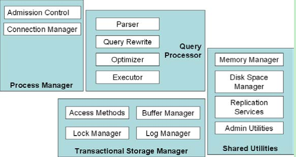

# 概述

[toc]

重点介绍整个数据库系统的架构设计， 并着重讲解那些没有被教科书着重谈到的、 但是却使那些广为人知的算法发挥作用的系统环境。

一个典型的数据库系包含4个主要模块：

* 一个用于管理和调度各种系统中任务的进程管理器；
* 一个一次一个语句的查询处理引擎；
* 一个共享的传统存储子系统负责存储，缓存管理，并发控制和恢复；
* 一系列共享的工具包括内存管理，磁盘空间管理，复制和很多管理员使用的工具。

## 参考资料

《Architecture-of-a-Database-System》
