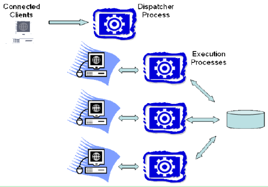
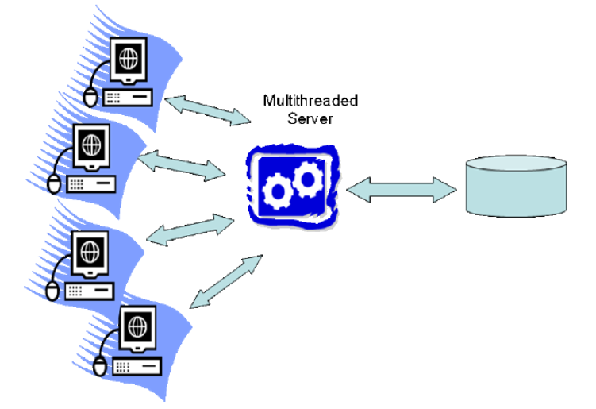
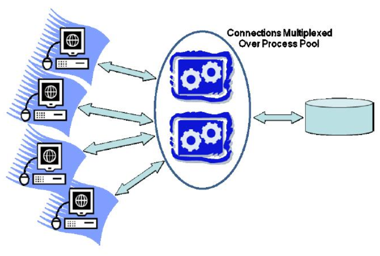

# 进程模型

[toc]

## 意义

在设计多用户服务器时，必须要尽早决定并发用户请求的执行以及它们是如何被映射到操作系统的进程和线程的。这个决定将对之后的系统软件架构以及运行效率、稳定性、轻便性产生深远影响。

## 术语定义

* 进程：一个操作系统进程包含了一个正在执行的程序的活动单元以及专属的地址空间，包括进程状态、系统资源句柄和安全性上下文环境。是程序执行的单元，被操作系统内核管理。
* 线程：一个操作系统线程是操作系统程序执行单元，它没有私有的地址空间和上下文。在多线程系统中，每个线程都可以共享地访问所属进程的地址空间。线程的执行是由系统内核来管理的，通常被称为内核线程或者 k-线程。
* 轻量级线程包：是一个应用层次上的结构，它支持单系统进程中的多线程。不同于由操作系统内核调度的线程，轻量级线程由应用级线程调度程序来负责调度。它们之间的区别是， 轻量级线程仅在用户空间内调度而没有内核调度程序的参与。轻量级线程仅运行在一个进程中，从操作系统调度程序的角度来看只有一个线程在运行。轻量级线程相对于系统线程而言，可以更快地切换，因为轻量级线程不必通过系统内核来切换调度。轻量级线程也有它的缺点，任何线程中断操作，比如 I/O 中断，都会打断进程中的其他线程。这使得一个线程中断等待系统资源时，其它线程就不能运行。轻量级线程包通过以下两点来避免该情况的发生：（1）只接受无中断的异步 I/O 操作；（2）不调用可以导致中断的系统操作。总的来说，轻量级线程相对于系统进程和系统线程，提供了一个更困难的编程模型。一些 DBMS 系统实现了它们自己的轻量级线程包，这些是轻量级线程包的特殊实现。当需要区别于其它线程时，我们将这些线程称为 DBMS 线程和简单线程。
* DBMS 工作者：是指 DBMS 中为客户端工作的线程。它与客户端是一一对应的，即一个 DBMS工作者处理来自一个 DBMS 客户端的所有 SQL 请求。

## 单处理机和轻量级线程

DBMS 拥有三个天然的进程模型性质。从最简单到最复杂依次为：

* 每个 DBMS 工作者拥有一个进程；
* 个 DBMS 工作者拥有一个线程；
* 进程池。

尽管该模型被简化了，但是， 今天的商业 DBMS 系统都遵循这三条性质。

### 每个 DBMS 工作者拥有一个进程

每个 DBMS 工作者拥有一个进程的模型（如下图所示）， 早期被用于 DBMS 开发， 并且今天仍被一些商业系统所采用。这个模型由于 DBMS 工作者被直接映射到系统进程，因而相对容易实现。系统调度管理 DBMS 工作者的运行时间， 而 DBMS 编程人员也可以利用系统的一些保护措施来排除标准错误， 如内存溢出。而且，不同的编程工具， 比如调试器和存储检测器， 都与这种进程模型相适应。使这个模型变复杂的是 DBMS 连接所需要的内存中的数据结构，包括锁机制和缓冲池。这些共享的数据结构必须分配在所有 DBMS 进程都可以访问的共享内存中。这需要系统支持（一般系统均支持）和DBMS 相关的代码。实际中，由于这种模型需要广泛使用共享内存， 使得地址空间分离的优势被削弱了。

如果把“扩展到大量并发连接”作为衡量标准， 那么， 每个 DBMS 工作者拥有一个进程的模型并不十分有效。这是因为， 进程相对于线程而言， 拥有更多的环境变量并且消耗更多 的存储空间。进程切换需要切换安全的上下文环境、 存储空间变量、 文件和网络句柄列表以及其他一些进程上下文。这在线程切换时是不需要的。尽管如此，每个 DBMS 工作者拥有一个进程的模型， 还是比较受欢迎的， 并得到 IBM DB2、 PostgreSQL 和 Oracle 的支持.

### 每个 DBMS 工作者拥有一个线程

在每个 DBMS工作者拥有一个线程的模型中，一个多线程进程负责所有的 DBMS工作者的工作。一个调度线程监听新的 DBMS 客户端连接。每个连接都被分配一个新的线程。当每个客户端提交 SQL 请求时，该请求都由对应的 DBMS 工作者线程来执行。这个线程在DBMS 进程中运行，一旦运行结束，结果将返回给客户端，然后该线程等待来自这个客户端的下一个请求。

多线程编程在这种架构下有以下困难：操作系统对线程不提供溢出和指针的保护；调试困难，尤其是在运行情况下更是如此；由于不同操作系统在线程接口和多线程扩展性方面的不同， 使得软件可移植性较差。“每个 DBMS 工作者拥有一个线程模型”中的很多编程问题，同样存在于每个 DBMS 工作者拥有一个进程模型中，因为它们都需要共享内存的使用。尽管不同操作系统在线程 API 的多样性方面， 近年来不断缩小，但不同平台之间微小的差别 还是不断带来调试上的麻烦。 如果不考虑实现上的困难， 那么， 每个 DBMS 工作者拥有一个线程的模型， 还是可以很好地扩展到高并发系统中的，并且这种模型在一些现代 DBMS 产品中也被使用了，如 IBM DB2、 微软 SQL Server、 MySql、 Informix 和 Sybase。

### 进程池

这个模型是“每个 DBMS 工作者一个进程”这种模型的变体。我们知道， 每个 DBMS工作者拥有一个进程的模型的优点是编程实现较为简单， 但是， 每一个连接都需要一个进程却是一个缺点。使用进程池后，不必每个 DBMS 工作者都分配一个进程，而是由进程池来管理所有 DBMS 工作者。一个中央进程控制所有的 DBMS 客户端连接，每个从客户端到来的 SQL 请求将被分配一个进程池中的进程。 SQL 请求处理完之后，结果返回客户端，进程回到缓冲池中准备分配给下一个请求。缓冲池的大小是一定的， 且通常不可变。如果一个请求到来而没有进程空闲，那么新的请求必须等待进程。

进程池拥有每个 DBMS 工作者一个进程模型的所有优点，而且，由于只需要少量的进程，所以， 其内存使用效率也很高。进程池一般被设计成大小可动态变化的，以此应对大量的高并发请求。当请求负载较低时，进程池可以缩减为较少的等待进程。跟每个 DBMS 工作者一 个进程一样，很多现代 DBMS 产品也支持进程池.

### 共享数据和进程空间

上述的每一个模型都试图尽可能地独立处理并发客户端请求。但是， DBMS 工作者完全地独立工作是不可能的，因为它们处理的是共享的数据库。对于每个 DBMS 工作者拥有一个线程的模型，数据共享较为简单，因为， 所有线程共享内存空间。在其它模型中，共享内存被用来存放共享数据结构。在所有三个模型中，数据必须从 DBMS 传送给客户端。这使得所有的 SQL 请求都必须传给服务器来处理， 然后得到的结果需要返回给客户端。要实现这个功能，简单地说， 就是使用不同的缓冲区。两种主要的缓冲区是磁盘 I/O 缓冲区和客户端通信缓冲区。我们简要地介绍一下它们以及它们的管理方式。

__磁盘 I/O 缓冲区__：最常见的工作者之间的数据依赖是读写共享的数据。所以，工作者之间的 I/O 中断是必要的。有两种不同的 I/O 中断需要分别考虑： (1)数据库请求；（2）日志请求；

* 数据库 I/O 中断请求：缓冲池。数据库提交的数据存放在数据库缓冲池中。对于每个 DBMS 工作者拥有一个线程的模型，缓冲池中的数据以堆结构的形式存放，允许共享该存储空间的所有线程来访问。在另外两种模型中，缓冲池被作为所有进程共享的空间。总的来说，三种模型都是将缓冲池中的数据共享给所有的线程或进程。当一个线程需要从数据库中读取一个数据页时，它产生一个 I/O 请求并且获得空闲的内存空间来存放得到的数据。当需要将缓冲区中的页存入磁盘时，线程产生一个I/O 请求将缓冲池中的页存入磁盘中的目标地址处。
* 日志 I/O 请求：日志尾部。数据库日志是存储在硬盘上的一组条目（entry）。 一个日志条目是在事务处理过程中产生的，它们会被暂时存储在内存队列中，然后， 周期性地按 FIFO 顺序刷新至日志磁盘中。这个队列常被称为日志尾部。在许多系统中，有一个独立的进程或者线程负责将它刷新至磁盘。

对于每个 DBMS 工作者拥有一个线程的模型，日志尾部只是一个堆数据结构。在另外两种模型中，它们的设计方式比较类似。一种方法是一个独立的进程负责管理日志。日志记录通过共享内存或者其他有效的通信协议与日志管理器进行交互。另一种方式是，日志尾部像上文中提到的缓冲池那样分配给共享内存。关键的一点是，所有的线程或者进程在处理客户 端请求时， 需要写日志记录并将日志尾部刷新至磁盘。
一种重要的日志刷新方法是提交事务刷新。一个事务在日志记录被刷新到日志存储器之前不能被成功提交。这意味着，客户端代码必须等待日志刷新， DBMS 服务端在刷新之前必须保存所有资源。日志刷新请求可能会被推迟一段时间，这样可以实现在一个 I/O 请求中批量提交记录。

__客户端通信缓冲区__： SQL 通常被用于“拉”（pull）模型，也就是说， 客户端通过重复发送 SQL FETCH 请求， 不断地获取结果元组， SQL FETCH 每个请求会获取一个或多个元组。大多数 DBMS 尽可能地在 FETCH 流到来之前做一些数据预提取工作，以此确保在客户端请求之前将结果存入队列。为支持预提取功能， DBMS 工作者使用客户端通信套接字作为元组队列。将来更复杂的方法是实现客户端游标缓存功能， 并使用 DBMS 客户端存储近期即将被访问的结果， 而不是依赖于操作系统通信缓冲区。
__锁表__：锁表由所有的 DBMS 工作者共享，由锁管理器实现数据库锁机制。锁共享技术类似于缓冲池共享， 并可以用类似的方法实现 DBMS 开发需要的其他数据结构共享。

## DBMS 线程

当前的大多数 DBMS 技术，都离不开 19 世纪 70 年代开始的系统研究和 19 世纪 80 年代开始的商业化发展。在数据库开发的早期阶段，标准操作系统的技术无法用到数据库开发中。高效的操作系统线程支持就是其中一种技术。直到 19 世纪 90 年代，操作系统线程的出现和广泛应用，才使得数据库开发发生了很大的变化。即便是今天，操作系统线程开发都没有很好地支持 DBMS 的工作负载。受历史发展的影响以及其他一些原因，很多广泛应用的 DBMS 在开发上并不依赖于操作系统线程。一些完全不涉及线程，而是使用每个 DBMS 工作者拥有一个进程或者进程池模型。其他的 DBMS， 比如一个 DBMS 工作者拥有一个线程的模型， 需要一个方案来应对那些没有 好的内核线程的系统。一些技术领先的 DBMS 解决该问题的方式是， 开发了自己的高效轻量级的线程包。这些轻量级线程或者说 DBMS 线程， 取代了上文提到的系统线程。每个 DBMS线程都管理自己的变量，通过非中断的异步接口来编写中断操作，并通过调度器来调度任务。

## 标准实践

在现今主要的 DBMS 中，我们可以看到 2.1 节中介绍的所有三种架构以及它们的一些有趣的变化。 IBM DB2 是支持四种进程模型的很有趣的例子。对于线程支持良好的操作系统，DB2 默认的模型是每个 DBMS 工作者拥有一个线程，它也支持 DBMS 工作者多路复用一个线程池。当运行在没有线程支持的系统上时， DB2 默认的模型是每个 DBMS 工作者拥有一个进程， 同时也支持 DBMS 工作者多路复用一个进程池。
我们对 IBM DB2、 MySql、 Oracle、 PostgreSQL 和 Microsoft SQL Server 所支持的进程模型做一个总结：

### 每个 DBMS 工作者拥有一个进程

这是最直接的进程模型， 同时也得到了广泛的应用。 DB2 在不支持线程的系统上，默认使用每个 DBMS 工作者拥有一个进程的模型，在支持线程的系统上，默认使用每个 DBMS工作者拥有一个线程的模型。这也是 Oracle 进程模型的默认设计。 Oracle 也支持上文提到的进程池。 PostgreSQL 在所有的操作系统上都只运行每个 DBMS 工作者拥有一个进程模型。

### 每个 DBMS 工作者拥有一个线程

该模型有两个种类，在目前来看十分高效：

1. 每个 DBMS 工作者拥有一个系统线程： IBM DB2 运行在有良好系统线程支持的系统上时， 默认使用该模型； MySQL 同样使用该模型。
2. 每个 DBMS 工作者拥有一个 DBMS 线程：在这个模型中， DBMS 工作者的调度是通过系统进程或线程去调度轻量级线程来实现的。这个模型规避了系统调度的一些问题，但是，它开发代价较高，没有良好的开发工具，也需要运营商的长期维护。它有两种子模型：
    1. 通过系统进程来调度 DBMS 线程：轻量级线程的调度是由一个或多个系统进程来完成的。 Sybase 和 Informix 支持该模型。现今很多系统采用这个模型来开发实现DBMS 线程的调度，以此调度 DBMS 工作者发挥多处理器的作用。然而，并不是所有采用这个模型的系统都实现了线程迁移：将 DBMS 线程再分配给不同的系统进程（如考虑到负载均衡）。
    2. 通过系统线程来调度系统进程：微软 SQL Sever 以可选择的方式支持这种模型（默认的模型为 DBMS 工作者多路复用线程池）。 SQL Sever 中这个选项叫做 Fibers，被用做应对高频事务处理，但是很少被使用

### 进程/线程池

在这个模型中， DBMS 工作者共用一个进程池。随着系统线程支持性能的不断提高，依赖线程池而不是进程池的新的变种开始出现。在后面这种变种模型中， DBMS 工作者复用系统的一个系统线程池：

1. DBMS 工作者共用进程池：这个模型相对于每个 DBMS 工作者拥有一个进程的模型而言， 有更高的内存使用效率。在系统没有良好的线程支持的情况下，它也易于与系统对接，并且在大量用户的情况下表现稳定。这个模型是 Oracle 数据库的可选项，Oracle 建议在大量用户并发操作的情况下使用。 Oracle 默认的模型是每个 DBMS 工作者拥有一个进程。这两个选项对于 Oracle 所适用的大多数操作系统而言都是支持的。
2. DBMS 工作者共用线程池：微软 SQL Server 默认使用该模型，且超过 99%的 SQL Server产品使用该模型来运行。为有效支持上万的并发连接用户， SQL Server 提供可选支持， 允许系统线程调度 DBMS 线程。我们将在下一章中谈到，现今大多数商业数据库支持内部查询并行化：并行多线程执行一条查询语句或者该语句的一部分。这一节中我们之所以提到这一点，是因为并行化内部查询，使得多个 DBMS工作者暂时分配给一条 SQL请求。除了一个客户端连接将拥有多个 DBMS工作者来处理其请求之外，之前提到的进程模型与该情况并无冲突。
