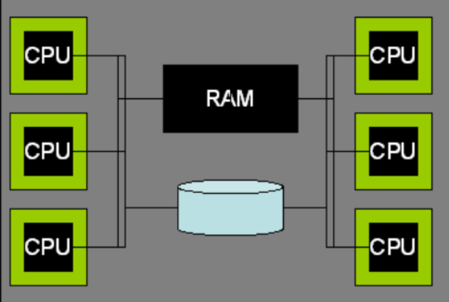
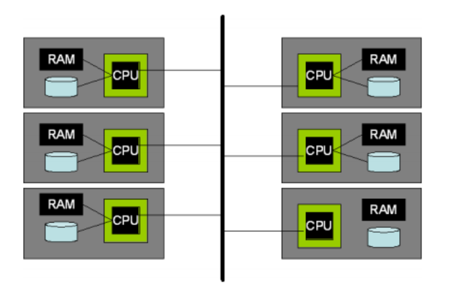
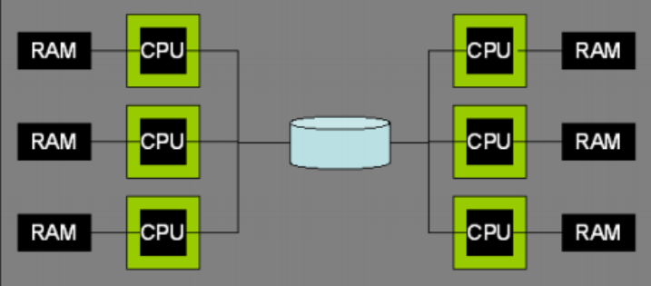

# 并行架构：进程和内存协调

[toc]

## 共享内存

在一个共享内存的并行系统中，所有的处理机可以使用相同的内存和硬盘，并且拥有大致相同的性能。这个架构现在已经是一个标准。

多核处理器在单一芯片上支持多个处理内核和共享一些基础结构，如高速缓存（cache）和内存总线。这使得它们在编程方面非常类似于共享内存的架构。 几乎所有的数据库部署都涉及到多个处理器，并且每个处理器都不只一个 CPU。 DBMS 架构需要充分利用这种潜在的并行。前面提到的3中进程模型的DBMS 的架构， 可以在现代共享内存硬件架构上运行得很好。

## 无共享

一个无共享的并行系统是由多个独立计算机的集群组成的，这些计算机可以高速地通过网络进行互连通信，或者逐渐频繁地在商业网络组件上通信。对于给定的一个系统，无法直接访问另一个系统的内存和硬盘。

无共享系统并没有提供抽象的硬件共享，协调不同机器的任务完全留给了 DBMS。 DBMS 支持这些集群最常用的技术就是在集群中的每台机器或每个节点上运行它们标准的进程模型。每一个节点都能够接受客户端 SQL 请求、访问需要的元数据、编译 SQL 请求、进行数据访问，正如上述描述的单一共享内存一样。主要的区别就是， 集群中的每个系统仅仅保存一部分的数据。对于每一个 SQL 请求，无共享系统中的每一个节点不只是单独执行查询本地的数据，这个请求会被发送到集群中的其他成员，然后所有的计算机并行地执行查询本地所保存的数据。每个表格会通过水平数据分区传播到集群的多个系统中，因此， 每个处理器可以独立于其他处理器执行。

数据库中的每一个元组被分配到到单独的机器， 因此， 每一张表被水平地切分，然后分布到整个系统。典型的数据分区方案包括： 基于哈希的分区，元基于范围的分区， round-robin，以及混合型分区方案（前两种方案的混合）。 每一个单独的计算机都负责访问、 锁定、 记录本地磁盘上的数据。 在查询执行期间，查询优化器会选择如何对表进行
重新水平分区，然后把中间结果分布到各个计算机上以满足查询的需要，并且给每一台机器分配一个作业的逻辑分区。不同的计算机上的查询执行部件， 将数据请求和元组传输到其他计算机中，但是， 没必要传输任何线程状态和其他低级的信息。

同时，在无共享系统中，局部故障是必须被妥善管理的。在一个无共享系统中，一个处理器发生故障通常会导致整个系统的停止运行，因此， 整个 DBMS 也会停止运行。在一个无共享系统中，集群中一个单一的节点发生故障， 并不一定会影响到其他的节点。但是， 这 肯定会影响 DBMS 的整体运行，因为， 失败的节点里寄存着数据库中部分的数据。在这种情形下，至少有三种可行的方法。 第一种办法就是，如果有任何一个节点发生故障，就停止运行所有的节点；这本质上是模拟在一个共享内存系统中将会发生的事情。第二种方法， 在Informix 上称为“数据跳跃”，允许在正常的节点上继续执行查询，而跳过故障节点的数据。 第三种方法是采用冗余方案， 范围从完整的数据库失败恢复（需要两倍的计算基数量和软件数量）到类似于链式分簇的细粒度冗余。

## 共享磁盘

在一个共享磁盘的并行系统中， 所有的处理器可以访问具备大致相同性能的磁盘，但是， 不能访问彼此的 RAM。这种架构是相当普遍的，两个突出的例子是 OracleRAC 和 DB2 for zSeries SYSPLEX。随着存储区域网络（SAN： Storage Area Networks）的普及，共享磁盘在最近几年已经变得越来越普遍。一个 SAN 允许一个或多个逻辑磁盘被安装到一个或多个宿主系统上，这样可以使得创建共享磁盘配置变得较为容易。

共享磁盘系统相对于无共享系统而言的一个潜在的优势就是，它们管理成本较低。共享磁盘系统的 DBAs 没必要为了实现并行而考虑对表进行分区并分布到不同计算机上。但是，大型的数据库仍然需要分区，所以， 对于大规模数据库，二者的区别不是很显著。
与共享内存系统不同的是，共享磁盘系统不存在很自然的内存位置来协调数据的共享，每个计算机都有为锁和缓冲池页面准备的本地内存。因此， 需要在多台计算机之间进行显示的数据共享协调。共享磁盘系统依赖于一个分布式锁管理设备和一个管理分布式缓冲池的高速缓存一致性协议。

## 非均衡内存访问

非均衡内存访问（NUMA： Non-Uniform Memory Access）系统， 在一个拥有独立内存 的集群系统中，提供了共享内存编程模型。集群中的每个系统都能快速访问本地内存，然而
高速集群中每个计算机之间的远程访问，会存在一定程度上的互连延迟。这个架构的名字来自于这种内存访问时间的不一致。

NUMA 的硬件架构是处于无共享系统和共享内存系统之间的一个有趣的中间地带，它们比无共享集群更容易编程，同时， 比共享内存系统拥有更大规模的处理器，这样就可以避免共享点的争用，例如共享内存系统总线。

## 线程和多处理器

当在多进程上运行多个 DBMS 线程的时候，就会出现这样的时刻，一个进程拥有大部分的工作，其他进程（处理器也一样）就被闲置了。在这种情形下，为了让这种模式工作得更好， DBMS 必须实现在进程之间迁移线程。

当 DBMS 线程映射到多个操作系统进程的时候，需要作出以下决定：（1） 需要使用多少个操作系统进程；（2） 怎么将 DBMS 线程分配到操作系统线程；（3） 怎么分配到多个操作系统进程。 一个好的经验法则就是每个物理处理器产生一个进程。这样就可以最大化硬件固有的并行度，同时最小化每个进程的内存开销。
