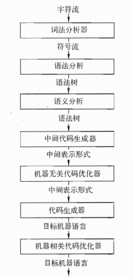
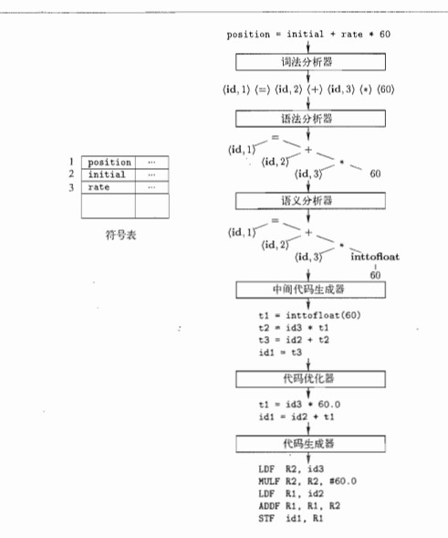

# 引论

程序设计语言是设计用来表示计算的形式语言，不同于自然语言，自然语言允许二义性，而程序语言应该避免二义性。

程序设计语言是向人以及计算机描述计算过程的记号。一个程序在可以运行之前，需要被翻译成一种能够被计算机执行的形式。

完成这项翻译工作的软件系统称为编译器（compiler）。

编译器必须遵守两个基本原则：

* 必须保持被编译程序的语义
* 必须以某种可察觉的方式改进输入程序

## 语言处理器

一个编译器就是一个程序，它可以阅读以某一种语言编写的程序，并把该程序翻译成一个等价的、用另一种语言（目标语言）编写的程序。

## 编译器的结构

编译器大致上可以分为三个部分：前端、优化器、后端。每一部分都会经理多趟。前端就是理解源程序，然后转换成IR，优化器专注于改进IR，后端把IR映射到目标机器。

编译器的流程如下：


### 前端

源程序一般是一个字符串的集合，通常是无限集，由某种规则的有限集定义，这个有限集成为语法。

程序设计语言语法通常基于词类来引用单词，将语法规则基于词类划分使得单一规则能够描述很多句子。例如英语中：

```c
Sentence(句子)-> Subject(主语) verb(动词) Object(宾语) endmark(结束标点符号) 
```

其中，verb和endmark是词类，而Sentence、Subject和Object是语法变量。Sentence表示任何具有该规则所描述形式的字符串。符号 -> 表示右侧的一个实例可以抽象为左侧的语法变量。

比如"Compilers are engineered objects."。理解这个句子的语法时，第一步就是标识输入程序的各个单词，并将各个单词划入对应的词类。这属于词法分析的处理过程。词法分析器以字符流为输入，并将其转换为已归类单词的流。已归类单词是形如(p,s)的对，其中p是单词的词类，s是单词的拼写，

```c
(noun, "Compilers"), (verb, "are"), (adjective, "engineered"), (noun, "objects"), (endmark, ".")
```

实际上，单词的拼写可能保存在散列表中，而(p,s)对中的s可以用一个整数索引表示，以简化相等性测试。

语法正确的句子可能是无意义的。比如"Rocks are green vegetables."与"Compilers are engineered objects."使用了相同的词类，但是前一个句子没有合理的语义。语义分析就是来检查这种问题的。

### 词法分析

编译器的第一个步骤就是词法分析，词法分析输入是源程序的字符流，然后将他们分割成有意义的词素（lexeme）序列。对于每个词素，词法分析器产生如下形式的词法单元（token）作为输出：
```<token-name, attribute-value>```
第一个分量token-name是一个由语法分析步骤使用的抽象符号，第二个分量attribute-value指向符号表中关于这个词法单元的条目，比如，假设一个源程序包含如下语句：

```c
position = initial + rate * 60
```

被词法分析器处理后输出为

1. position是一个词素，被映射成词法单元<id, 1>, 其中id是表时标识符的抽象符号，1指向符号表中position对应的条目。
2. 赋值符号=是一个词素，被映射成词法单元<=>。因为这个词法单依安不需要属性值，所以省略了第二个分量。
3. initial是一个词素，被映射成<id,2>，其中2指向initial对应的符号表条目。
4. `+` 是一个词素，被映射成< + >
5. rate是一个词素，被映射成 <id, 3>， 3指向rate对应的符号表条目。
6. \* 是一个词素，被映射成 <*>
7. 60是一个词素，被映射成<60>。

空格都会被忽略。
最终，赋值语句可以表示成如下形式

```c
<id, 1> <=> <id, 2> <id, 3> <*> <60>
```



### 语义分析

语义分析使用语法树和符号表来检查源程序是否和语言定义的语义一致。同时也收集类型信息，并把这些信息存放在语法树或符号表中。语义分析的一个重要工作就是类型检查。比如数组下标必须是整数，负数的话就要报错。
