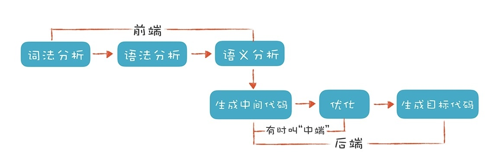
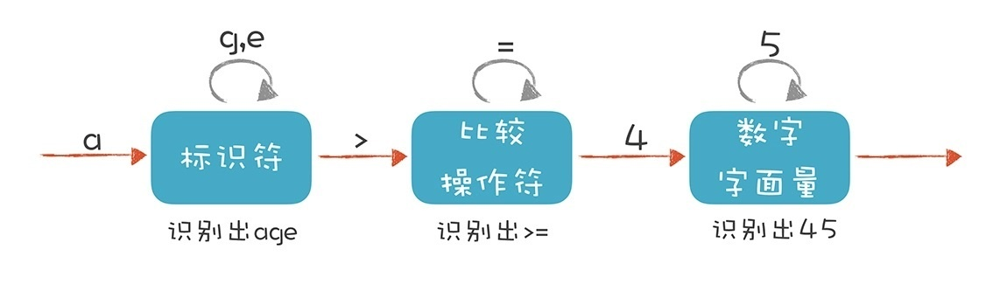
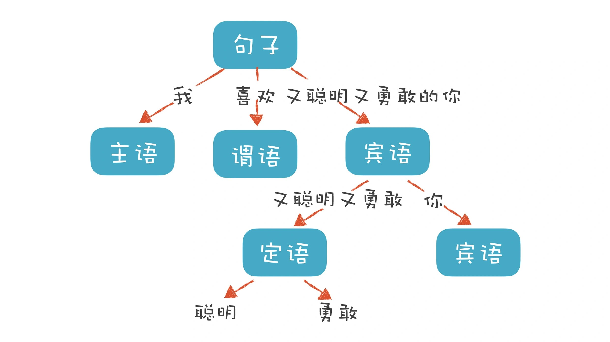
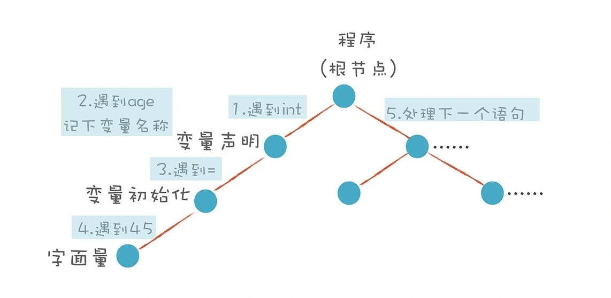

编译器的前端（Front End），指的是编译器对程序代码的分析和理解过程。它通常只跟语言的语法有关，跟目标机器无关。主要分为词法分析、语法分析和语义分析三个部分。

编译器的后端（Back End），则是生成目标代码的过程，跟目标机器有关。

## 词法分析（Lexical Analysis）
将字符串序列转换成Token序列的过程，也就是分词的过程，比如把‘i’和‘f’当成‘if’，‘1’、‘2’、‘3’、‘4’是一个常量‘1234’。

编译器的第一项工作叫做词法分析。就像阅读文章一样，文章是由一个个的中文单词组成的。程序处理也一样，只不过这里不叫单词，而是叫做“词法记号”，英文叫 Token。

关键字、标识符、运算符、标点符号、字符串、字面量等等都是Token。

用正则表达式，生成一种“__有限自动机__”的算法，来完成词法分析。

比如，词法分析器在分析age=5，它分析整个程序的字符串，当遇到不同的字符时，会驱使它迁移到不同的状态。在扫描 age 的时候，处于“标识符”状态，等它遇到一个 > 符号，就切换到“比较操作符”的状态。词法分析过程，就是这样一个个状态迁移的过程。

## 语法分析 （Syntactic Analysis, or Parsing）
编译器下一个阶段的工作是语法分析。词法分析是识别一个个的单词，而语法分析就是在词法分析的基础上识别出程序的语法结构。这个结构是一个树状结构，是计算机容易理解和执行的。

个人理解，语法分析就是判断程序是否符合变成语言的语法规范，比如scala函数定义def fun（）：Type = {}和c语言int fun() {}的结构是不同的。

比如，“我喜欢又聪明又勇敢的你”这个句子包含了“主、谓、宾”三个部分。主语是“我”，谓语是“喜欢”，宾语部分是“又聪明又勇敢的你”。其中宾语部分又可以拆成两部分，“又聪明又勇敢”是定语部分，用来修饰“你”。定语部分又可以分成“聪明”和“勇敢”两个最小的单位。

程序也有定义良好的语法结构，它的语法分析过程，就是构造这么一棵树。一个程序就是一棵树，这棵树叫做抽象语法树（Abstract Syntax Tree，AST）。树的每个节点（子树）是一个语法单元，这个单元的构成规则就叫“语法”。每个节点还可以有下级节点。

怎样写程序来构造AST呢？

一种非常直观的构造思路是自上而下进行分析。首先构造根节点，代表整个程序，之后向下扫描 Token 串，构建它的子节点。当它看到一个 int 类型的 Token 时，知道这儿遇到了一个变量声明语句，于是建立一个“变量声明”节点；接着遇到 age，建立一个子节点，这是第一个变量；之后遇到 =，意味着这个变量有初始化值，那么建立一个初始化的子节点；最后，遇到“字面量”，其值是 45。这样，一棵子树就扫描完毕了。程序退回到根节点，开始构建根节点的第二个子节点。这样递归地扫描，直到构建起一棵完整的树。

这个算法就是非常常用的递归下降算法（Recursive Descent Parsing）。

递归下降算法是一种自顶向下的算法，与之对应的，还有自底向上的算法。这个算法会先将最下面的叶子节点识别出来，然后再组装上一级节点。有点儿像搭积木，我们总是先构造出小的单元，然后再组装成更大的单元。原理就是这么简单。

## 语义分析（Semantic Analysis）
语义分析就是使用语法树和符号表中的信息来检查源程序是否和语言定义的语义一致。它同时也收集类型信息，并把这些信息存放在语法树或符号表中，以便在随后的中间代码生成过程中使用。。

到语义分析结束就实现了一个编译器完整的前端部分，不同的目标语言可以用相同的中间代码表示，即对程序的翻译，以此实现多种语言间的编译。

## 小结
词法分析是把程序分割成一个个 Token 的过程，可以通过构造有限自动机来实现。

语法分析是把程序的结构识别出来，并形成一棵便于由计算机处理的抽象语法树。可以用递归下降的算法来实现。

语义分析是消除语义模糊，生成一些属性信息，让计算机能够依据这些信息生成目标代码。
