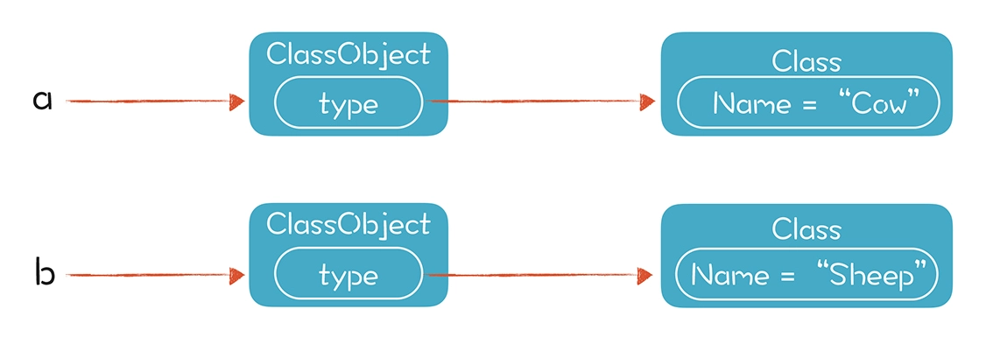

继承和多态对类型系统提出的新概念，就是子类型。我们之前接触的类型往往是并列关系，你是整型，我是字符串型，都是平等的。而现在，一个类型可以是另一个类型的子类型，比如我是一只羊，又属于哺乳动物。这会导致我们在编译期无法准确计算出所有的类型，从而无法对方法和属性的调用做完全正确的消解（或者说绑定）。这部分工作要留到运行期去做，也因此，面向对象编程会具备非常好的优势，因为它会导致多态性。这个特性会让面向对象语言在处理某些类型的问题时，更加优雅。

而我们要想深刻理解面向对象的特征，就必须了解子类型的原理和运行期的机制。所以，接下来，我们从类型体系的角度理解继承和多态，然后看看在编译期需要做哪些语义分析，再考察继承和多态的运行期特征。

## 从类型体系的角度理解继承和多态
__继承的意思是一个类的子类，自动具备了父类的属性和方法，除非被父类声明为私有的__。比如一个类是哺乳动物，它有体重（weight）的属性，还会做叫 (speak) 的操作。如果基于哺乳动物这个父类创建牛和羊两个子类，那么牛和羊就自动继承了哺乳动物的属性，有体重，还会叫。

所以继承的强大之处，就在于重用。也就是有些逻辑，如果在父类中实现，在子类中就不必重复实现。

__多态的意思是同一个类的不同子类，在调用同一个方法时会执行不同的动作__。这是因为每个子类都可以重载掉父类的某个方法，提供一个不同的实现。哺乳动物会“叫”，而牛和羊重载了这个方法，发出“哞~”和“咩~”的声音。这似乎很普通，但如果创建一个哺乳动物的数组，并在里面存了各种动物对象，遍历这个数组并调用每个对象“叫”的方法时，就会发出“哞~”“咩~”“喵~”等各种声音，这就有点儿意思了。

下面这段示例代码，演示了继承和多态的特性，a 的 speak() 方法和 b 的 speak() 方法会分别打印出牛叫和羊叫，调用的是子类的方法，而不是父类的方法：
```java
/**
mammal.play 演示面向对象编程：继承和多态。
*/
class Mammal{
    int weight = 20;  
    boolean canSpeak(){
        return true;
    }
    void speak(){
        println("mammal speaking...");
    }
}
class Cow extends Mammal{
    void speak(){
        println("moo~~ moo~~");
    }
}
class Sheep extends Mammal{
    void speak(){
        println("mee~~ mee~~");
        println("My weight is: " + weight); //weight的作用域覆盖子类
    }
}
//将子类的实例赋给父类的变量
Mammal a = Cow();
Mammal b = Sheep();
//canSpeak()方法是继承的
println("a.canSpeak() : " + a.canSpeak());
println("b.canSpeak() : " + b.canSpeak());
//下面两个的叫声会不同，在运行期动态绑定方法
a.speak();  //打印牛叫
b.speak();  //打印羊叫
```

所以，多态的强大之处，在于虽然每个子类不同，但我们仍然可以按照统一的方式使用它们，做到求同存异。以前端工程师天天打交道的前端框架为例，这是最能体现面向对象编程优势的领域之一。
前端界面往往会用到各种各样的小组件，比如静态文本、可编辑文本、按钮等等。如果我们想刷新组件的显示，没必要针对每种组件调用一个方法，把所有组件的类型枚举一遍，可以直接调用父类中统一定义的方法 redraw()，非常简洁。即便将来添加新的前端组件，代码也不需要修改，程序也会更容易维护。

总结一下：面向对象编程时，我们可以给某个类创建不同的子类，实现一些个性化的功能；写程序时，我们可以站在抽象度更高的层次上，不去管具体的差异。

如果把上面的结论抽象成一般意义上的类型理论，就是__子类型（subtype）__。

子类型（或者动名词：子类型化），是对我们前面讲的类型体系的一个补充。
子类型的核心是提供了 is-a 的操作。也就是对某个类型所做的所有操作都可以用子类型替代。因为子类型 is a 父类型，也就是能够兼容父类型，比如一只牛是哺乳动物。

这意味着只要对哺乳动物可以做的操作，都可以对牛来做，这就是子类型的好处。它可以放宽对类型的检查，从而导致多态。你可以粗略地把面向对象的继承看做是子类型化的一个体现，它的结果就是能用子类代替父类，从而导致多态。

子类型有两种实现方式：一种就是像 Java 和 C++ 语言，需要显式声明继承了什么类，或者实现了什么接口。这种叫做名义子类型（Nominal Subtyping）。
另一种是结构化子类型（Structural Subtyping），又叫鸭子类型（Duck Type）。也就是一个类不需要显式地说自己是什么类型，只要它实现了某个类型的所有方法，那就属于这个类型。鸭子类型是个直观的比喻，如果我们定义鸭子的特征是能够呱呱叫，那么只要能呱呱叫的，就都是鸭子。

## 如何对继承和多态的特性做语义分析
首先，从类型处理的角度出发，我们要识别出新的类型：Mammal、Cow 和 Sheep。之后，就可以用它们声明变量了。

第二，我们要设置正确的作用域。

第三，要对变量和函数做类型的引用消解。

## 如何在运行期实现方法的动态绑定
在运行期，我们能知道 a 和 b 这两个变量具体指向的是哪个对象，对象里是保存了真实类型信息的。这个类型信息是在创建对象的时候被正确赋值的：

在调用类的属性和方法时，我们可以根据运行时获得的，确定的类型信息进行动态绑定。下面这段代码是从本级开始，逐级查找某个方法的实现，如果本级和父类都有这个方法，那么本级的就会覆盖掉父类的，这样就实现了多态：
```java
protected Function getFunction(String name, List<Type> paramTypes){
    //在本级查找这个这个方法
    Function rtn = super.getFunction(name, paramTypes);  //TODO 是否要检查visibility
    //如果在本级找不到，那么递归的从父类中查找
    if (rtn == null && parentClass != null){
        rtn = parentClass.getFunction(name,paramTypes);
    }
    return rtn;
}
```
如果当前类里面没有实现这个方法，它可以直接复用某一级的父类中的实现，这实际上就是继承机制在运行期的原理。

这里延伸一下。我们刚刚谈到，在运行时可以获取类型信息，这种机制就叫做运行时类型信息（Run Time Type Information, RTTI）。C++、Java 等都有这种机制，比如 Java 的 instanceof 操作，就能检测某个对象是不是某个类或者其子类的实例。

汇编语言是无类型的，所以一般高级语言在编译成目标语言之后，这些高层的语义就会丢失。如果要在运行期获取类型信息，需要专门实现 RTTI 的功能，这就要花费额外的存储开销和计算开销。

## 继承情况下对象的实例化
在存在继承关系的情况下，创建对象时，不仅要初始化自己这一级的属性变量，还要把各级父类的属性变量也都初始化。比如，在实例化 Cow 的时候，还要对 Mammal 的成员变量 weight 做初始化。


在逐级初始化的过程中，我们要先执行缺省的成员变量初始化，也就是变量声明时所带的初始化部分，然后调用这一级的构造方法。

## 如何实现 this 和 super
```java
package play;
public class ThisSuperTest {
    public static void main(String args[]){
        //创建Cow对象的时候，会在Mammal的构造方法里调用this.reportWeight()，这里会显示什么
        Cow cow = new Cow();
        System.out.println();
        //这里调用，会显示什么
        cow.speak();
    }
}
class Mammal{
    int weight;
    Mammal(){
        System.out.println("Mammal() called");
        this.weight = 100;
    }
    Mammal(int weight){
        this();   //调用自己的另一个构造函数
        System.out.println("Mammal(int weight) called");
        this.weight = weight;
        //这里访问属性，是自己的weight
        System.out.println("this.weight in Mammal : " + this.weight);
        //这里的speak()调用的是谁，会显示什么数值
        this.speak();
    }
    void speak(){
        System.out.println("Mammal's weight is : " + this.weight);
    }
}
class Cow extends Mammal{
    int weight = 300;
    Cow(){
        super(200);   //调用父类的构造函数
    }
    void speak(){
        System.out.println("Cow's weight is : " + this.weight);
        System.out.println("super.weight is : " + super.weight);
    }
}
```
运行结果如下：
```
Mammal() called
Mammal(int weight) called
this.weight in Mammal : 200
Cow's weight is : 0
super.weight is : 200
Cow's weight is : 300
super.weight is : 200
```
答案是 Cow 的 speak() 方法，而不是 Mammal 的。怎么回事？代码里不是调用的 this.speak() 吗？怎么这个 this 不是 Mammal，却变成了它的子类 Cow 呢？

其实，在这段代码中，this 用在了三个地方：
* this.weight 是访问自己的成员变量，因为成员变量的作用域是这个类本身，以及子类。
* this() 是调用自己的另一个构造方法，因为这是构造方法，肯定是做自身的初始化。换句话说，构造方法不存在多态问题。
* this.speak() 是调用一个普通的方法。这时，多态仍会起作用。运行时会根据对象的实际类型，来绑定到 Cow 的 speak() 方法上。

只不过，在 Mammal 的构造方法中调用 this.speak() 时，虽然访问的是 Cow 的 speak() 方法，打印的是 Cow 中定义的 weight 成员变量，但它的值却是 0，而不是成员变量声明时“int weight = 300;”的 300。为什么呢？
要想知道这个答案，我们需要理解多层继承情况下对象的初始化过程。在 Mammal 的构造方法中调用 speak() 的时候，Cow 的初始化过程还没有开始呢，所以“int weight = 300;”还没有执行，Cow 的 weight 属性还是缺省值 0。

super 的调用，也是分成三种情况：
* super.weight。这是调用父类或更高的祖先的 weight 属性，而不是 Cow 这一级的 weight 属性。不一定非是直接父类，也可以是祖父类中的。根据变量作用域的覆盖关系，只要是比 Cow 这一级高的就行。
* super(200)。这是调用父类的构造方法，必须是直接父类的。
* super.speak()。跟访问属性的逻辑一样，是调用父类或更高的祖先的 speak() 方法。

## 小结
* 从类型的角度，面向对象的继承和多态是一种叫做子类型的现象，子类型能够放宽对类型的检查，从而支持多态。
* 在编译期，无法准确地完成对象方法和属性的消解，因为无法确切知道对象的子类型。
* 在运行期，我们能够获得对象的确切的子类型信息，从而绑定正确的方法和属性，实现继承和多态。另一个需要注意的运行期的特征，是对象的逐级初始化过程。