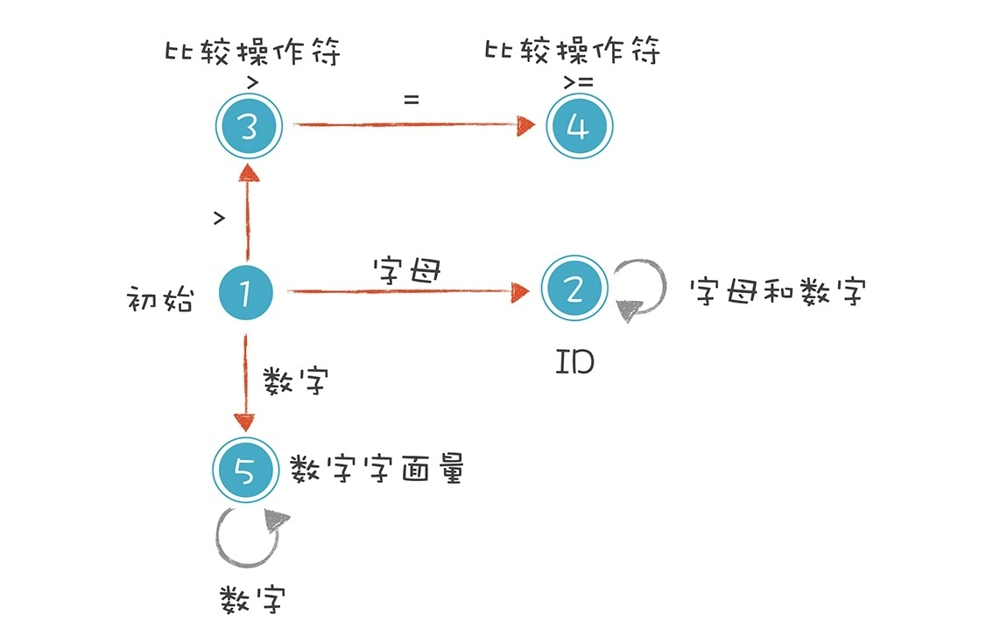
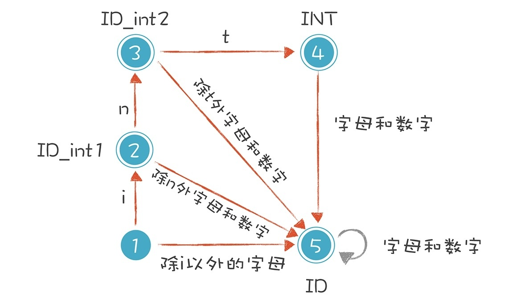

以下列三种情况来分析词法解析过程：

* age >= 45
* int age = 40
* 2+3*5
它们分别是关系表达式、变量声明和初始化语句，以及算术表达式。

## 解析 age >= 45

先定义一下词法规则：

* 标识符：第一个字符必须是字母，后面的字符可以是字母或数字。
* 比较操作符：> 和 >=（其他比较操作符暂时忽略）。
* 数字字面量：全部由数字构成（像带小数点的浮点数，暂时不管它）。
* 

1. 初始状态：刚开始启动词法分析的时候，程序所处的状态。
2. 标识符状态：在初始状态时，当第一个字符是字母的时候，迁移到状态 2。当后续字符是字母和数字时，保留在状态 2。如果不是，就离开状态 2，写下该 Token，回到初始状态。
3. 大于操作符（GT）：在初始状态时，当第一个字符是 > 时，进入这个状态。它是比较操作符的一种情况。
4. 大于等于操作符（GE）：如果状态 3 的下一个字符是 =，就进入状态 4，变成 >=。它也是比较操作符的一种情况。
5. 数字字面量：在初始状态时，下一个字符是数字，进入这个状态。如果后续仍是数字，就保持在状态 5。

依据构造好的有限自动机，在不同的状态中迁移，从而解析出 Token 来。你只要再扩展这个有限自动机，增加里面的状态和迁移路线，就可以逐步实现一个完整的词法分析器了。

## 解析 int age = 40，处理标识符和关键字规则的冲突

标识符和关键字规则有可能是相同的。需要特殊处理。

解决办法就是增加特殊分支判断‘

## 小结

可以看到，要实现一个词法分析器，首先需要写出每个词法的正则表达式，并画出有限自动机，之后，只要用代码表示这种状态迁移过程就可以了。

就是根据规则进行分词，不做任何语法方面的检查。