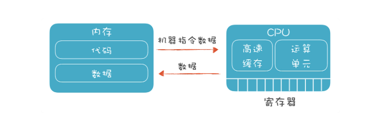
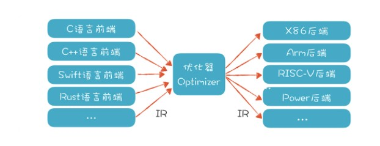

前面的内容都是讲如何让编译器读懂程序，从这节开始，就是让编译器能运行程序。这时，我们就面临了三个问题：
1. 我们必须了解计算机运行一个程序的原理（也就是运行期机制），只有这样，才知道如何生成这样的程序。
2. 要能利用前端生成的 AST 和属性信息，将其正确翻译成目标代码。
3. 需要对程序做尽可能多的优化，比如让程序执行效率更高，占空间更少等等。

弄清这三个问题，是顺利完成编译器后端工作的关键。

## 弄清程序的运行机制
总的来说，编译器后端要解决的问题是：现在给你一台计算机，你怎么生成一个可以运行的程序，然后还能让这个程序在计算机上正确和高效地运行？

基本上，我们需要面对的是两个硬件：
* 一个是 CPU，它能接受机器指令和数据，并进行计算。它里面有寄存器、高速缓存和运算单元，充分利用寄存器和高速缓存会让系统的性能大大提升.
* 另一个是内存。我们要在内存里保存编译好的代码和数据，还要设计一套机制，让程序最高效地利用这些内存。

通常情况下，我们的程序要受某个操作系统的管理，所以也要符合操作系统的一些约定。但有时候我们的程序也可能直接跑在硬件上，单片机和很多物联网设备采用这样的结构，甚至一些服务端系统，也可以不跑在操作系统上。

你可以看出，编译器后端技术跟计算机体系结构的关系很密切。我们必须清楚地理解计算机程序是怎么运行的，有了这个基础，才能探讨如何编译生成这样的程序。

## 生成代码
编译器后端的最终结果，就是生成目标代码。如果目标是在计算机上直接运行，就像 C 语言程序那样，那这个目标代码指的是汇编代码。而如果运行目标是 Java 虚拟机，那这个目标代码就是指 JVM 的字节码。

为了降低后端工作量，提高软件复用度，就需要引入中间代码（Intermediate Representation，IR）的机制，它是独立于具体硬件的一种代码格式。各个语言的前端可以先翻译成 IR，然后再从 IR 翻译成不同硬件架构的汇编代码。如果有 n 个前端语言，m 个后端架构，本来需要做 m*n 个翻译程序，现在只需要 m+n 个了。这就大大降低了总体的工作量。

## 代码分析和优化
生成正确的、能够执行的代码比较简单，可这样的代码执行效率很低，因为直接翻译生成的代码往往不够简洁，比如会生成大量的临时变量，指令数量也较多。因为翻译程序首先照顾的是正确性，很难同时兼顾是否足够优化，这是一方面。另一方面，由于高级语言本身的限制和程序员的编程习惯，也会导致代码不够优化，不能充分发挥计算机的性能。所以我们一定要对代码做优化。程序员在比较各种语言的时候，一定会比较它们的性能差异。一个语言的性能太差，就会影响它的使用和普及。

优化工作又分为“__独立于机器的优化”和“依赖于机器的优化__”两种。

独立于机器的优化，是基于 IR 进行的。

依赖于机器的优化，则是依赖于硬件的特征。
* __寄存器优化__。对于频繁访问的变量，最好放在寄存器中，并且尽量最大限度地利用寄存器，不让其中一些空着，有不少算法是解决这个问题的，教材上一般提到的是染色算法；
* __充分利用高速缓存__。高速缓存的访问速度可以比内存快几十倍上百倍，所以我们要尽量利用高速缓存。比如，某段代码操作的数据，在内存里尽量放在一起，这样 CPU 读入数据时，会一起都放到高速缓存中，不用一遍一遍地重新到内存取。
* __并行性__。现代计算机都有多个内核，可以并行计算。我们的编译器要尽可能把充分利用多个内核的计算能力。 这在编译技术中是一个专门的领域。
* __流水线__。CPU 在处理不同的指令的时候，需要等待的时间周期是不一样的，在等待某些指令做完的过程中其实还可以执行其他指令。就比如在星巴克买咖啡，交了钱就可以去等了，收银员可以先去处理下一个顾客，而不是要等到前一个顾客拿到咖啡才开始处理下一个顾客。
* __指令选择__。有的时候，CPU 完成一个功能，有多个指令可供选择。而针对某个特定的需求，采用 A 指令可能比 B 指令效率高百倍。比如 X86 架构的 CPU 提供 SIMD 功能，也就是一条指令可以处理多条数据，而不是像传统指令那样一条指令只能处理一条数据。在内存计算领域，SIMD 也可以大大提升性能，我们在第 30 讲的应用篇，会针对 SIMD 做一个实验。
* __其他优化__。比如可以针对专用的 AI 芯片和 GPU 做优化，提供 AI 计算能力，等等。

## 小结
编译器的后端，要把高级语言翻译成计算机能够理解的目标语言。它跟前端相比，关注点是不同的。前端关注的是正确反映了代码含义的静态结构，而后端关注的是让代码良好运行的动态结构。它们之间的差别，从我讲解“作用域”和“生存期”两个概念时就能看出来。作用域是前端的概念，而生存期是后端的概念。
