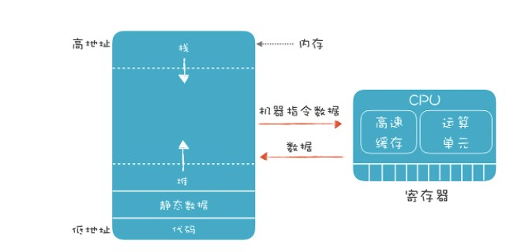
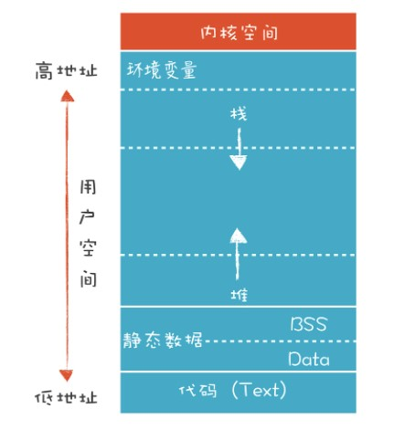
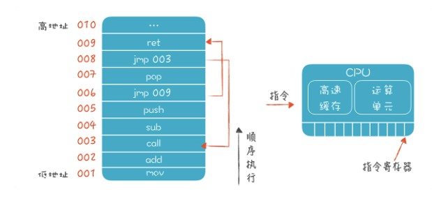
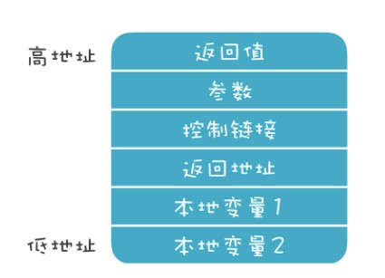
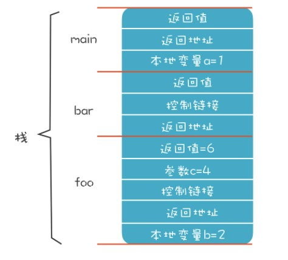
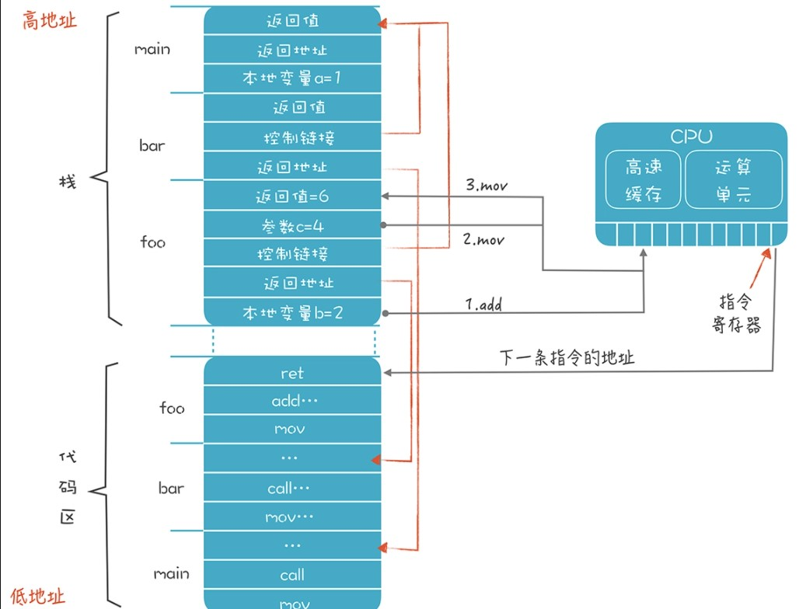

编译器的任务，是要生成能够在计算机上运行的代码，但要生成代码，我们必须对程序的运行环境和运行机制有比较透彻的了解。
本节分成两个部分：
1. 了解程序运行的环境，包括 CPU、内存和操作系统，探知它们跟程序到底有什么关系。
2. 了解程序运行的过程。比如，一个程序是怎么跑起来的，代码是怎样执行和跳转的，又是如何管理内存的。

## 程序运行的环境
程序运行的过程中，主要是跟两个硬件（CPU 和内存）以及一个软件（操作系统）打交道。本质上，我们的程序只关心 CPU 和内存这两个硬件。


### 1. 关注 CPU 和内存
CPU 的内部有很多组成部分，对于本课程来说，我们重点关注的是寄存器以及高速缓存，它们跟程序的执行机制和优化密切相关。

__寄存器__ 是 CPU 指令在进行计算的时候，临时数据存储的地方。CPU 指令一般都会用到寄存器，比如，典型的一个加法计算（c=a+b）的过程是这样的：
```
指令 1（mov）：从内存取 a 的值放到寄存器中；
指令 2（add）：再把内存中 b 的值取出来与这个寄存器中的值相加，仍然保存在寄存器中；
指令 3（mov）：最后再把寄存器中的数据写回内存中 c 的地址。
```

寄存器的速度也很快，所以能用寄存器就别用内存。尽量充分利用寄存器，是编译器做优化的内容之一。

而 __高速缓存__ 可以弥补 CPU 的处理速度和内存访问速度之间的差距。我们的指令在内存读一个数据的时候，它不是老老实实地只读进当前指令所需要的数据，而是把跟这个数据相邻的一组数据都读进高速缓存了。这就相当于外卖小哥送餐的时候，不会为每一单来回跑一趟，而是一次取一批，如果这一批外卖恰好都是同一个写字楼里的，那小哥的送餐效率就会很高。内存和高速缓存的速度差异差不多是两个数量级，也就是一百倍。比如，高速缓存的读取时间可能是 0.5ns，而内存的访问时间可能是 50ns。

写程序时，尽量把某个操作所需的数据都放在内存中的连续区域中，不要零零散散地到处放，这样有利于充分利用高速缓存。这种优化思路，叫做数据的局部性。

一个编译器的作者，可以决定在哪儿放代码，在哪儿放数据，当然了，别的作者也可能采用其他的策略。实际上，C 语言和 Java 虚拟机对内存的管理和使用策略就是不同的。

尽管如此，大多数语言还是会采用一些通用的内存管理模式。以 C 语言为例，会把内存划分为代码区、静态数据区、栈和堆。


一般来讲，代码区是在最低的地址区域，然后是静态数据区，然后是堆。而栈传统上是从高地址向低地址延伸，栈的最顶部有一块区域，用来保存环境变量。

__代码区（也叫文本段）存放编译完成以后的机器码__。这个内存区域是只读的，不会再修改，但也不绝对。现代语言的运行时已经越来越动态化，除了保存机器码，还可以存放中间代码，并且还可以在运行时把中间代码编译成机器码，写入代码区。

__静态数据区保存程序中全局的变量和常量__。它的地址在编译期就是确定的，在生成的代码里直接使用这个地址就可以访问它们，它们的生存期是从程序启动一直到程序结束。它又可以细分为 Data 和 BSS 两个段。Data 段中的变量是在编译期就初始化好的，直接从程序装在进内存。BSS 段中是那些没有声明初始化值的变量，都会被初始化成 0。

__堆适合管理生存期较长的一些数据，这些数据在退出作用域以后也不会消失__。比如，我们在某个方法里创建了一个对象并返回，并希望代表这个对象的数据在退出函数后仍然可以访问。

__而栈适合保存生存期比较短的数据，比如函数和方法里的本地变量__。它们在进入某个作用域的时候申请内存，退出这个作用域的时候就可以释放掉。

### 2. 程序和操作系统的关系
程序跟操作系统的关系比较微妙：
* 一方面我们的程序可以编译成不需要操作系统也能运行，就像一些物联网应用那样，完全跑在裸设备上。
* 另一方面，有了操作系统的帮助，可以为程序提供便利，比如可以使用超过物理内存的存储空间，操作系统负责进行虚拟内存的管理。

在存在操作系统的情况下，因为很多进程共享计算机资源，所以就要遵循一些约定。这就仿佛办公室是所有同事共享的，那么大家就都要遵守一些约定，如果一个人大声喧哗，就会影响到其他人。

程序需要遵守的约定包括：程序文件的二进制格式约定，这样操作系统才能程序正确地加载进来，并为同一个程序的多个进程共享代码区。在使用寄存器和栈的时候也要遵守一些约定，便于操作系统在不同的进程之间切换的时候、在做系统调用的时候，做好上下文的保护。

## 程序运行的过程
### 1. 程序运行的细节
首先，可运行的程序一般是由操作系统加载到内存的，并且定位到代码区里程序的入口开始执行。比如，C 语言的 main 函数的第一行代码。

每次加载一条代码，程序都会顺序执行，碰到跳转语句，才会跳到另一个地址执行。CPU 里有一个指令寄存器，里面保存了下一条指令的地址。

假设我们运行这样一段代码编译后形成的程序：
```java
int main(){
  int a = 1;
  foo(3);
  bar();
}

int foo(int c){
    int b = 2;
    return b+c;
}

int bar(){
    return foo(4) + 1;
}
```

目前我们用栈来管理内存，所以可以把活动记录等价于栈桢。栈桢是活动记录的实现方式，我们可以自由设计活动记录或栈桢的结构，下图是一个常见的设计：

* 返回值：一般放在最顶上，这样它的地址是固定的。foo() 函数返回以后，它的调用者可以到这里来取到返回值。在实际情况中，我们会优先通过寄存器来传递返回值，比通过内存传递性能更高。
* 参数：在调用 foo 函数时，把参数写到这个地址里。同样，我们也可以通过寄存器来传递，而不是内存。
* 控制链接：就是上一级栈桢的地址。如果用到了上一级作用域中的变量，就可以顺着这个链接找到上一级栈桢，并找到变量的值。
* 返回地址：foo 函数执行完毕以后，继续执行哪条指令。同样，我们可以用寄存器来保存这个信息。
* 本地变量：foo 函数的本地变量 b 的存储空间。
* 寄存器信息：我们还经常在栈桢里保存寄存器的数据。如果在 foo 函数里要使用某个寄存器，可能需要先把它的值保存下来，防止破坏了别的代码保存在这里的数据。这种约定叫做被调用者责任，也就是使用寄存器的人要保护好寄存器里原有的信息。某个函数如果使用了某个寄存器，但它又要调用别的函数，为了防止别的函数把自己放在寄存器中的数据覆盖掉，要自己保存在栈桢中。这种约定叫做调用者责任。
  

你可以看到，每个栈桢的长度是不一样的。

### 2. 从全局角度看整个运行过程

代码区里存储了一些代码，main 函数、bar 函数和 foo 函数各自有一段连续的区域来存储代码，我用了一些汇编指令来表示这些代码（实际运行时这里其实是机器码）。
假设我们执行到 foo 函数中的一段指令，来计算“b+c”的值，并返回。这里用到了 mov、add、jmp 这三个指令。mov 是把某个值从一个地方拷贝到另一个地方，add 是往某个地方加一个值，jmp 是改变代码执行的顺序，跳转到另一个地方去执行
```
mov b的地址 寄存器1
add c的地址 寄存器1
mov 寄存器1 foo的返回值地址
jmp 返回地址  //或ret指令
```
执行完这几个指令以后，foo 的返回值位置就写入了 6，并跳转到 bar 函数中执行 foo 之后的代码。

这时，foo 的栈桢就没用了，新的栈顶是 bar 的栈桢的顶部。理论上讲，操作系统这时可以把 foo 的栈桢所占的内存收回了。比如，可以映射到另一个程序的寻址空间，让另一个程序使用。但是在这个例子中你会看到，即使返回了 bar 函数，我们仍要访问栈顶之外的一个内存地址，也就是返回值的地址。

所以，目前的调用约定都规定，程序的栈顶之外，仍然会有一小块内存（比如 128K）是可以由程序访问的，比如我们可以拿来存储返回值。这一小段内存操作系统并不会回收。

## 小结
* CPU 上运行程序的指令，运行过程中要用到寄存器、高速缓存来提高指令和数据的存取效率。
* 内存可以划分成不同的区域保存代码、静态数据，并用栈和堆来存放运行时产生的动态数据。
* 操作系统会把物理的内存映射成进程的寻址空间，同一份代码会被映射进多个进程的内存空间，操作系统的公共库也会被映射进进程的内存空间，操作系统还会自动维护栈。

程序在运行时顺序执行代码，可以根据跳转指令来跳转；栈被划分成栈桢，栈桢的设计有一定的自由度，但通常也要遵守一些约定；栈桢的大小和结构在编译时就能决定；在运行时，栈桢作为活动记录，不停地被动态创建和释放。