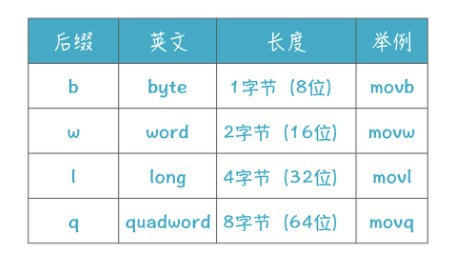

对于静态编译型语言，比如 C 语言和 Go 语言，编译器后端的任务就是生成汇编代码，然后再由汇编器生成机器码，生成的文件叫目标文件，最后再使用链接器就能生成可执行文件或库文件了。


## 了解汇编语言
用 C 语言写的例子来生成一下汇编代码。
```c
#include <stdio.h>
int main(int argc, char* argv[]){
    printf("Hello %s!\n", "Richard");
    return 0;
}
```
在mac下生成的汇编代码是下面的样子：
```
 .section    __TEXT,__text,regular,pure_instructions
    .build_version macos, 10, 14    sdk_version 10, 14
    .globl  _main                   ## -- Begin function main
    .p2align    4, 0x90
_main:                                  ## @main
    .cfi_startproc
## %bb.0:
    pushq   %rbp
    .cfi_def_cfa_offset 16
    .cfi_offset %rbp, -16
    movq    %rsp, %rbp
    .cfi_def_cfa_register %rbp
    leaq    L_.str(%rip), %rdi
    leaq    L_.str.1(%rip), %rsi
    xorl    %eax, %eax
    callq   _printf
    xorl    %eax, %eax
    popq    %rbp
    retq
    .cfi_endproc
                                        ## -- End function 
    .section    __TEXT,__cstring,cstring_literals
L_.str:                                 ## @.str
    .asciz  "Hello %s!\n"

L_.str.1:                               ## @.str.1
    .asciz  "Richard"

.subsections_via_symbols
```

### 1. 汇编语言的组成元素
这段代码里有指令、伪指令、标签和注释四种元素，每个元素单独占一行。
指令（instruction）是直接由 CPU 进行处理的命令，例如：
```
pushq   %rbp
movq    %rsp, %rbp
```
其中，开头的一个单词是助记符（mnemonic），后面跟着的是操作数（operand），有多个操作数时以逗号分隔。第二行代码的意思是把数据从这里（源）拷贝到那里（目的）.

伪指令以“.”开头，末尾没有冒号“：”。
```
.section    __TEXT,__text,regular,pure_instructions
.globl  _main        
.asciz  "Hello %s!\n"
```
伪指令是是辅助性的，汇编器在生成目标文件时会用到这些信息，但伪指令不是真正的 CPU 指令，就是写给汇编器的。每种汇编器的伪指令也不同，要查阅相应的手册。

标签以冒号“:”结尾，用于对伪指令生成的数据或指令做标记。例如 L_.str: 标签是对一个字符串做了标记。其他代码可以访问标签，例如跳转到这个标签所标记的指令。
```
L_.str:                                 ## @.str
    .asciz  "Hello %s!\n"
```
标签很有用，它可以代表一段代码或者常量的地址（也就是在代码区或静态数据区中的位置）。可一开始，我们没法知道这个地址的具体值，必须生成目标文件后，才能算出来。所以，标签会简化汇编代码的编写。

第四种元素，注释，以“#”号开头，这跟 C 语言中以 // 表示注释语句是一样的。

### 详细了解指令这个元素
代码中，助记符“movq”“xorl”中的“mov”和“xor”是指令，而“q”和“l”叫做后缀，表示操作数的位数。后缀一共有 b, w, l, q 四种，分别代表 8 位、16 位、32 位和 64 位。

比如，movq 中的 q 代表操作数是 8 个字节，也就是 64 位的。movq 就是把 8 字节从一个地方拷贝到另一个地方，而 movl 则是拷贝 4 个字节。

而在指令中使用操作数，可以使用四种格式，它们分别是：立即数、寄存器、直接内存访问和间接内存访问。

__立即数以 $ 开头， 比如 $40__。（下面这行代码是把 40 这个数字拷贝到 %eax 寄存器）。
```
movl $40, %eax
```
除此之外，我们在指令中最常见到的就是对寄存器的访问，GNU 的汇编器规定寄存器一定要以 % 开头。

__直接内存访问__：当我们在代码中看到操作数是一个数字时，它其实指的是内存地址。不要误以为它是一个数字，因为数字立即数必须以 $ 开头。另外，汇编代码里的标签，也会被翻译成直接内存访问的地址。比如“callq _printf”中的“_printf”是一个函数入口的地址。汇编器帮我们计算出程序装载在内存时，每个字面量和过程的地址。

__间接内存访问__：带有括号，比如（%rbp），它是指 %rbp 寄存器的值所指向的地址。
间接内存访问的完整形式是：`偏移量（基址，索引值，字节数）这样的格式。`
其地址是：`基址 + 索引值 * 字节数 + 偏移量`
举例来说：
```
8(%rbp)，是比 %rbp 寄存器的值加 8。
-8(%rbp)，是比 %rbp 寄存器的值减 8。
（%rbp, %eax, 4）的值，等于 %rbp + %eax*4。这个地址格式相当于访问 C 语言中的数组中的元素，数组元素是 32 位的整数，其索引值是 %eax，而数组的起始位置是 %rbp。其中字节数只能取 1,2,4,8 四个值。
```

## x86-64 架构的寄存器
寄存器一般以%开头。
x86-64 架构的 CPU 里有很多寄存器，我们在代码里最常用的是 16 个 64 位的通用寄存器，分别是：`%rax，%rbx，%rcx，%rdx，%rsi，%rdi，%rbp，%rsp， %r8，%r9，%r10，%r11，%r12，%r13，%r14，%r15。`

这些寄存器在历史上有各自的用途，比如，rax 中的“a”，是 Accumulator(累加器) 的意思，这个寄存器是累加寄存器。但随着技术的发展，这些寄存器基本上都成为了通用的寄存器，不限于某种特定的用途。

