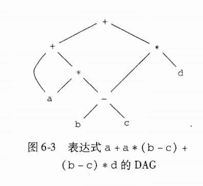
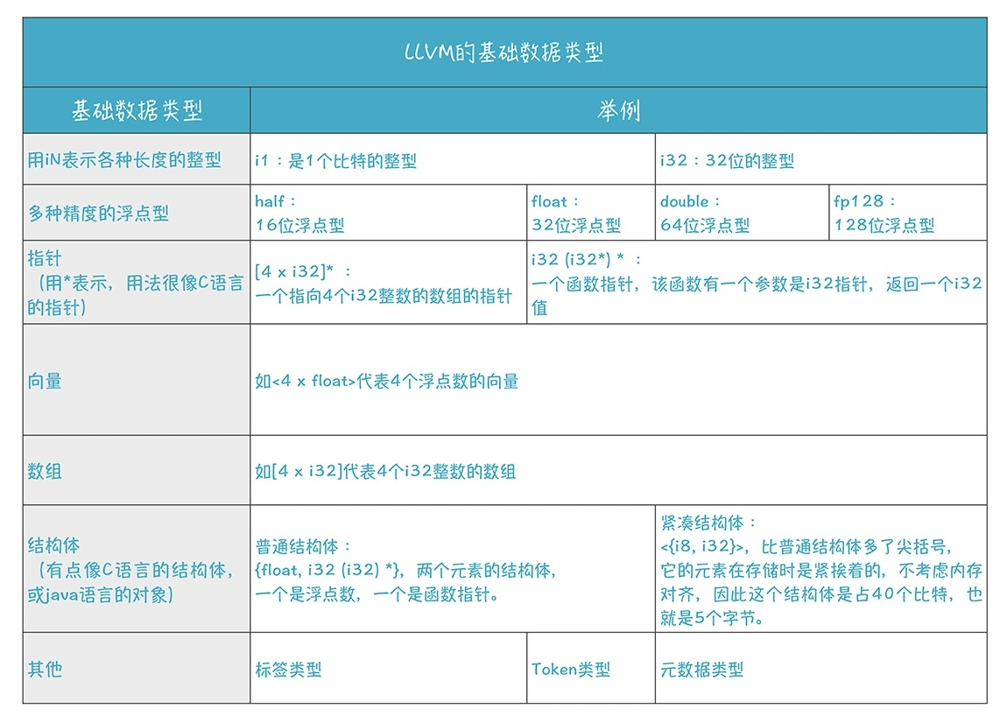

# 中间代码表示

前几节课，我带你尝试不通过 IR，直接生成汇编代码，这是为了帮你快速破冰，建立直觉。在这个过程中，你也遇到了一些挑战，比如：

* 你要对生成的代码进行优化，才有可能更好地使用寄存器和内存，同时也能减少代码量；
* 另外，针对不同的 CPU 和操作系统，你需要调整生成汇编代码的逻辑

这些实际体验，都进一步验证了IR 的作用：我们能基于 IR 对接不同语言的前端，也能对接不同的硬件架构，还能做很多的优化。

## 介于中间的语言

IR 的意思是中间表达方式，它在高级语言和汇编语言的中间，这意味着，它的特征也是处于二者之间的。

与高级语言相比，IR 丢弃了大部分高级语言的语法特征和语义特征，比如循环语句、if 语句、作用域、面向对象等等，它更像高层次的汇编语言；而相比真正的汇编语言，它又不会有那么多琐碎的、与具体硬件相关的细节。汇编语言的细节特别多。比如，你要知道很多指令的名字和用法，还要记住很多不同的寄存器。IR 不会像 x86-64 汇编语言那么繁琐，但它却包含了足够的细节信息，能方便我们实现优化算法，以及生成针对目标机器的汇编代码。

我们在后端部分所讲的 IR，目的是方便执行各种优化算法，并有利于生成汇编。这种 IR，可以看做是一种高层次的汇编语言，主要体现在：

* 它可以使用寄存器，但寄存器的数量没有限制；
* 控制结构也跟汇编语言比较像，比如有跳转语句，分成多个程序块，用标签来标识程序块等；
* 使用相当于汇编指令的操作码。这些操作码可以一对一地翻译成汇编代码，但有时一个操作码会对应多个汇编指令。

编译器的IR必须有足够的表达力，才能记录从源程序分析出来的所有信息，源代码不足以达到改目的，编译器推导出的很多事实无法用源代码表示，比如变量和常量的地址，给定参数用哪个寄存器传递，等等。

## IR的分类

* 图IR
* 线性IR，比如汇编语言就是一种线性IR
* 混合IR

一个多趟编译器可能在编译过程中的不同位置，使用不同的IR表示。在前端，关注点是生成IR，链表既可以简化实现，又可以降低总体代价。在指令调度器中，关注点是操作的重跑，因而两种基于数组的实现可能更有意义。

AST（抽象语法树）是语法分析树的简写，其中忽略了表示非终结符的大部分接点,但它仍然忠实地保留了原来的源代码结构，比如a*2 + a*2 *b的AST包含了表达式a*2的两个不同副本。有向无环图（DAG）是避免这种复制的一种简写。在DAG中，节点可以有多个父节点，相同的子树可以被重用。

## 有向无环图

例子: `a + a * (b -c) + (b -c) * d`

构造这个DAG的方法是：

* 输入：标号op、节点l和节点r
* 输出：数组中具有三元组`<op，l，r>`形式的节点的值编码
* 方法：在数组中搜索标号为op、左子节点为l且右子节点为r的节点M。如果存在这样的节点，则返回M节点的值编码。若不存在，则在数据汇总添加一个节点N，其标号为op，左右子节点分别为l和r，返回新建节点对应的值编码。

一般数组会有散列表表示。

控制流图（CFG）也是一种IR表示，通常会与另外一种IR结合使用。CFG表示块之间的关系，而块内部使用另一种IR表示，比如AST、DAG或者某种线性IR。有次得到一种混合IR。

依赖关系图也是一种IR，它可以针对特定任务（比如指令调度领域）从权威IR构建依赖关系图，使用完丢弃即可。

下面来看看一个典型 IR：三地址代码，简称 TAC。

## 认识典型的 IR：三地址代码（TAC）

下面是一种常见的 IR 的格式，它叫做三地址代码（Three Address Code, TAC），它的优点是很简洁，所以适合用来讨论算法：

```tac
x := y op z   //二元操作
x := op y     //一元操作
```

每条三地址代码最多有三个地址，其中两个是源地址（比如第一行代码的 y 和 z），一个是目的地址（也就是 x），每条代码最多有一个操作（op）。

### 1. 基本的算术运算

```java
int a, b, c, d;
a = b + c * d;
```

TAC:

```tac
t1 := c * d
a  := b + t1
```

t1 是新产生的临时变量。当源代码的表达式中包含一个以上的操作符时，就需要引入临时变量，并把原来的一条代码拆成多条代码。

### 2. 布尔值的计算

```java
int a, b;
bool x, y;
x = a * 2 < b;
y = a + 3 == b;
```

TAC:

```tac
t1 := a * 2;
x  := t1 < b;
t2 := a + 3;
y  := t2 == b;
```

布尔值实际上是用整数表示的，0 代表 false，非 0 值代表 true。

### 3. 条件语句

```JAVA
int a, b c;
if (a < b )
    c = b;
else
    c = a;  
c = c * 2;      
```

TAC:

```llvm
  t1 := a < b;
  IfZ t1 Goto L1;
  c := a;
  Goto L2;
L1:
  c := b;
L2:
  c := c * 2;  
```

IfZ 是检查后面的操作数是否是 0，“Z”就是“Zero”的意思。这里使用了标签和 Goto 语句来进行指令的跳转（Goto 相当于 x86-64 的汇编指令 jmp）。

### 4. 循环语句

```java
int a, b;
while (a < b){
  a = a + 1;
}
a = a + b;
```

TAC:

```tac
L1:
  t1 := a < b;
  IfZ t1 Goto L2;
  a := a + 1;
  Goto L1;
L2:
  a := a + b;  
```

三地址代码主要用来描述优化算法，因为它比较简洁易读，操作（指令）的类型很少，书写方式也符合我们的日常习惯。不过，我并不用它来生成汇编代码，因为它含有的细节信息还是比较少，比如，整数是 16 位的、32 位的还是 64 位的？目标机器的架构和操作系统是什么？生成二进制文件的布局是怎样的等等？

我会用 LLVM 的 IR 来承担生成汇编的任务，因为它有能力描述与目标机器（CPU、操作系统）相关的更加具体的信息，准确地生成目标代码，从而真正能够用于生产环境。

还有其他的几种IR形式：  

* 首先是四元式。它是与三地址代码等价的另一种表达方式，格式是：（OP，arg1，arg2，result）所以，“a := b + c” 就等价于（+，b，c，a）。
* 另一种常用的格式是逆波兰表达式。它把操作符放到后面，所以也叫做后缀表达式。“b + c”对应的逆波兰表达式是“b c +”；而“a = b + c”对应的逆波兰表达式是“a b c + =”。

逆波兰表达式特别适合用栈来做计算。比如计算“b c +”，先从栈里弹出加号，知道要做加法操作，然后从栈里弹出两个操作数，执行加法运算即可。这个计算过程，跟深度优先的遍历 AST 是等价的。

## 内存模型

编译器对每个值的存储位置都会有选择。对于将指向的代码，编译器必须分配一个特定的位置，如寄存器。一般来说，编译器会使用两种内存模型之一：

1. 寄存器到寄存器的模型
   这种模式下，编译器激进的把值保存在寄存器中，忽略了物理寄存器的任何限制。仅当程序语义要求值保存在内存时，编译器才会采取相应的操作。
2. 内存到内存的模型
   此模型下，编译器假定所有只有都保存在内存中，直到使用时才从内存加载到寄存器。执行完毕后又立即写会内存。

RISC机器的编译器倾向于使用寄存器到寄存器的模型，原因有二：

1. 寄存器到寄存器的模型更严密地反应了RISC体系结构的指令集。RISC机器上，内存到内存操作的集合是不完备的。
2. 寄存器到寄存器的模型，允许编译器将其推到出的一部分微妙的事实直接编码在IR中，值保存在寄存器中的事实，意味这编译器已经在先前的某个位置上证明了将其保存在寄存器中是安全的。也就是说，如果编译器能够证明只有利用名字才能访问某个值，那么它可以将该值保存在寄存器中。如果有多个名字能够访问同一个值，那么编译器必须做出保守的决策，将该值保存在内存中。

## 认识 LLVM 汇编码

__首先，LLVM 汇编码是采用静态单赋值代码形式的。__

在三地址代码上再加一些限制，就能得到另一种重要的代码，即静态单赋值代码（Static Single Assignment, SSA），在静态单赋值代码中，一个变量只能被赋值一次，来看个例子。

“y = x1 + x2 + x3 + x4”的普通三地址代码如下：

```tac
y := x1 + x2;
y := y + x3;
y := y + x4;
```

其中，y 被赋值了三次，如果写成 SSA 的形式，就只能写成下面的样子：

```tac
t1 := x1 + x2;
t2 := t1 + x3;
y  := t2 + x4; 
```

为什么要费力写成这种形式呢，还要为此多添加 t1 和 t2 两个临时变量？原因是 SSA 的形式，体现了精确的“使用 - 定义”关系。每个变量很确定地只会被定义一次，然后可以多次使用。这种特点使得基于 SSA 更容易做数据流分析，而数据流分析又是很多代码优化技术的基础，所以，几乎所有语言的编译器、解释器或虚拟机中都使用了 SSA，因为有利于做代码优化。而 LLVM 的 IR，也是采用 SSA 的形式，也是因为 SSA 方便做代码优化。

__其次，LLVM IR 比起三地址代码，有更多的细节信息。__ 比如整型变量的字长、内存对齐方式等等，所以使用 LLVM IR 能够更准确地翻译成汇编码。

看看下面这段 C 语言代码：

```c
int fun1(int a, int b){
  int c = 10;
  return a + b + c;
}
```

对应的 LLLM 汇编码如下（这是我在 macOS 上生成的）：

```llvm
; ModuleID = 'fun1.c'
source_filename = "fun1.c"
target datalayout = "e-m:o-i64:64-f80:128-n8:16:32:64-S128"
target triple = "x86_64-apple-macosx10.14.0"
; Function Attrs: noinline nounwind optnone ssp uwtable
define i32 @fun1(i32, i32) #0 {
  %3 = alloca i32, align 4        //为3个变量申请空间
  %4 = alloca i32, align 4     
  %5 = alloca i32, align 4
  store i32 %0, i32* %3, align 4  //参数1赋值给变量1
  store i32 %1, i32* %4, align 4  //参数2赋值给变量2
  store i32 10, i32* %5, align 4  //常量10赋值给变量3
  %6 = load i32, i32* %3, align 4 //
  %7 = load i32, i32* %4, align 4
  %8 = add nsw i32 %6, %7
  %9 = load i32, i32* %5, align 4
  %10 = add nsw i32 %8, %9
  ret i32 %10
}
attributes #0 = { noinline nounwind optnone ssp uwtable "correctly-rounded-divide-sqrt-fp-math"="false" "disable-tail-calls"="false" "less-precise-fpmad"="false" "no-frame-pointer-elim"="true" "no-frame-pointer-elim-non-leaf" "no-infs-fp-math"="false" "no-jump-tables"="false" "no-nans-fp-math"="false" "no-signed-zeros-fp-math"="false" "no-trapping-math"="false" "stack-protector-buffer-size"="8" "target-cpu"="penryn" "target-features"="+cx16,+fxsr,+mmx,+sahf,+sse,+sse2,+sse3,+sse4.1,+ssse3,+x87" "unsafe-fp-math"="false" "use-soft-float"="false" }

!llvm.module.flags = !{!0, !1, !2}
!llvm.ident = !{!3}

!0 = !{i32 2, !"SDK Version", [2 x i32] [i32 10, i32 14]}
!1 = !{i32 1, !"wchar_size", i32 4}
!2 = !{i32 7, !"PIC Level", i32 2}
!3 = !{!"Apple LLVM version 10.0.1 (clang-1001.0.46.4)"}
```

我们来熟悉一下里面的元素：

* 模块
  
    LLVM 程序是由模块构成的，这个文件就是一个模块。模块里可以包括函数、全局变量和符号表中的条目。链接的时候，会把各个模块拼接到一起，形成可执行文件或库文件。

    在模块中，你可以定义目标数据布局（target datalayout）。例如，开头的小写“e”是低字节序（Little Endian）的意思，对于超过一个字节的数据来说，低位字节排放在内存的低地址端，高位字节排放在内存的高地址端。

    `target datalayout = "e-m:o-i64:64-f80:128-n8:16:32:64-S128"`

    “target triple”用来定义模块的目标主机，它包括架构、厂商、操作系统三个部分。

    `target triple = "x86_64-apple-macosx10.14.0"`

* 函数

    在示例代码中有一个以 define 开头的函数的声明，还带着花括号。这有点儿像 C 语言的写法，比汇编用采取标签来表示一个函数的可读性更好。

    函数声明时可以带很多修饰成分，比如链接类型、调用约定等。如果不写，缺省的链接类型是 external 的，也就是暴露出来被其他模块链接。调用约定也有很多种选择，缺省是“ccc”，也就是 C 语言的调用约定（C Calling Convention），而“swiftcc”则是 swift 语言的调用约定。这些信息都是生成汇编时所需要的。

    示例中函数 fun1 还带有“#0”的属性值，定义了许多属性。这些也是生成汇编时所需要的。

* 标识符
  
    分为全局的（Glocal）和本地的（Local）：全局标识符以 @开头，包括函数和全局变量，前面代码中的 @fun1 就是；本地标识符以 % 开头。

    有的标识符是有名字的，比如 @fun1 或 %a，有的是没有名字的，用数字表示就可以了，如 %1。

* 操作码

    alloca、store、load、add、ret 这些，都是操作码。它们的含义是：

    | 操作码 | 含义 |
    |----|----|
    | alloca | 栈上分配空间 |
    |store|写入内存|
    |load|从内存读取|
    |add|加法运算|
    |ret|从过程中返回|

* 类型系统

    汇编是无类型的。如果你用 add 指令，它就认为你操作的是整数。而用 fadd（或 addss）指令，就认为你操作的是浮点数。这样会有类型不安全的风险，把整型当浮点数用了，造成的后果是计算结果完全错误。

    LLVM 汇编则带有一个类型系统。它能避免不安全的数据操作，并且有助于优化算法。这个类型系统包括基础数据类型、函数类型和 void 类型。

    

    函数类型是包括对返回值和参数的定义，比如：i32 (i32)；

    void 类型不代表任何值，也没有长度。

* 全局变量和常量
  
    在 LLVM 汇编中可以声明全局变量。全局变量所定义的内存，是在编译时就分配好了的，而不是在运行时，例如下面这句定义了一个全局变量 C：

    ```llvm
    @c = global i32 100, align 4
    ```

    你也可以声明常量，它的值在运行时不会被修改：

    ```llvm
    @c = constant i32 100, align 4
    ```

* 元数据

    在代码中你还看到以“!”开头的一些句子，这些是元数据。这些元数据定义了一些额外的信息，提供给优化器和代码生成器使用。

* 基本块

    函数中的代码会分成一个个的基本块，可以用标签（Label）来标记一个基本块。下面这段代码有 4 个基本块，其中第一个块有一个缺省的名字“entry”，也就是作为入口的基本块，这个基本块你不给它标签也可以。

    ```llvm
    define i32 @bb(i32) #0 {
    %2 = alloca i32, align 4
    %3 = alloca i32, align 4
    store i32 %0, i32* %3, align 4
    %4 = load i32, i32* %3, align 4
    %5 = icmp sgt i32 %4, 0
    br i1 %5, label %6, label %9

    ; <label>:6:                                      ; preds = %1
    %7 = load i32, i32* %3, align 4
    %8 = mul nsw i32 %7, 2
    store i32 %8, i32* %2, align 4
    br label %12

    ; <label>:9:                                      ; preds = %1
    %10 = load i32, i32* %3, align 4
    %11 = add nsw i32 %10, 3
    store i32 %11, i32* %2, align 4
    br label %12

    ; <label>:12:                                     ; preds = %9, %6
    %13 = load i32, i32* %2, align 4
    ret i32 %13
    }
    ```

    这段代码实际上相当于下面这段 C 语言的代码：

    ```c
    int bb(int b){
        if (b > 0)
            return b * 2;
        else
            return b + 3;
    }
    ```

    我们分析一下标签为 9 的基本块，第一行（%10 = load i32, i32* %3, align 4）的含义是：把 3 号变量（32 位整型）从内存加载到寄存器，叫做 10 号变量，其中，内存对齐是 4 字节。

    第二行（%11 = add nsw i32 %10, 3）的含义是：把 10 号变量（32 位整型）加上 3，保存到 11 号变量，其中 nsw 是加法计算时没有符号环绕（No Signed Wrap）的意思。

    第三行（store i32 %11, i32* %2, align 4）的含义是：把 11 号变量（32 位整型）存入内存中的 2 号变量，内存对齐 4 字节。

    第四行（br label %12）的含义是：跳转到标签为 12 的代码块。其中，br 指令是一条终结指令。终结指令要么是跳转到另一个基本块，要么是从函数中返回（ret 指令），基本块的最后一行必须是一条终结指令。

    最后我要强调，从其他基本块不可以跳转到入口基本块，也就是函数中的第一个基本块。这个规定也是有利于做数据优化。

## 小结

  IR 是我们后续做代码优化、汇编代码生成的基础:

  1. 三地址代码是很常见的一种 IR，包含一个目的地址、一个操作符和至多两个源地址。
  2. LLVM IR 的第一个特点是静态单赋值（SSA），也就是每个变量（地址）最多被赋值一次，它这种特性有利于运行代码优化算法；第二个特点是带有比较多的细节，方便我们做优化和生成高质量的汇编代码。
