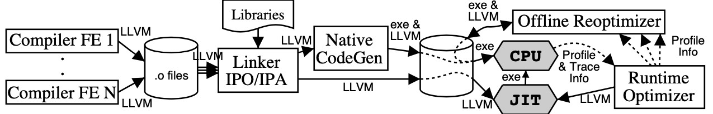

在编译器后端，做代码优化和为每个目标平台生成汇编代码，工作量是很大的。能降低这方面的工作量，提高我们的工作效率就需要利用现成的工具。

## 两个编译器后端框架：LLVM 和 GCC

LLVM 是一个开源的编译器基础设施项目，主要聚焦于编译器的后端功能（代码生成、代码优化、JIT……）。它最早是美国伊利诺伊大学的一个研究性项目，核心主持人员是 Chris Lattner（克里斯·拉特纳）。

LLVM 的出名是由于苹果公司全面采用了这个框架。苹果系统上的 C 语言、C++、Objective-C 的编译器 Clang 就是基于 LLVM 的，最新的 Swift 编程语言也是基于 LLVM，支撑了无数的移动应用和桌面应用。无独有偶，在 Android 平台上最新的开发语言 Kotlin，也支持基于 LLVM 编译成本地代码。

与 LLVM 起到类似作用的后端编译框架是 GCC（GNU Compiler Collection，GNU 编译器套件）。它支持了 GNU Linux 上的很多语言，例如 C、C++、Objective-C、Fortran、Go 语言和 Java 语言等。其实，它最初只是一个 C 语言的编译器，后来把公共的后端功能也提炼了出来，形成了框架，支持多种前端语言和后端平台。最近华为发布的方舟编译器，据说也是建立在 GCC 基础上的。

##  了解 LLVM 的特点
LLVM 能够支持多种语言的前端、多种后端 CPU 架构。在 LLVM 内部，使用类型化的和 SSA 特点的 IR 进行各种分析、优化和转换：

LLVM 项目包含了很多组成部分：

* LLVM 核心（core）。就是上图中的优化和分析工具，还包括了为各种 CPU 生成目标代码的功能；这些库采用的是 LLVM IR，一个良好定义的中间语言，在上一讲，我们已经初步了解它了。
* Clang 前端（是基于 LLVM 的 C、C++、Objective-C 编译器）。
* LLDB（一个调试工具）。
* LLVM 版本的 C++ 标准类库。
* 其他一些子项目。

优点：

* 首先，LLVM 有良好的模块化设计和接口。以前的编译器后端技术很难复用，而 LLVM 具备定义了良好接口的库，方便使用者选择在什么时候，复用哪些后端功能。比如，针对代码优化，LLVM 提供了很多算法，语言的设计者可以自己选择合适的算法，或者实现自己特殊的算法，具有很好的灵活性。
* 第二，LLVM 同时支持 JIT（即时编译）和 AOT（提前编译）两种模式。过去的语言要么是解释型的，要么编译后运行。习惯了使用解释型语言的程序员，很难习惯必须等待一段编译时间才能看到运行效果。很多科学工作者，习惯在一个 REPL 界面中一边写脚本，一边实时看到反馈。LLVM 既可以通过 JIT 技术支持解释执行，又可以完全编译后才执行，这对于语言的设计者很有吸引力。
* 第三，有很多可以学习借鉴的项目。Swift、Rust、Julia 这些新生代的语言，实现了很多吸引人的特性，还有很多其他的开源项目，而我们可以研究、借鉴它们是如何充分利用 LLVM 的。
* 第四，全过程优化的设计思想。LLVM 在设计上支持全过程的优化。Lattner 和 Adve 最早关于 LLVM 设计思想的文章《LLVM: 一个全生命周期分析和转换的编译框架》，就提出计算机语言可以在各个阶段进行优化，包括编译时、链接时、安装时，甚至是运行时。

    以运行时优化为例，基于 LLVM 我们能够在运行时，收集一些性能相关的数据对代码编译优化，可以是实时优化的、动态修改内存中的机器码；也可以收集这些性能数据，然后做离线的优化，重新生成可执行文件，然后再加载执行，这一点非常吸引我，因为在现代计算环境下，每种功能的计算特点都不相同，确实需要针对不同的场景做不同的优化。下图展现了这个过程（图片来源《 LLVM: A Compilation Framework for Lifelong Program Analysis & Transformation》）：
    

* LLVM 的授权更友好。GNU 的很多软件都是采用 GPL 协议的，所以如果用 GCC 的后端工具来编写你的语言，你可能必须要按照 GPL 协议开源。而 LLVM 则更友好一些，你基于 LLVM 所做的工作，完全可以是闭源的软件产品。

## 体验一下 LLVM 的功能