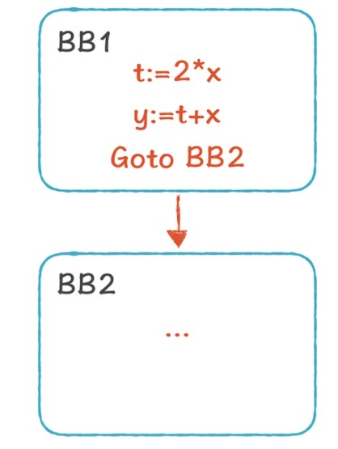

# 代码优化

优化器的认为就是转换前端产生的IR程序，以提高后端生成的代码的质量。这里的提高可以有多重含义。通常，是使编译后的代码执行的更快，也可能使程序再运行是耗费较少的资源或占用较少的内存空间，也可能是编译后的代码长度尽量的小，总之，目标就是降低能耗、提高代码对实时事件的想过要或降低对内存的总访问量等。

优化机会一般有两个来源，一个是优化器可以对IR的上下文进行广发分析，前端一般只针对远程西的局部代码就行抽象转换，生成的IR通常是为了处理各种源语言结构的最一般形式。另一个优化机会来源于目标机。编译器必须详细了解目标机影响性能的属性，比如功能单元的数据和能力、内存层次结构中各个层次的延迟和带宽、指令集支持的各种寻址方式、罕见或复杂操作的可用性等问题。

对优化需要考虑两个问题，__安全性__ 和 __可获利性__。

在使用 LLVM 的过程中，你应该觉察到了，优化之后和优化之前的代码相差很大。代码优化之后，数量变少了，性能也更高了。

* 代码优化的目标是什么？除了性能上的优化，还有什么优化？
* 代码优化可以在多大的范围内执行？是在一个函数内，还是可以针对整个应用程序？
* 常见的代码优化场景有哪些？

当然了，代码优化是编译器后端的两大工作之一（另一个是代码生成）。

## 了解代码优化的目标、对象、范围和策略

* 代码优化的目标
  
  代码优化的目标，是优化程序对计算机资源的使用。我们平常最关心的就是 CPU 资源，最大效率地利用 CPU 资源可以提高程序的性能。代码优化有时候还会有其他目标，比如代码大小、内存占用大小、磁盘访问次数、网络通讯次数等等。

* 代码优化的对象
  
  从代码优化的对象看，大多数的代码优化都是在 IR 上做的，而不是在前一阶段的 AST 和后一阶段汇编代码上进行的，为什么呢？

  其实，在 AST 上也能做一些优化，比如在讲前端内容的时候，我们曾经会把一些不必要的 AST 层次削减掉（例如 add->mul->pri->Int，每个父节点只有一个子节点，可以直接简化为一个 Int 节点），但它抽象层次太高，含有的硬件架构信息太少，难以执行很多优化算法。 在汇编代码上进行优化会让算法跟机器相关，当换一个目标机器的时候，还要重新编写优化代码。所以，在 IR 上是最合适的，它能尽量做到机器独立，同时又暴露出很多的优化机会。

* 代码优化的范围
  
  从优化的范围看，分为本地优化、全局优化和过程间优化。

  优化通常针对一组指令，最常用也是最重要的指令组，就是基本块。基本块的特点是：每个基本块只能从入口进入，从最后一条指令退出，每条指令都会被顺序执行。因着这个特点，我们在做某些优化时会比较方便。比如，针对下面的基本块，我们可以很安全地把第 3 行的“y:=t+x”改成“y:= 3 * x”，因为 t 的赋值一定是在 y 的前面：

  ```llvm
  BB1:
  t:=2 * x
  y:=t + x
  Goto BB2 
  ```
  
  这种针对基本块的优化，我们叫做本地优化（Local Optimization）。

  那么另一个问题来了：我们能否把第二行的“t:=2 * x”也优化删掉呢？这取决于是否有别的代码会引用 t。所以，我们需要进行更大范围的分析，才能决定是否把第二行优化掉。

  超越基本块的范围进行分析，我们需要用到控制流图（Control Flow Graph，CFG）。CFG 是一种有向图，它体现了基本块之前的指令流转关系。如果从 BB1 的最后一条指令是跳转到 BB2，那么从 BB1 到 BB2 就有一条边。一个函数（或过程）里如果包含多个基本块，可以表达为一个 CFG。
  

  如果通过分析 CFG，我们发现 t 在其他地方没有被使用，就可以把第二行删掉。这种针对一个函数、基于 CFG 的优化，叫做全局优化（Global Optimization）。
  
  比全局优化更大范围的优化，叫做过程间优化（Inter-procedural Optimization），它能跨越函数的边界，对多个函数之间的关系进行优化，而不是仅针对一个函数做优化。

* 代码优化的策略
  
  最后，你不需要每次都把代码优化做彻底，因为做代码优化本身也需要消耗计算机的资源。所以，你需要权衡代码优化带来的好处和优化本身的开支这两个方面，然后确定做多少优化。比如，在浏览器里加载 JavaScript 的时候，JavaScript 引擎一定会对 JavaScript 做优化，但如果优化消耗的时间太长，界面的响应会变慢，反倒影响用户使用页面的体验，所以 JavaScript 引擎做优化时要掌握合适的度或调整优化时机。

## 一些优化的场景

* 代数优化（Algebraic Optimazation）
  
  代数优化是最简单的一种优化，当操作符是代数运算的时候，你可以根据学过的数学知识进行优化。比如“x:=x+0 ”这行代码，操作前后 x 没有任何变化，所以这样的代码可以删掉；又比如“x:=x*0” 可以简化成“x:=0”；对某些机器来说，移位运算的速度比乘法的快，那么“x:=x*8”可以优化成“x:=x<<3”。

* 常数折叠（Constant Folding）
  
  它是指，对常数的运算可以在编译时计算，比如 “x:= 20 * 3 ”可以优化成“x:=60”。另外，在 if 条件中，如果条件是一个常量，那就可以确定地取某个分支。比如：“If 2>0 Goto BB2” 可以简化成“Goto BB2”就好了。

* 删除不可达的基本块
  
  有些代码永远不可能被激活。比如在条件编译的场景中，我们会写这样的程序：“if(DEBUG) {...}”。如果编译时，DEBUG 是一个常量 false，那这个代码块就没必要编译了。

* 删除公共子表达式（Common Subexpression Elimination）
  
  下面这两行代码，x 和 y 右边的形式是一样的，如果这两行代码之间，a 和 b 的值没有发生变化（比如采用 SSA 形式），那么 x 和 y 的值一定是一样的。

  ```llvm
  x := a + b
  y := a + b
  ```

  那我们就可以让 y 等于 x，从而减少了一次“a+b”的计算，这种优化叫做删除公共子表达式。

  ```llvm
  x := a + b
  y := x
  ```

* 拷贝传播（Copy Propagation）和常数传播（Constant Propagation）
  
  下面的示例代码中，第三行可以被替换成“z:= 2 * x”， 因为 y 的值就等于 x，这叫做拷贝传播。

  ```llvm
  x := a + b
  y := x
  z := 2 * y
  ```

  如果 y := 10，常数 10 也可以传播下去，把最后一行替换成 z:= 2 * 10，这叫做常数传播。再做一次常数折叠，就变成 z:=20 了。

* 死代码删除（Ded code elimination）
  
  在上面的拷贝传播中，如果没有其他地方使用 y 变量了，那么第二行就是死代码，就可以删除掉，这种优化叫做死代码删除。

* 移动代码
  目的是减少循环内部代码数量。这个转换处理的是那些不管循环多少次都得到相同结果的表达式。比如

  ```c
  while (i <= limit -2>) // 不改变limit的值

  //进行代码移动之后得到如下等价代码：
  t=limit - 2
  while(i <= t>)
  ```

* 归纳变量和强度消减

## 如何做本地优化

上面这些优化场景，可以用于本地优化、全局优化和过程间优化。这节课我们先看看如何做本地优化，因为它相对简单，学习难度较低，下节课再接着讨论全局优化。
