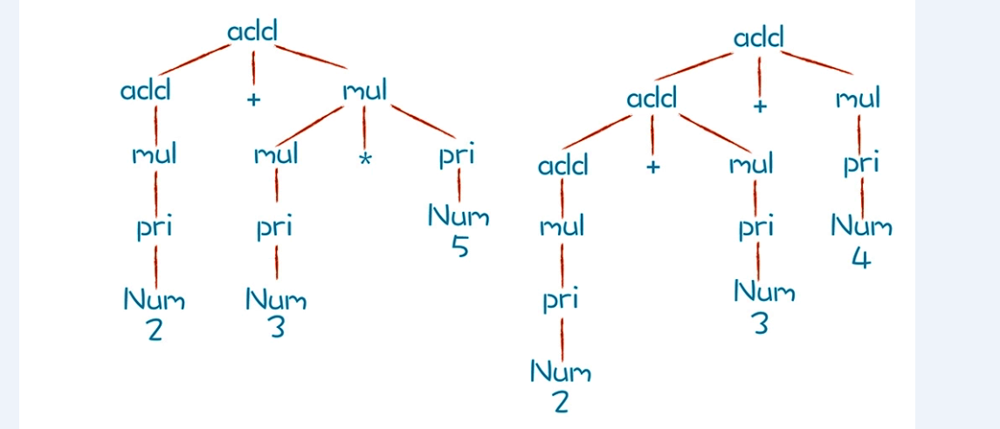

本节主要解决怎么消除左递归，怎么确保正确的优先级和结合性。
## 书写语法规则，并进行推导
我们已经知道，语法规则是由上下文无关文法表示的，而上下文无关文法是由一组替换规则（又叫产生式）组成的，比如算术表达式的文法规则可以表达成下面这种形式：
```
add -> mul | add + mul
mul -> pri | mul * pri
pri -> Id | Num | (add)
```
按照上面的产生式，add 可以替换成 mul，或者 add + mul。这样的替换过程又叫做“推导”。以“2+3*5” 和 “2+3+4”这两个算术表达式为例，这两个算术表达式的推导过程分别如下图所示：

通过上图的推导过程，你可以清楚地看到这两个表达式是怎样生成的。而分析过程中形成的这棵树，其实就是 AST。

那么，上图中两颗树的叶子节点有哪些呢？Num、+ 和 * 都是终结符，终结符都是词法分析中产生的 Token。而那些非叶子节点，就是非终结符。文法的推导过程，就是把非终结符不断替换的过程，让最后的结果没有非终结符，只有终结符，计算机程序就根据这些终结符来计算非终结符。

## 确保正确的优先级
刚刚，我们由加法规则推导到乘法规则，这种方式保证了 AST 中的乘法节点一定会在加法节点的下层，也就保证了乘法计算优先于加法计算。

听到这儿，你一定会想到，我们应该把关系运算（>、=、<）放在加法的上层，逻辑运算（and、or）放在关系运算的上层。的确如此，我们试着将它写出来：
```
exp -> or | or = exp  
or -> and | or || and
and -> equal | and && equal
equal -> rel | equal == rel | equal != rel
rel -> add | rel > add | rel < add | rel >= add | rel <= add
add -> mul | add + mul | add - mul
mul -> pri | mul * pri | mul / pri
```
这里表达的优先级从低到高是：赋值运算、逻辑运算（or）、逻辑运算（and）、相等比较（equal）、大小比较（rel）、加法运算（add）、乘法运算（mul）和基础表达式（pri）。

实际语言中还有更多不同的优先级，比如位运算等。而且优先级是能够改变的，比如我们通常会在语法里通过括号来改变计算的优先级。不过这怎么表达成语法规则呢？
其实，我们在最低层，也就是优先级最高的基础表达式（pri）这里，用括号把表达式包裹起来，递归地引用表达式就可以了。这样的话，只要在解析表达式的时候遇到括号，那么就知道这个是最优先的。这样的话就实现了优先级的改变：

pri -> Id | Literal | (exp)


## 确保正确的结合性
同样优先级的运算符是从左到右计算还是从右到左计算叫做结合性。我们常见的加减乘除等算术运算是左结合的，“.”符号也是左结合的。比如“rectangle.center.x” 是先获得长方形（rectangle）的中心点（center），再获得这个点的 x 坐标。计算顺序是从左向右的。那有没有右结合的例子呢？肯定是有的。赋值运算就是典型的右结合的例子，比如“x = y = 10”。

我们得出一个规律：对于左结合的运算符，递归项要放在左边；而右结合的运算符，递归项放在右边。


## 小结

* 优先级是通过在语法推导中的层次来决定的，优先级越低的，越先尝试推导。
* 结合性是跟左递归还是右递归有关的，左递归导致左结合，右递归导致右结合。
* 左递归可以通过改写语法规则来避免，而改写后的语法又可以表达成简洁的 EBNF 格式，从而启发我们用循环代替右递归。
