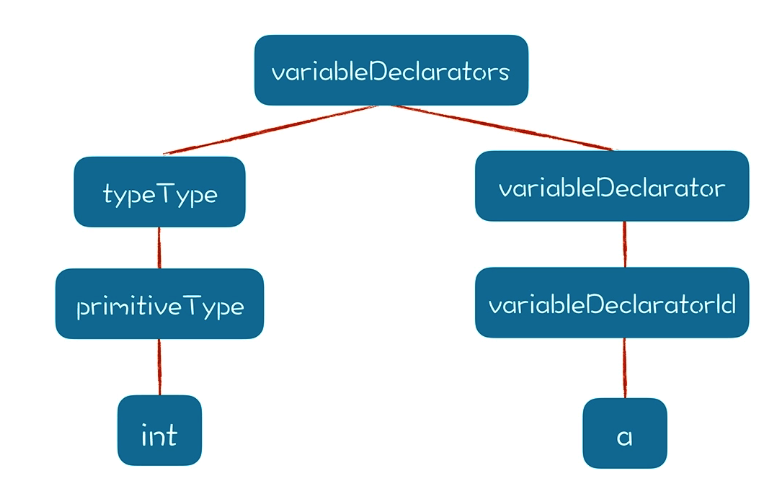

什么是类型系统？

类型系统是一门语言所有的类型的集合，操作这些类型的规则，以及类型之间怎么相互作用的（比如一个类型能否转换成另一个类型）。

如果要建立一个完善的类型系统，形成对类型系统比较完整的认知，需要从两个方面出发：

根据领域的需求，设计自己的类型系统的特征。
在编译器中支持类型检查、类型推导和类型转换。

## 设计类型系统的特征
类型到底是什么？

在机器代码层面，所有的数据都是0101组成的，不会区分哪个变量是整型，哪个是字符串，哪个是指针，比如汇编语言里的操作符都是跟字长有关系，不区分变量类型的。

高级语言为什么要有类型？

类型的定义很难，担忧一个公认的说法就是：类型是针对一组数值，以及在这组数值之上的一组操作。比如，对于数字类型，你可以对它进行加减乘除算术运算，对于字符串就不行。

类型是高级语言赋予的一种语义，有了类型这种机制，就相当于定了规矩，可以检查施加在数据上的操作是否合法。因此类型系统最大的好处，就是可以通过类型检查降低计算出错的概率。

## 如何做类型检查、类型推导和类型转换
先举个例子，`a = b+10`
* 如果b是一个浮点型，则b+10的结果也是浮点型。如果b是字符串，则b+10就是字符串的连接。这个分析过程，就是类型推导（Type Inference）。
* 当右边的值计算完，赋值给 a 的时候，要检查左右两边的类型是否匹配。这个过程，就是类型检查（Type Checking）。
* 如果 a 的类型是浮点型，而右边传过来的是整型，那么一般就要进行缺省的类型转换（Type Conversion）。

下面这段代码就是在编译期做了类型判断，
```java
/ 这段代码提到，如果操作符号两边有一边数据类型是 String 类型的，那整个表达式就是 String 类型的。
// 如果是其他基础类型的，就要按照一定的规则进行类型的转换，并确定运算结果的类型。
case PlayScriptParser.ADD:
    if (type1 == PrimitiveType.String ||
        type2 == PrimitiveType.String){
        type = PrimitiveType.String;
    }
    else if (type1 instanceof PrimitiveType &&
             type2 instanceof PrimitiveType){
        //类型“向上”对齐，比如一个int和一个float，取float
        type = PrimitiveType.getUpperType(type1,type2);
    }else{
        at.log("operand should be PrimitiveType for additive operation", ctx);
    }
    break;
```

通过这个类型推导的例子，我们又可以引出 S 属性（Synthesized Attribute）的知识点。如果一种属性能够从下级节点推导出来，那么这种属性就叫做 S 属性，字面意思是综合属性，就是在 AST 中从下级的属性归纳、综合出本级的属性。更准确地说，是通过下级节点和自身来确定的。与 S 属性相对应的是 I 属性（Inherited Attribute），也就是继承属性，即 AST 中某个节点的属性是由上级节点、兄弟节点和它自身来决定的，比如int a；变量 a 的类型是 int，这个很直观，因为变量声明语句中已经指出了 a 的类型，但这个类型可不是从下级节点推导出来的，而是从兄弟节点推导出来的。把 int a; 这样一个简单的变量声明语句解析成 AST，就形成了一棵有两个分枝的树：

这棵树的左枝，可以从下向上推导类型，所以类型属性也就是 S 属性。而右枝则必须从根节点（也就是 variableDeclarators）往下继承类型属性，所以对于 a 这个节点来说，它的类型属性是 I 属性。

类型检查主要出现在几个场景中：
* 赋值语句（检查赋值操作左边和右边的类型是否匹配）。
* 变量声明语句（因为变量声明语句中也会有初始化部分，所以也需要类型匹配）。
* 函数传参（调用函数的时候，传入的参数要符合形参的要求）。
* 函数返回值（从函数中返回一个值的时候，要符合函数返回值的规定）。


类型检查还有一个特点：以赋值语句为例，左边的类型，是 I 属性，是从声明中得到的；右边的类型是 S 属性，是自下而上综合出来的。当左右两边的类型相遇之后，就要检查二者是否匹配，被赋值的变量要满足左边的类型要求。

