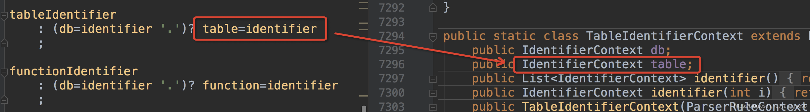

1. 序列模式
   ```g4
   file : (row '\n')* ;         // 以一个'\n'作为终止符的序列
   row  : field (',', field)* ; // 以一个','作为分隔符的序列
   field: INT ;                 // 假设字段都是整数
   ```


2. 选择模式（多个备选分支）
   用 | 作为或者来表达选择模式

   ```
   field : INT | STRING ;       //  允许字段中出现整数或者字符串

   stmt :  mode_stmt
        |   edge_stmt
        |   attr_stmt
        |   id '=' id
        |   subgraph
   ```

3. 词法符号依赖模式
   用一个序列来指明所有配对的符号。

   ```
   vector : '[' INT+ ']' ;  //  [1], [1 2], [1 2 3] ...

   expr :   expr '(' exprList? ')' // 类似 f(), f(x), f(1,2)的函数调用、
        |   expr '[' expr ']'      // 类似a[i], a[i][j]的数组索引
        ...
        ;
   ```

4. 嵌套模式
   
   ```
   stat:   'while' '(' expr ')' stat    // 匹配while语句
        |   '{' stat* '}'               // 匹配花括号中若干条语句组成的代码块
        ...                             // 其他种类的语句
        ;
   ```

5. 规则元素标签
   Antlr允许用 = 操作符为规则中的元素添加标签,这样会在规则的上下文对象中添加元素的字段，等号左边为属性名，右边为规则名，如下图所示：
   

