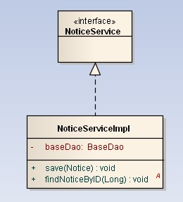
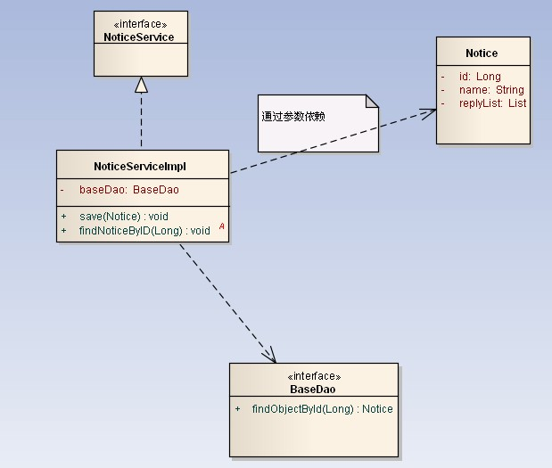
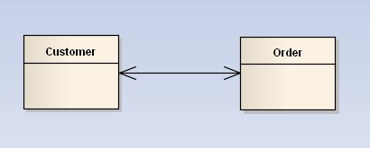
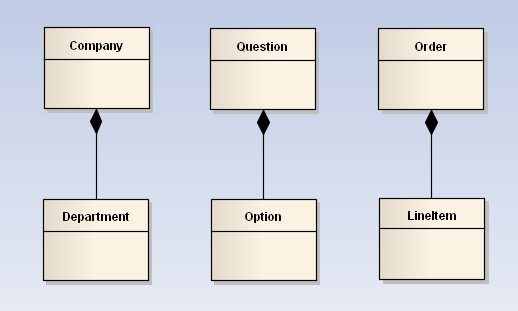
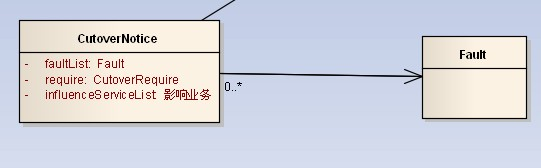
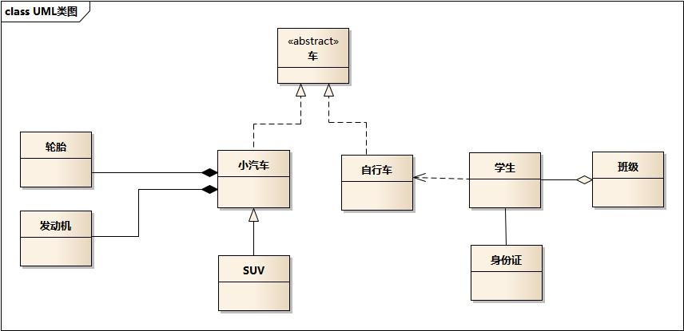

# UML类图

在画类图的时候，理清类和类之间的关系是重点。类的关系有泛化(Generalization)、实现（Realization）、依赖(Dependency)和关联(Association)。其中关联又分为一般关联关系和聚合关系(Aggregation)，合成关系(Composition)。下面我们结合实例理解这些关系。

1.基本概念
类图（Class Diagram）: 类图是面向对象系统建模中最常用和最重要的图，是定义其它图的基础。类图主要是用来显示系统中的类、接口以及它们之间的静态结构和关系的一种静态模型。
类图的3个基本组件：类名、属性、方法。

2.泛化(generalization)：表示is-a的关系，是对象之间耦合度最大的一种关系，子类继承父类的所有细节。直接使用语言中的继承表达。在类图中使用带三角箭头的实线表示，箭头从子类指向父类。在Java中用extends关键字。

3.实现（Realization）:在类图中就是接口和实现的关系。这个没什么好讲的。在类图中使用带三角箭头的虚线表示，箭头从实现类指向接口。在Java中此类关系通过关键字implements明确标识。

4.依赖(Dependency)：对象之间最弱的一种关联方式，是临时性的关联。代码中一般指由局部变量、函数参数、返回值建立的对于其他对象的调用关系。一个类调用被依赖类中的某些方法而得以完成这个类的一些职责。在类图使用带箭头的虚线表示，箭头从使用类指向被依赖的类。

5.关联(Association) : 对象之间一种引用关系，比如客户类与订单类之间的关系。这种关系通常使用类的属性表达。关联又分为一般关联、聚合关联与组合关联。后两种在后面分析。在类图使用带箭头的实线表示，箭头从使用类指向被关联的类。可以是单向和双向。

6.聚合(Aggregation) : 表示has-a的关系，是一种不稳定的包含关系。较强于一般关联,有整体与局部的关系,并且没有了整体,局部也可单独存在。如公司和员工的关系，公司包含员工，但如果公司倒闭，员工依然可以换公司。在类图使用空心的菱形表示，菱形从局部指向整体。

7.组合(Composition) : 表示contains-a的关系，是一种强烈的包含关系。组合类负责被组合类的生命周期。是一种更强的聚合关系。部分不能脱离整体存在。如公司和部门的关系，没有了公司，部门也不能存在了；调查问卷中问题和选项的关系；订单和订单选项的关系。在类图使用实心的菱形表示，菱形从局部指向整体。

8.多重性(Multiplicity) : 通常在关联、聚合、组合中使用。就是代表有多少个关联对象存在。使用数字..星号（数字）表示。如下图，一个割接通知可以关联0个到N个故障单。

9.例子：

车的类图结构为abstract，表示车是一个抽象类；
它有两个继承类：小汽车和自行车；它们之间的关系为实现关系，使用带空心箭头的虚线表示；
小汽车为与SUV之间也是继承关系，它们之间的关系为泛化关系，使用带空心箭头的实线表示；
小汽车与发动机之间是组合关系，使用带实心箭头的实线表示；
学生与班级之间是聚合关系，使用带空心箭头的实线表示；
学生与身份证之间为关联关系，使用一根实线表示；
学生上学需要用到自行车，与自行车是一种依赖关系，使用带箭头的虚线表示。
