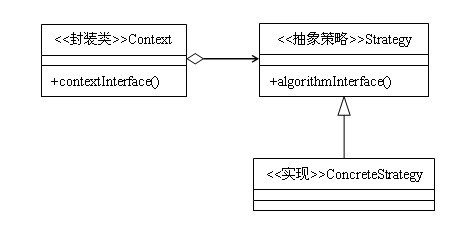

# 策略模式

1. 定义：策略模式定义了算法族，分别封装起来，让它们之间可以互相替换，次模式让算法的变化独立于使用算法的客户。

2. 类型：行为类模式

3. 类图：


4. 策略模式的结构
封装类：也叫上下文，对策略进行二次封装，目的是避免高层模块对策略的直接调用。
抽象策略：通常情况下为一个接口，当各个实现类中存在着重复的逻辑时，则使用抽象类来封装这部分公共的代码，此时，策略模式看上去更像是模版方法模式。
具体策略：具体策略角色通常由一组封装了算法的类来担任，这些类之间可以根据需要自由替换。

5. 策略模式代码实现

```java
interface IStrategy {
    public void doSomething();
}
class ConcreteStrategy1 implements IStrategy {
    public void doSomething() {
        System.out.println("具体策略1");
    }
}
class ConcreteStrategy2 implements IStrategy {
    public void doSomething() {
        System.out.println("具体策略2");
    }
}
class Context {
    private IStrategy strategy;
     
    public Context(IStrategy strategy){
        this.strategy = strategy;
    }
     
    public void execute(){
        strategy.doSomething();
    }
}
 
public class Client {
    public static void main(String[] args){
        Context context;
        System.out.println("-----执行策略1-----");
        context = new Context(new ConcreteStrategy1());
        context.execute();
 
        System.out.println("-----执行策略2-----");
        context = new Context(new ConcreteStrategy2());
        context.execute();
    }
}
```

1. 策略模式的优缺点

策略模式的主要优点有：
策略类之间可以自由切换，由于策略类实现自同一个抽象，所以他们之间可以自由切换。
易于扩展，增加一个新的策略对策略模式来说非常容易，基本上可以在不改变原有代码的基础上进行扩展。
避免使用多重条件，如果不使用策略模式，对于所有的算法，必须使用条件语句进行连接，通过条件判断来决定使用哪一种算法，在上一篇文章中我们已经提到，使用多重条件判断是非常不容易维护的。
策略模式的缺点主要有两个：
维护各个策略类会给开发带来额外开销，可能大家在这方面都有经验：一般来说，策略类的数量超过5个，就比较令人头疼了。
必须对客户端（调用者）暴露所有的策略类，因为使用哪种策略是由客户端来决定的，因此，客户端应该知道有什么策略，并且了解各种策略之间的区别，否则，后果很严重。例如，有一个排序算法的策略模式，提供了快速排序、冒泡排序、选择排序这三种算法，客户端在使用这些算法之前，是不是先要明白这三种算法的适用情况？再比如，客户端要使用一个容器，有链表实现的，也有数组实现的，客户端是不是也要明白链表和数组有什么区别？就这一点来说是有悖于迪米特法则的。
