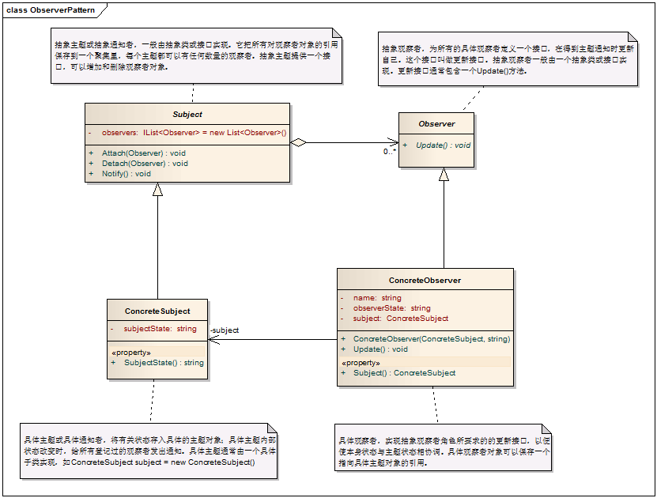

# 观察者模式

0. 意图：定义对象间的一种一对多的依赖关系，当一个对象的状态发生改变时，所有依赖于它的对象都得到通知并被自动更新。

1. 定义： 观察者模式定义了对象之间的一对多依赖，这样一来，当一个对象改变状态时，它的所有依赖者都会收到通知并自动更新。

2. 类型：

3. 类图：


4. 代码

```java
public interface Subject{   
    public void attach(Observer observer);
    public void detach(Observer observer);
    void notifyObservers();
}

import java.util.Vector;
import java.util.Enumeration;

public class ConcreteSubject implements Subject
{
    private Vector observersVector = new java.util.Vector();
    public void attach(Observer observer)
    {
        observersVector.addElement(observer);
    }

    public void detach(Observer observer)
    {
        observersVector.removeElement(observer);
    }

    public void notifyObservers()
    {
        Enumeration enumeration = observers();
        while (enumeration.hasMoreElements())
        {
            ((Observer)enumeration.nextElement()).update();
        }
    }

    public Enumeration observers()
    {
        return (（Vector) observersVector.clone()).elements();
    }
    
}


public interface Observer
{
    void update();
}


public class ConcreteObserver implements Observer
{
    public void update()
    {
    // Write your code here
    }
}
```
